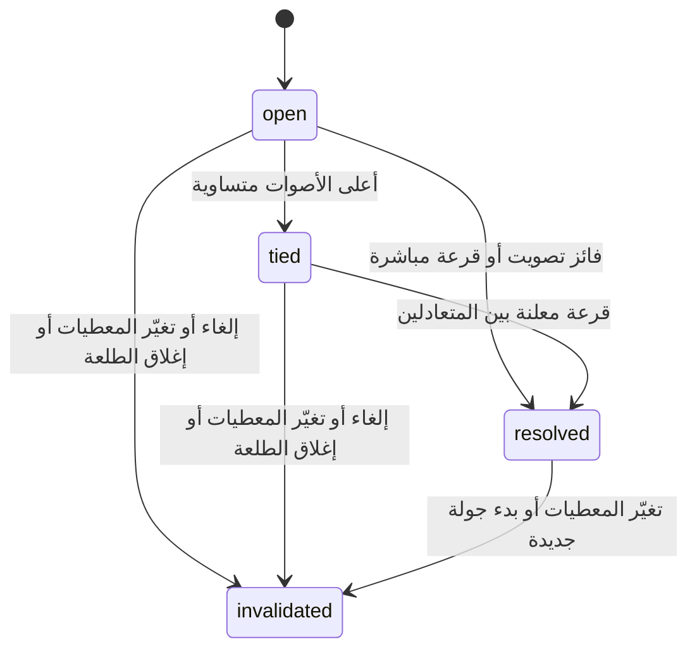

# عقد API — القروبات والطلعات

هذا مرجع النسخة المنفذة على `codex/persistent-groups`. المصدر الدقيق القابل للآلة هو [backend/openapi.json](../backend/openapi.json)، وتعرضه FastAPI في `/api/docs`. جميع المسارات أدناه تحت `/api/v2`، وتتعامل مع JSON. أنواع الواجهة في [schema.d.ts](../src/api/schema.d.ts) تُولّد بالأمر `npm run types:api` ولا تُكتب يدويًا.

## الهوية والأخطاء

المسارات الخاصة تتطلب `Authorization: Bearer <session-token>`. التسجيل والدخول يعيدان `{token, account: {id, handle, name}}`. كلمة المرور ١٠–١٢٨ حرفًا، واسم المستخدم ٣–٤٠ من الأحرف الإنجليزية والأرقام و`_.-`؛ يُوحّد إلى أحرف صغيرة. الاسم المعروض مختلف عن اسم الدخول. الجلسة تنتهي بعد ٣٠ يومًا وتُلغى عند الخروج.

الأخطاء: 401 للجلسة غير المقبولة، 403 لعدم الصلاحية، 404 لمورد غير موجود أو غير متاح لهذا الحساب، 409 لتعارض حالة أو امتلاء أو عضوية موقوفة، 422 لمدخلات غير صالحة، 429 لتجاوز حد المحاولات. الرسالة في `detail`. لا تفسر الواجهة فشل الشبكة باعتباره انتهاء جلسة، ولا تحذف بيانات الدخول عند 5xx.

## الحسابات والكتالوج

| الطريقة والمسار | المدخل | الناتج |
|---|---|---|
| `POST /auth/register` | handle، password، name | 201 AccountSession |
| `POST /auth/login` | handle، password | AccountSession |
| `GET /auth/me` | جلسة | Account |
| `POST /auth/logout` | جلسة، حتى لو منتهية | `{ok: true}` وإلغاء مفتاحها |
| `GET /experiences` | عام | Experience[] من PostgreSQL |

## القروبات

| الطريقة والمسار | المدخل/الصلاحية | الناتج |
|---|---|---|
| `GET /groups` | حساب | CircleSummary[]، تشمل المثبت والمؤرشف |
| `POST /groups` | title وpreferences | 201 CircleView، المنشئ مالك وعضو |
| `GET /groups/{id}` | عضو نشط | CircleView |
| `PUT /groups/{id}/title` | title، المالك | CircleView |
| `PUT /groups/{id}/me/preferences` | Preferences للعضو نفسه | CircleView |
| `PATCH /groups/{id}/me/options` | pinned و/أو fun_opt_in | CircleView؛ الحقل غير المرسل يبقى كما هو |
| `GET /invites/{code}` | عام | PublicCircle: id، title، member_count فقط |
| `POST /invites/{code}/join` | preferences وlegacy_token اختياري | CircleView؛ الانضمام المتكرر لا يكرر العضو |
| `POST /groups/{id}/members/{member}/remove` | المالك | إزالة منطقية وCircleView |
| `POST /groups/{id}/members/{member}/restore` | المالك | إعادة العضوية وCircleView |
| `POST /groups/{id}/transfer` | member_id لحساب نشط، المالك | CircleView بمالك جديد |
| `POST /groups/{id}/archive` | المالك، دون طلعات مفتوحة | CircleView مؤرشفة |
| `POST /legacy/claim` | group_id، owner_token وحساب جديد | ربط القروب السابق وإرجاع CircleView |

Preferences هي نفس البنية الأصلية: name، role بمعنى مقيم/زائر، cuisines، allergies، vegetarian، mild، budget. `role` هنا ليست صلاحية إدارية. تفضيلات الآخرين تساوي null إلا إذا كان القارئ مالك القروب. `is_me` و`is_owner` قيم يحسبها الخادم، وليستا تصريحًا يقبله من المتصفح.

## الطلعات

| الطريقة والمسار | المدخل/الصلاحية | الناتج |
|---|---|---|
| `POST /groups/{id}/outings` | عضو نشط، title وslots من١ إلى٩ | 201 OutingView، المنشئ حاضر وقائد |
| `GET /outings/{id}` | عضو نشط في القروب | OutingView بحسب صلاحياته |
| `PUT /outings/{id}/me/attendance` | attendance: pending/going/declined وbudget_override اختياري٣٠–٥٠٠ | OutingView؛ null يعيد الميزانية المحفوظة |
| `PUT /outings/{id}/settings` | `{settings, expected}`، مالك/قائد | OutingView، أو409 إذا تغيرت Settings منذ قراءتها |
| `PUT /outings/{id}/coordinator` | member_id، المالك | حاضر مرتبط بحساب يصبح القائد |
| `POST /outings/{id}/close` | مالك/قائد | لقطة مغلقة؛ تكراره لا يعيد حسابها |
| `POST /outings/{id}/fun/{member}` | الطرفان نشطان وحاضران ومشتركان بالمزاح | بطاقة٣٠ثانية، واحدة للمستهدف في الطلعة |
| `DELETE /outings/{id}/fun/me` | المستهدف | إغلاق بطاقته فورًا |

مثال حفظ خانات دون مسح تغيير جهاز آخر:

```json
{
  "expected": {"slots": 3, "anchor_id": "fire", "pocket_ids": [], "completed_ids": []},
  "settings": {"slots": 1, "anchor_id": "fire", "pocket_ids": [], "completed_ids": []}
}
```

يأتي `expected` من آخر OutingView، لا من قيم ابتدائية مفترضة. عند409 تُقرأ الطلعة مجددًا ويُراجع المستخدم التغيير. لا يعيد العميل الكتابة تلقائيًا فوق النتيجة الجديدة.

OutingView تحتوي settings وplan وparticipants وround وcards، إضافة إلى `can_manage` و`is_owner` و`my_member_id` و`eligible_ids` و`planning_revision`. مشارك الطلعة يتضمن claimed وfun_used حتى لا تعرض الواجهة تعيين قائد غير مرتبط أو مزحة مستهلكة. التفضيلات والميزانية الخاصة تظهر لصاحبها أو المالك أو قائد الطلعة. التجارب المؤهلة لفتح جولة ترجع للمدير في الطلعة المفتوحة فقط.

## جولات القرار

| الطريقة والمسار | المدخل/الصلاحية | الناتج |
|---|---|---|
| `POST /outings/{id}/rounds` | mode: vote/draw وexperience_ids من١ إلى٥، مالك/قائد | 201 OutingView بجولة مفتوحة |
| `PUT /rounds/{id}/my-vote` | experience_id، حاضر ضمن مصوتي الجولة | إنشاء/تغيير صوته الوحيد |
| `DELETE /rounds/{id}/my-vote` | نفس شرط التصويت | سحب الصوت |
| `POST /rounds/{id}/resolve` | مالك/قائد | فائز بالأصوات أو tied، ولا يحسم صفر أصوات |
| `POST /rounds/{id}/draw` | مالك/قائد | حسم القرعة المباشرة أو تعادل مُغلق مسبقًا |
| `POST /rounds/{id}/cancel` | مالك/قائد | إبطال الجولة مع بقاء السجل |

RoundView تحتوي خيارات الجولة وعدد أصوات كل تجربة، `my_vote`، عدد الحاضرين وقت الفتح `voter_count`، وعدد من صوّتوا `voted_count`، وحالة الجولة والنتيجة وطريقة الحسم. لا تُرسل خريطة «من صوّت لمن».



`resolved_by` تساوي vote أو draw أو only_option. إعادة طلب الحسم تعيد النتيجة الموجودة؛ لا تسحب فائزًا جديدًا. عند تغيّر المعطيات تبقى الركيزة وتصبح الجولة invalidated، وتُراجع صلاحيتها قبل جولة جديدة. تغيير الخانات وحده لا يبطلها.

## التوافق والتشغيل

المسارات السابقة تحت `/api/groups` و`/api/invites` محفوظة للقروبات غير المرتبطة بعد. بعد claim تمنع الكتابة القديمة بـ409، ويصبح `/join/code` بوابة القروب الجديد. لا يتغير رمز الدعوة في DB. تغير نطاق Cloudflare يتطلب مشاركة الرابط بالنطاق الجديد وإعادة بناء نسخة iPhone إذا تغيّر EXPO_PUBLIC_API_URL.

`GET /api/health` يفحص DB ويرجع `api_generation: 2` إلى جانب version/backend/database/catalog_mode. سكربت النفق يرفض إعادة استخدام خادم قديم لا يدعم هذه الإضافة، لكن تعديل Python بعد بدء الخادم يظل يتطلب إعادة تشغيل العملية.
