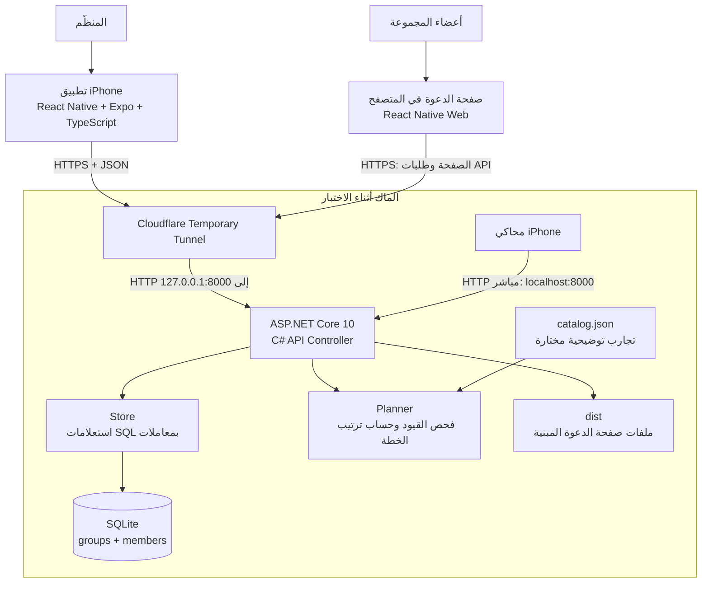
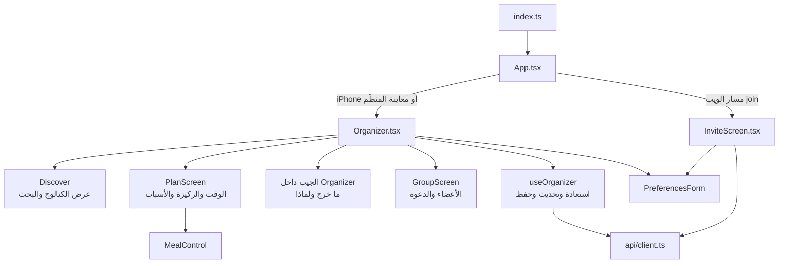
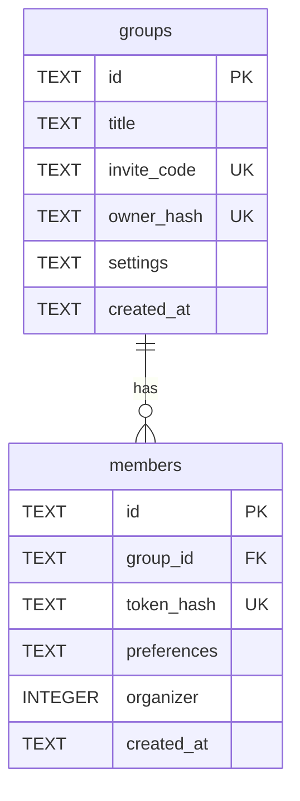
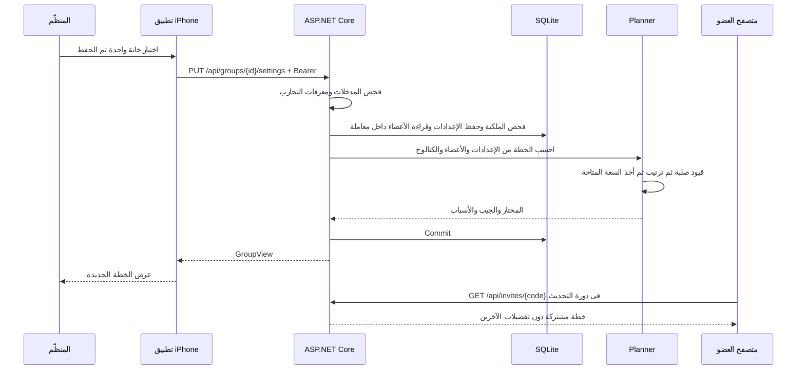
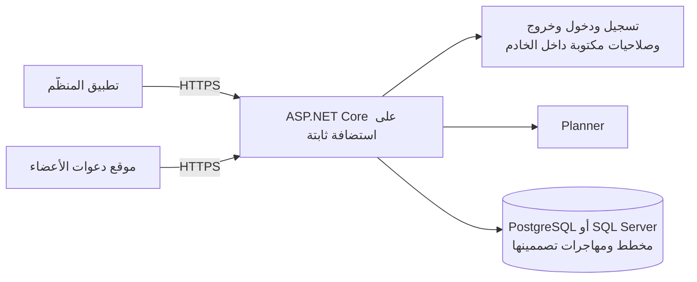

# معمارية حاتم — نسخة .NET الحالية

مرجع هذا الوصف: الفرع `codex/dotnet-backend` عند `508219d326ec2f2ec5fa8c18dba3b35d49ef5fc0`. هذا مخطط للتنفيذ الموجود، لا لخدمات مستقبلية مفترضة.

## ١. مخطط النظام

الأسهم بين الواجهات والخادم تمثل الطلبات؛ الردود تعود في الاتجاه المقابل. التطبيق الأصلي يحصل على JSON، والمتصفح يحصل أولًا على ملفات الواجهة ثم يطلب JSON. Cloudflare لا يحسب التوصيات ولا يخزن قاعدة البيانات. عمل النفق يعتمد على تشغيل الماك والخدمة والنفق.

## ٢. الطبقات ومسؤولياتها

| الطبقة | التنفيذ | المسؤولية |
|---|---|---|
| العرض | React Native، Expo 57، React Native Web، TypeScript | استقبال التفضيلات، عرض التجارب والخطة والجيب، حالات الانتظار والخطأ |
| الاتصال والحالة | `client.ts`، `storage.ts`، `useOrganizer.ts` | HTTP، حفظ مفتاح الوصول محليًا، تحديث المجموعة كل ٦ ثوانٍ |
| مدخل الخادم | `Program.cs`، `ApiController.cs` | التوجيه، قراءة JSON، التحقق من المدخلات والصلاحيات، توحيد الردود |
| قواعد المنتج | `Models.cs`، `Planner.cs` | تعريف البيانات، القيود الصلبة، البدائل المحددة، النقاط والرتب والانكماش |
| الوصول إلى البيانات | `Store.cs` + Microsoft.Data.Sqlite | استعلامات محددة المعاملات، التحقق من المفاتيح، معاملات القراءة والكتابة |
| التخزين | SQLite محلية | المجموعات والأعضاء والتفضيلات والإعدادات وبصمات المفاتيح |
| المحتوى التحريري | `catalog.json` وصور محلية | تسع تجارب وهمية ثابتة؛ ليس كتالوج مطاعم مباشرًا |
| توثيق العقد | OpenAPI → `schema.d.ts` | ربط أنواع الواجهة بعقد خادم .NET |

هذه بنية **خادم واحد منظم إلى أجزاء صغيرة (modular monolith بسيط)**. كل وحدات .NET تعمل في نفس العملية. لا توجد microservices أو queue أو Redis أو Temporal أو نموذج AI في مسار القرار. لا يوجد ORM؛ الاستعلامات مكتوبة مباشرة.

## ٣. مكونات الواجهة

`ui.tsx` يوفر النصوص والأزرار والأوراق والملاحظات والزجاج لكل الشاشات. `theme.ts` يوفر الألوان والخطوط والصور. Liquid Glass مسؤول عن المظهر على iOS المدعوم، ولا يغيّر قرار الخطة.

## ٤. أين تعيش البيانات؟

علاقة مجموعة واحدة إلى عدة أعضاء. `settings` نص JSON يحتوي الخانات والركيزة والحفظ اليدوي والتجارب المكتملة. `preferences` نص JSON يحتوي الاسم والمطابخ والحساسيات والنباتية والحرارة والميزانية وسياق الإقامة. الخطة نفسها تُحسب، ولا تُحفظ كجدول مستقل.

على الهاتف يُحفظ مفتاح المنظّم في SecureStore. في المتصفح يُحفظ مفتاح العضو في تخزين ذلك المتصفح. الخادم يحتفظ ببصمات المفاتيح. هذه مفاتيح عشوائية للوصول، ولا توجد حاليًا حسابات بكلمات مرور أو JWT.

## ٥. مثال: تقليص الخطة إلى عشاء واحد

النقاط لا تعتمد على عدد الخانات، ولذلك تقليل الوقت وحده يأخذ مقدمة نفس القائمة المرتبة. إذا كانت الركيزة ممنوعة، يظهر السبب وتُحجز خانتها بدل استبدالها تلقائيًا. كل تجربة تستخدم خانة واحدة؛ لا توجد جدولة تقويم أو حجوزات.

## ٦. حدود الوصول

| صاحب الطلب | ما يستطيع الوصول إليه؟ |
|---|---|
| حامل رمز الدعوة | أسماء الأعضاء والخطة المشتركة والانضمام ضمن حد المجموعة |
| حامل مفتاح عضو مع الدعوة | قراءة وتعديل ملف ذلك العضو |
| حامل مفتاح المنظّم | قراءة كل قيود المجموعة، تعديل ملفه والإعدادات، إزالة عضو غير المنظّم |

هذه الحدود تُفرض في API. لا يُرسل العرض العام تفضيلات الأعضاء أو تعديلاتهم الشخصية؛ يحصل على سبب تحريري وتنبيه عام للركيزة. امتلاك رابط الدعوة يتيح العرض المشترك، لذلك لا يعامل كقائمة عامة قابلة للفهرسة.

## ٧. البنية المناسبة للتسليم الأكاديمي المقترح

البنية أعلاه هي الحالية. استنادًا إلى [المتطلبات التقنية](https://hoblertonschool.notion.site/Portfolio-Project-Technical-Requirements-311204290bfc8076ac82d9867899af46) و[خطة الاجتماعات](https://hoblertonschool.notion.site/Portfolio-Project-Meetings-Plan-397204290bfc8077b41fe6333d5b9f16)، يحتاج التسليم حسابات وتسجيل دخول وخروج وقاعدة بيانات على خادم وتوثيق التصميم والتعلّم. الاقتراح التالي **لم يُنفّذ في هذه النسخة**:

لا يلزم تقسيمه إلى خدمات كثيرة. حافظي على خادم واحد، واجعلي تصميم الحسابات والمجموعات والمحتوى واضحًا، وأضيفي استضافة دائمة ونسخًا احتياطية مناسبة. النقاش التفصيلي في [متطلبات المدرسة](learning-dotnet/00-school-and-scope.md)، وشرح الملفات في [دليل تعلّم نسخة .NET](learning-dotnet/README.md).
