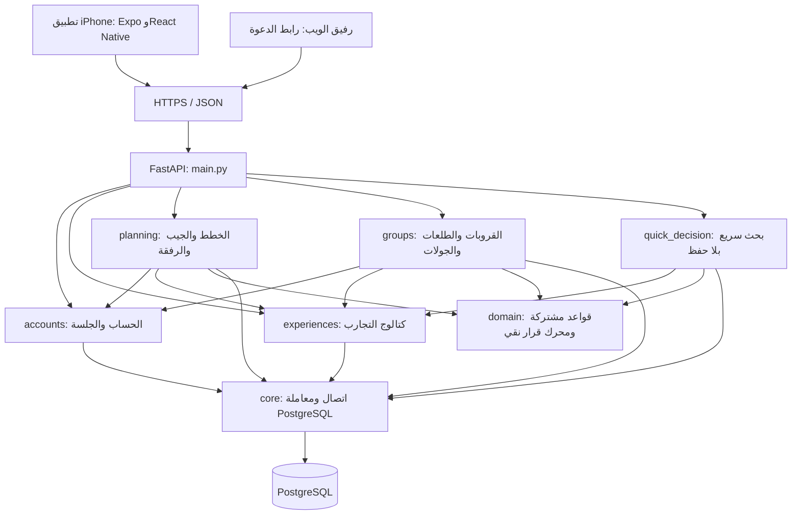
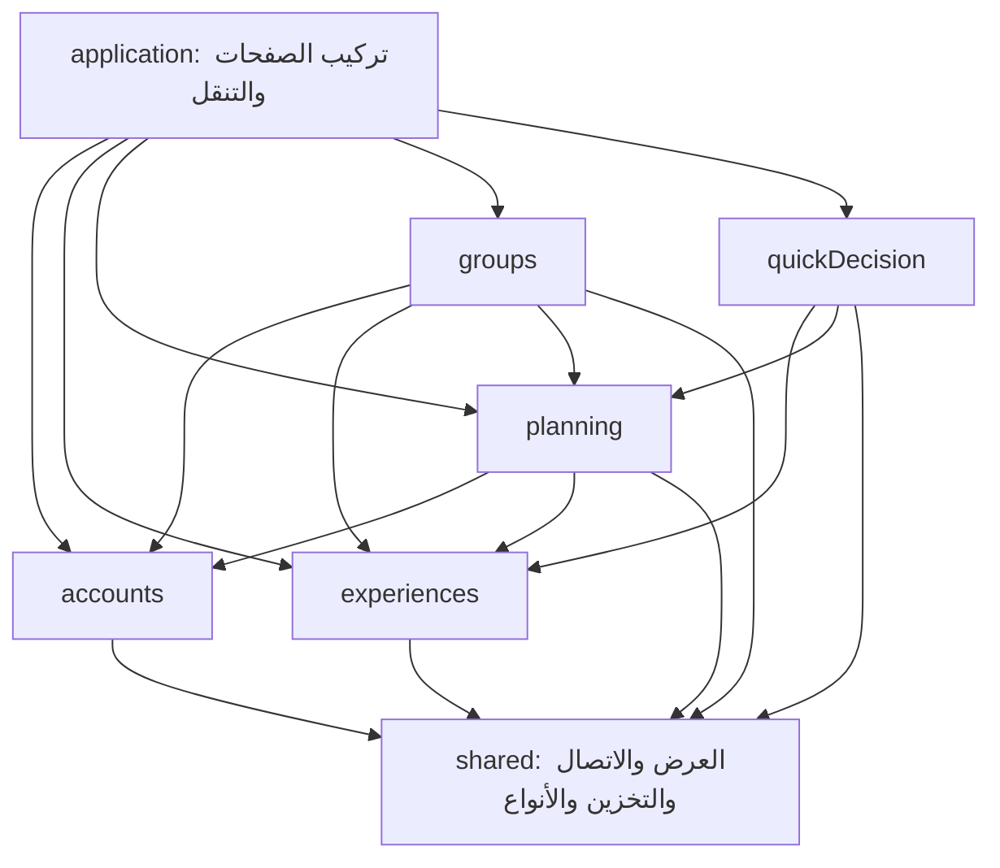

# معمارية حاتم القابلة للتوسعة

**الأساس مطبق في16سبتمبر2026، وآخر إضافة موثقة24سبتمبر2026.** التطبيق يستخدم React Native وExpo SDK57، والخادم Python/FastAPI، وقاعدة البيانات PostgreSQL. التنظيم هو **Modular Monolith**: خادم واحد، داخله وحدات واضحة حسب الميزة. إضافة ميزة تعني عادة إضافة وحدة وربطها، مع تعديل محدود في الوحدات التي تشاركها السلوك.

هذا تنظيم يساعدنا على التوسع؛ لا يجعل كل ميزة مستقبلية مجانية. الدفع مثلًا يحتاج مزودًا وصلاحيات واختبارات جديدة، والمزامنة دون اتصال تحتاج حل تعارض البيانات. نضيف تلك الأجزاء عند وجود حاجة محددة لها.

[معمارية المنتج وERD والصلاحيات](architecture-python-postgres.ar.md) · [شرح الترتيب للمبتدئة](learning-python-postgres/17-extensible-architecture.ar.md) · [عقد الخطة](api-planning.ar.md) · [عقد الحساب والقروبات](api-social.ar.md).

## الحدود التي تحمي المنتج

التجربة والخطة المتكيفة والجيب هي الأساس. فتح الاكتشاف لا يحتاج تسجيل دخول أو قروبًا. الحساب ميزة عامة، والقروبات والطلعات والتصويت إضافة اختيارية. القيود الصلبة والتفضيلات وخانات الوجبات تُحسب في محرك واحد؛ لا تنشئ كل ميزة نسخة مختلفة منه.



ملفات الويب تُخدم من FastAPI أيضًا. النفق المؤقت يمرر HTTPS إلى الخادم المحلي لاختبار الأعضاء. ملفات Docker للنشر موجودة، والاستضافة الدائمة مؤجلة حسب اختيارك. الوحدات لا تحتاج خادمًا أو حاوية لكل واحدة.

## الواجهة: التجميع ثم الميزات ثم المشترك

```text
App.tsx                              مدخل Expo؛ يعيد تصدير AppRoot
src/
  application/
    AppRoot.tsx                      الخطوط والجلسة واختيار الصفحة والدعوة
    PlannerHome.tsx                  يجمع الاكتشاف والخطة والجيب والتنقل الاختياري
    AccountPage.tsx                  يجمع الحساب وقائمة الخطط المحفوظة
  features/
    accounts/                        AccountProvider + AuthScreen + api + index
    experiences/                     Discover + ExperienceCard + api + index
    planning/                        الخطة والرفقة والدعوة وإعداد الخطة والتخزين وapi
    groups/                          القروب والطلعة والتصويت والإدارة وapi
    quickDecision/                   شاشة القرار السريع وapi وindex
  shared/
    api/http.ts                      العنوان وHTTP والمهلة وتصنيف الخطأ
    api/schema.d.ts                  عقد TypeScript مولد؛ لا يعدل يدويًا
    contracts.ts                    أسماء مختصرة لأنواع البيانات المشتركة
    preferences.ts                  قيم نموذج الذوق الفارغ
    storage.ts                      SecureStore وAsyncStorage حسب المنصة
    useRemote.ts                    القراءة والتحديث ومنع الردود القديمة
    theme.ts                        الألوان والخطوط وصور التجارب التوضيحية
    ui/                             مكونات العرض المشتركة وExpo UI والزجاج
```

اخترنا `application` للتجميع. التطبيق الحالي يدخل من `index.ts → App.tsx`، ولا يستخدم Expo Router؛ لم نضع شاشات عادية في `src/app` التي تكتشفها أدوات Expo كمجلد مسارات.

كل ميزة لها `index.ts` يعلن ما تسمح باستعماله من الخارج. مثلًا الصفحة العليا تستورد `PlanScreen` من `features/planning`، لا من ملفها الداخلي مباشرة. داخل الميزة يمكن للملفات استيراد بعضها مباشرة. لا تستورد الميزة من `application`؛ تستقبل التنقل أو الإجراء كدالة عبر props.



السهم يعني «يستورد من». `shared` لا يعرف أي ميزة أو صفحة تطبيق. الحسابات والتجارب لا تستوردان التخطيط أو القروبات. القروبات تستعمل عرض الخطة والدعوة القديمة من واجهة التخطيط العامة. عند إضافة صفحة تجمع ميزتين، تكون في `application`، مثل `AccountPage`، بدل خلق اعتماد متبادل بين الميزتين.

حالة الحقول والنافذة المفتوحة تبقى محلية. حالة الحساب المشتركة في `AccountProvider`. `useOrganizer` يدير اختيار الخطة وحفظها وتحديثها. PostgreSQL هو المصدر الدائم للحقيقة؛ التخزين المحلي يحفظ مفاتيح الوصول والاختيار بالآلية السابقة. المكونات المشتركة لا تجري طلبات API من تلقاء نفسها.

## الخادم: مسؤولية كل مجلد

إضافة الشخصيات24سبتمبر2026 تبقى داخل groups: المجلد `src/features/groups/skins` يضم `catalog.ts` لأسماء وعبارات وألوان الشخصيات، `SkinAvatar.tsx` لطبقات SVG، `SkinEditor.tsx` لمسودة التعديل وحفظها، و`SkinPeople.tsx` لعرض الحاضرين في الخطة والاختيار. CircleScreen وOutingScreen يملكان الاتصال عبر groups/api.ts. هذه رسومات ومعانٍ خاصة بالقروبات؛ لم ننقلها إلى shared ولم نضف اعتمادًا بين ميزتين في architecture.json.

في الخادم، `features/groups/skins.py` يملك مساري تعديل الشخصية مع نماذجهما في models.py. domain.py يحسب الشخصية المعروضة، وoutings.py يلتقط شكلها عند الإغلاق. وحدة groups تملك أعمدة skin وskin_override وskin_snapshot المضافة في الترحيل005؛ نفس ترتيب الأقفال circle ثم outing، والتعديل التجميلي لا يستدعي invalidate. [التفاصيل والعقد والاختبارات](learning-python-postgres/19-outing-skins.ar.md).

```text
backend/hatim/
  main.py                            تشغيل وربط routers وأخطاء وملفات الويب وhealth
  core/
    db.py                            connect/initialize/digest ومعاملات وترحيلات
    models.py                        Model وErrorResponse وTitleChange وAcknowledged
    middleware.py                    سياسة الردود وحد الطلب
  domain/
    models.py                        Preferences وExperience وSettings وPlan
    planner.py                       build_plan وevaluate؛ لا HTTP ولا SQL
  features/
    accounts/
      __init__.py                    router وUser وAccount ودوال التحقق العامة
      access.py                      التحقق من الجلسة وملكية الحساب
      models.py                      عقود التسجيل والحساب والجلسة
      router.py                      التسجيل والدخول والخروج والاسم
    experiences/
      __init__.py                    router وcatalog كواجهة عامة
      router.py                      مسارا الكتالوج الحاليان
      repository.py                  SELECT من experiences ضمن معاملة المستدعي
      fixtures.py                    بيانات مرجعية للاختبارات والمستورد السابق
    quick_decision/
      __init__.py                    router العامة
      models.py                      QuickRequest وQuickResult
      router.py                      معاملة كتالوج للقراءة فقط
      service.py                     تصفية الوقت والحي ثم محرك القرار القائم
    planning/
      __init__.py                    router كواجهة عامة
      router.py                      عقد HTTP وقراءة المدخلات وتفويض العملية
      service.py                     إنشاء/قراءة/إدارة الخطة والدعوات ومعاملاتها
      models.py                      نماذج الخطة المباشرة والطلب والرد
    groups/
      __init__.py                    يجمع routers الداخلية ويصدر router واحدة
      circles.py                     القروب والعضوية والملكية
      outings.py                     الحضور والقائد والخطة والأرشيف والمزاح
      rounds.py                      التصويت والقرعة والحسم
      skins.py                       تعديل شكل العضو نفسه في القروب أو الطلعة
      domain.py                      الصلاحيات والاستعلامات وبناء الردود الداخلية
      models.py                      نماذج القروب والطلعة والجولة
  integrations/legacy_plans.py        التحويل الصريح من خطة ضيف إلى قروب دائم
  export_openapi.py                   توليد العقد دون تشغيل DB
  import_sqlite.py                    أداة استيراد تاريخية؛ ليست قاعدة التشغيل
backend/migrations/                  SQL مرقم ببصمات؛ القديم لا يعاد تحريره
```

`domain/planner.py` نقي: تدخل التجارب والأشخاص والإعدادات وتخرج خطة. يمكن اختباره دون شبكة أو قاعدة. أما `features/groups/domain.py` فهو مساعد داخلي للقروبات ويحتوي SQL وصلاحيات؛ كلمة domain في اسمه القديم لا تعني أنه مستقل عن قاعدة البيانات.

لا نفرض ملفات `service` و`repository` فارغة في كل ميزة. مسار بسيط يمكن أن يبقى داخل router، كما في الحسابات الحالية. عند نمو حالة استخدام، نفصلها داخل الميزة. فصلنا خدمة الخطط لأن منطقها كان مختلطًا بتشغيل الخادم في `main.py`. الواجهات العامة وحدود الاستيراد هي القاعدة الثابتة، وعدد الملفات يتبع الحاجة.

## ملكية البيانات والمعاملات

| المالك | الجداول التي يغيرها |
|---|---|
| accounts | accounts، account_sessions، auth_attempts |
| experiences | experiences؛ البذر002 وصفات الكتالوج الوهمي004 |
| quick_decision | لا جداول مملوكة؛ معاملة قراءة كتالوج فقط |
| planning | groups، members؛ الاسمان تاريخيان للخطة المباشرة ورفقتها |
| groups | circles، circle_members، outings، outing_participants، decision_rounds، round_options، votes، outing_fun_cards |
| core/db | schema_migrations وتطبيق الترحيلات |

تستدعي الخطط `accounts.session_owns(db, account_id, token_hash)` للتحقق داخل نفس معاملة التعديل، بدل معرفة تفاصيل جدول الجلسات. يقرأ التخطيط والقروبات التجارب بواسطة `experiences.catalog(db)`. لا يفتح الكتالوج اتصالًا جديدًا في وسط معاملة القائد.

الاستثناء المقصود هو `integrations/legacy_plans.py`: تحويل بيانات الضيف القديمة إلى قروب دائم يجب أن يقرأ جداول الطرفين ويكتبها ذريًا. جُمعت عملية التحويل وفحص منع تعديل الخطة المحوّلة هنا؛ تستدعيها الوحدتان داخل معاملتهما. هذا جسر توافق قائم، وليس مكانًا عامًا تضعين فيه أي ميزة جديدة.

تبقى أقفال الكتابة كما كانت: القروب ثم الطلعة ثم الجولة. عملية التحويل تبدأ بقفل الخطة القديمة. التحقق والتعديل وبناء الرد يحدث في معاملة واحدة حيث كان كذلك سابقًا. لا تفصلي التصويت وحفظ الركيزة إلى عمليتين مستقلتين؛ ذلك قد يظهر نتيجة تصويت لا تطابق الخطة.

## العقود والتوافق

مصدر عقد API هو نماذج ومسارات FastAPI. `npm run types:api` يولّد [OpenAPI](../backend/openapi.json) ثم [أنواع الواجهة](../src/shared/api/schema.d.ts). كل `api.ts` خاص بميزة يمر عبر `shared/api/http.ts`، ويستورد الأنواع المولدة.

في هذه الإعادة بقيت جميع المسارات والحقول وoperation IDs كما هي؛ تمت مقارنة العقد كاملًا مع النسخة94f2277 ونجحت المقارنة. لم يتغير ERD، ولم نضف ترحيلًا أو نعيد تسمية جدول. مفاتيح التخزين والدعوات والجلسات الحالية بقيت كما هي. اختلاف ترتيب أقسام الملفات المولدة لا يغير العقد.

عند تعديل API مستقبلًا، تذكري أن نسخة iPhone المثبتة قد تكون أقدم من الخادم: إضافة حقل اختياري تختلف عن حذف حقل مطلوب. التغيير غير المتوافق يحتاج خطة انتقال أو إصدار مسار، لا مجرد تعديل TypeScript في جهاز التطوير.

## كيف نضيف ميزة جديدة؟

مثال **تقييم تجربة** للتخطيط فقط؛ لم نضف تقييمات أو جدول reviews الآن.

1. اكتبي سلوكًا قابلًا للاختبار: من يقيّم؟ هل يلزم إكمال التجربة؟ هل يسمح بتعديل التقييم؟ من يراه؟ لا تختاري الملفات قبل الإجابة.
2. أنشئي `backend/hatim/features/reviews/` مع نماذج الطلب والرد وrouter. أضيفي خدمة أو مستودعًا عندما يحتاج المنطق ذلك. استعملي حساب المستخدم من واجهة accounts العامة، وتحققي من أهلية التجربة في الخادم.
3. إذا احتجتِ بيانات جديدة، أضيفي الترحيل التالي برقم غير مستخدم. ضعي مفاتيح أجنبية وقيودًا مثل تقييم واحد لكل حساب وتجربة إذا كان هذا شرط المنتج. حدّثي ERD، واختبري نجاح الترحيل على بيانات قديمة.
4. صدّري `router` من `__init__.py` وسجليها صراحة في `main.py`. لا تحتاجين نظام plugins أو تحميل ملفات ديناميكي.
5. شغلي `npm run types:api`. أنشئي `src/features/reviews/` وفيه api ومكونات/شاشة و`index.ts`. أدوات HTTP والأزرار موجودة في shared. اعرضي المدخل من صفحة التجميع المناسبة في application.
6. أضيفي reviews إلى `architecture.json` مع الاعتمادات الضرورية فقط. إذا احتاجت ميزة معلومة من أخرى، أضيفي دالة عامة صغيرة أو بيانات تمرر من صفحة التجميع؛ لا تستوردي ملف الخدمة الداخلي. احذري اعتماد reviews على planning ثم planning على reviews.
7. اختبري النجاح، رفض غير المخول، المدخلات، التكرار والتزامن إن كانا مؤثرين، وفشل الشبكة. حدّثي شرح الميزة والمعمارية والعقد وERD عند تغيره في نفس التغيير.

قد تتطلب الميزة تعديل ملفات موجودة: مدخل التنقل، router registration، عقد مشترك أو دالة أهلية جديدة. الهدف أن تكون هذه التعديلات محددة ومفهومة، لا أن نعد بعدم لمس أي ملف موجود.

| إضافة مستقبلية محتملة | مكانها ونقطة التكامل |
|---|---|
| تقييمات | وحدة reviews، حساب، تجربة، جدول مستقل بحسب قواعد المنتج |
| تذكيرات داخل التطبيق | وحدة notifications؛ وقت وحالة قراءة ومستلم، مع تحقق الخصوصية |
| إشعارات Push موثوقة | notifications + مزود خارجي؛ عند الحاجة نضيف outbox وعامل معالجة وإعادة محاولة بعد نجاح المعاملة |
| حجز أو دفع | وحدة bookings/payments وقواعد إلغاء ومنع تنفيذ الطلب مرتين؛ لا تنفذ اتصال الدفع داخل قفل جولة التصويت |
| تعديل معادلة التفضيل | domain/planner مع اختبارات قيود وثبات ترتيب؛ غالبًا لا يحتاج ميزة كاملة |
| شاشة إدارة تحريرية | واجهة ومسارات بصلاحية محرر داخل experiences، لا تعديل JSON مباشرة من الهاتف |

الأمثلة الأخيرة مسارات توسعة وليست ميزات منفذة أو التزامًا بإضافتها الآن.

## كيف نحافظ على الحدود؟

[architecture.json](../architecture.json) يحدد اعتماد الميزات المسموح في كل طرف. `npm run check:architecture` يشغّل فحص TypeScript بواسطة المحلل اللغوي، وفحص Python بواسطة AST. يمنعان الاستيراد المعاكس والمرور إلى داخل ميزة أخرى والدورات. يفحص اختبار آخر تطابق OpenAPI المنشور مع المسارات المسجلة. الأمر داخل `npm run check` أيضًا.

هذه فحوص للشفرة واستيراداتها، وليست تدقيقًا لكل استعلام SQL أو بديلًا لاختبارات الصلاحيات والتزامن. ملكية الجداول ومبررات أي تكامل بين وحدتين جزء من مراجعة التغيير. تسجيل ميزة جديدة في JSON لا يثبت صحة سلوكها.

نتيجة التحقق من إعادة الهيكلة: 255 اختبار Python، و11 رحلة Playwright على PostgreSQL في مخططات معزولة، وتوليد الأنواع وفحص TypeScript. فحصا الحدود رفضا عمدًا استيرادًا مخالفًا تجريبيًا في كل طرف، ثم أزيل المثالان. نجح بناء Release وفحص المسار الأساسي على محاكيiPhone17Pro، وبناء Docker وتشغيله مع PostgreSQL منفصلة؛ [تفاصيل التحقق](learning-python-postgres/17-extensible-architecture.ar.md).

## خريطة الانتقال للقارئة

| المكان السابق | المكان الحالي |
|---|---|
| src/screens/Organizer.tsx | application/PlannerHome + planning/PlanSetupContent + planning/PlanExperienceContent + shared/ui/Logo |
| src/account/AccountScreen.tsx | application/AccountPage؛ يجمع الحساب والخطط |
| src/account/AccountProvider.tsx وsocial/AuthScreen | features/accounts |
| src/screens/Discover وcomponents/ExperienceCard | features/experiences |
| src/screens/PlanScreen وGroupScreen وInviteScreen وuseOrganizer | features/planning |
| src/social/ شاشات القروبات | features/groups |
| src/api/client.ts | planning/api + experiences/api + shared/api/http + shared/contracts + shared/preferences |
| src/social/client.ts | accounts/api + groups/api؛ الكتالوج في experiences/api |
| src/social/ui وuseRemote | shared/ui/layout وshared/useRemote |
| src/components/ui.tsx وبقية المكونات العامة | shared/ui/primitives وبقية shared/ui |
| src/storage.ts | shared/storage للأداة وplanning/storage لمفتاح الخطة |
| backend/hatim/main.py منطق الخطط | features/planning/router وservice |
| backend/hatim/social/auth.py | features/accounts/router وaccess |
| backend/hatim/social/ بقية أعمال القروبات | features/groups؛ تحويل الضيف في integrations/legacy_plans |
| backend/hatim/models.py | domain/models + core/models + planning/models |
| backend/hatim/store.py وmiddleware.py | core/db وcore/middleware |
| backend/hatim/planner.py | domain/planner |
| backend/hatim/experience_store.py وcatalog.py | experiences/repository وexperiences/fixtures |

الدروس القديمة تحتفظ بتاريخها وروابط نسخة المصدر التي شرحتها. كتاب48 ملفًا يبقى لقطة59d45d3؛ لم نستبدل كوده بكود جديد ونبقي شرحًا قديمًا فوقه.

يعتمد تجميع الخادم على [APIRouter في توثيق FastAPI الرسمي](https://fastapi.tiangolo.com/tutorial/bigger-applications/)، والواجهة على [توثيق Expo SDK57 المحدد](https://docs.expo.dev/versions/v57.0.0/). حدود الميزات المذكورة هنا قرار لهذا المشروع وليست مجلدات يفرضها إطار العمل.

## إضافة القرار السريع وتفضيلات الطلعة —24سبتمبر2026

quickDecision يستورد عرض التجربة ونموذج سياق الطلعة من الواجهات العامة. PlannerHome يركبه مع التخطيط ويستقبل onChoose؛ لا اعتماد معاكس من planning. الخادم quick_decision يعتمد على experiences للقراءة وعلى domain للمحرك. التفضيلات الجديدة في Settings.context وExperience.outing_traits؛ لا علاقة جديدة في ERD. التفاصيل في [عقد الإضافة](api-quick-decision.ar.md) و[الفصل18](learning-python-postgres/18-quick-decision.ar.md). أضيفت الحدود المطلوبة فقط إلى architecture.json. مكوّن Sheet المشترك يقبل scrollRef اختياريًا لتعيد الصفحة التمرير للأعلى عند الانتقال من البحث إلى النتائج والتأكيد.

تحقق الإضافة:270 اختبار Python، وخمس رحلات متصفح جديدة مع نجاح الرحلات الـ11 السابقة وإعادة رحلة القروب العائلية، وفحص الحدود والأنواع، وبناء Release وفحص شاشة النتائج على المحاكي. [تفصيل التحقق وحدوده](learning-python-postgres/18-quick-decision.ar.md).
