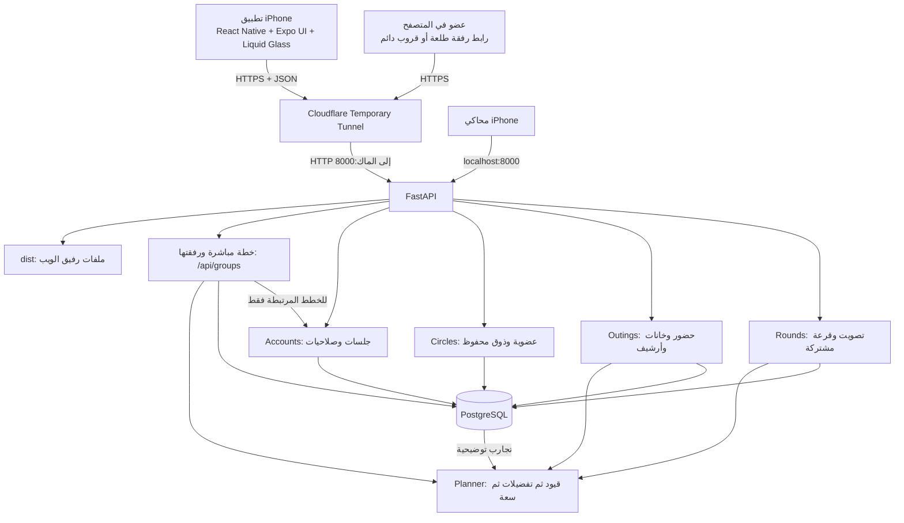
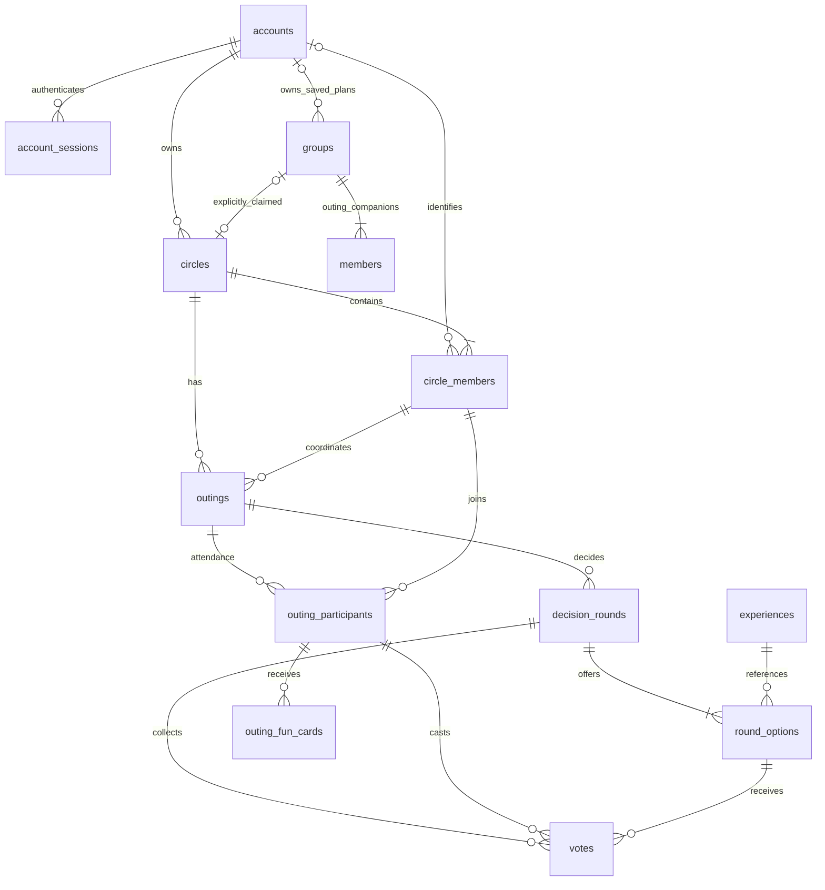
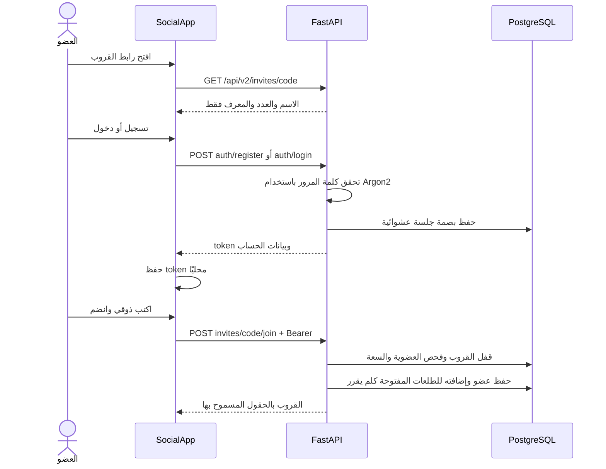
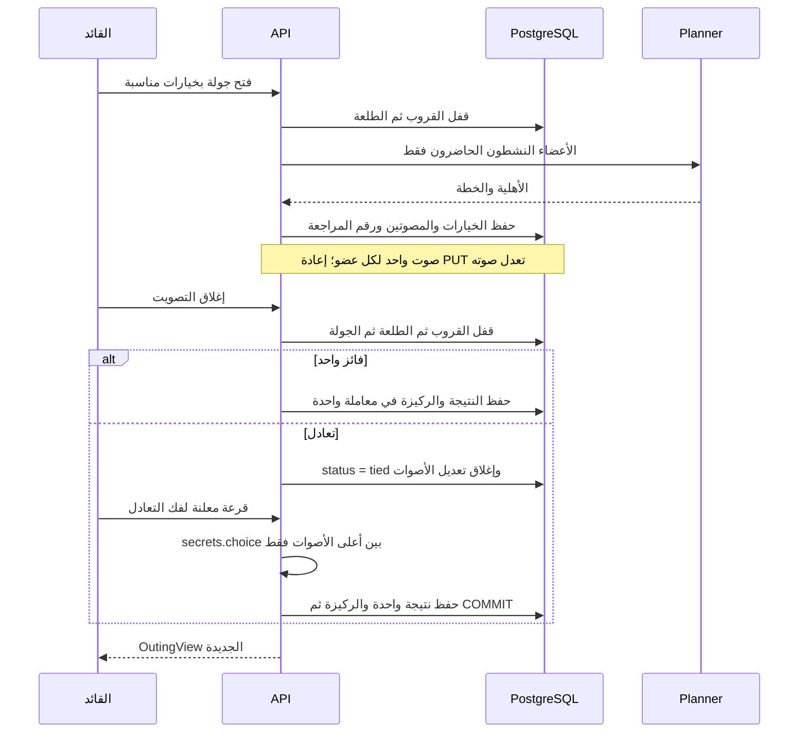

# معمارية حاتم — التجارب والخطة، والقروبات إضافة اختيارية

النسخة المنفذة على الفرع `codex/persistent-groups`، 15 سبتمبر 2026. الواجهة React Native وExpo SDK 57، والخادم Python/FastAPI، وقاعدة البيانات PostgreSQL. نسخة .NET مستقلة ولم تتغير.

[تصحيح مسار البداية](learning-python-postgres/15-experiences-first.ar.md) · [شرح إضافة القروبات](learning-python-postgres/13-social-groups.ar.md) · [API القروبات](api-social.ar.md) · [API الخطة المباشرة](api-planning.ar.md) · [معمارية النسخة السابقة 59d45d3](architecture-python-postgres-v1.ar.md) · [النقاش الأصلي](proposals/persistent-groups.ar.md).

## الفكرة التي انعكست على المعمارية

وحدة المنتج هي التجربة، ووظيفته اتخاذ قرار يتكيف مع خانات الوجبات والذوق والقيود. يبدأ الهاتف بالاكتشاف، ثم الخطة والجيب. يمكن التخطيط ودعوة رفقة الطلعة دون حساب أو قروب دائم.

«حسابي» مدخل مستقل من أعلى الرئيسية للتسجيل والدخول والخروج واسم الحساب والخطط المحفوظة. يمكن إنشاء أكثر من خطة واستعادتها من جهاز آخر، أو حفظ خطة الجهاز صراحة دون تحويلها إلى قروب دائم. [مراجعة المدرسة الحالية](school-readiness.ar.md) و[الفصل16](learning-python-postgres/16-accounts-and-school.ar.md) يشرحان هذه الإضافة وحدودها.

القروبات إضافة اختيارية لحفظ الرفقة والتفضيلات والتصويت في طلعات متكررة. القروب علاقة دائمة بين أشخاص؛ الطلعة قرار له حضور وخانات وإعدادات مستقلة. حساب واحد يستطيع الانضمام إلى قروبات متعددة. الذوق محفوظ لكل عضوية، والحضور والميزانية المؤقتة محفوظان لكل طلعة. التصويت والقرعة يحسمان الركيزة فقط، ثم يرتب محرك القرار باقي التجارب.



هذا خادم واحد مقسم إلى وحدات، وليس خدمات مستقلة. لا Redis أو queues أو WebSockets. `psycopg` ينفذ SQL بمعاملات، وPydantic يتحقق من المدخلات. المحرك دالة Python عادية لا يتصل بقاعدة البيانات ولا يستخدم نموذج ذكاء اصطناعي. النفق ينشر HTTP فقط، ولا ينشر منفذ PostgreSQL.

## هيكلة الملفات

```text
App.tsx                         الاكتشاف أولًا، ثم الحساب أو القروبات عند اختيارهما، أو الدعوة
src/
  account/AccountProvider.tsx  جلسة واحدة مشتركة للتطبيق واستعادتها وإلغاؤها
  account/AccountScreen.tsx    الدخول والحساب والخطط المحفوظة والحفظ الصريح لخطة الجهاز
  screens/Organizer.tsx        الاكتشاف والخطة والجيب ورفقة الطلعة والتخصيص
  screens/Discover.tsx         التجارب والبحث والتصنيفات قبل إنشاء خطة
  screens/GroupScreen.tsx      رفقة الطلعة الحالية ودعوة دون حساب
  useOrganizer.ts             مفتاح الخطة المباشرة وحفظها واستعادتها
  social/
    SocialApp.tsx               التنقل والدعوة وربط القروب السابق، ويستهلك الجلسة المشتركة
    AuthScreen.tsx              التسجيل والدخول
    GroupsScreen.tsx            لَمّاتي والتثبيت والإنشاء
    CircleScreen.tsx            الأعضاء والذوق والدعوة والطلعات والملكية
    OutingScreen.tsx            خطة الطلعة والحضور والميزانية والجيب والمزاح
    OutingManagement.tsx        أسماء المالك والقائد وتعيينه والطرد وشروط الإجراءات
    RoundPanel.tsx              التصويت والتعادل والقرعة والنتيجة المشتركة
    useRemote.ts               القراءة الدورية وحفظ التغييرات وحارس الردود القديمة
    client.ts                  طلبات /api/v2 وأنواعها المولدة
    ui.tsx                     حاوية الصفحة والنماذج والتأكيد والأخطاء
  api/client.ts                HTTP المشترك والعناوين وطلبات الخطة المباشرة
  api/schema.d.ts              عقد TypeScript مولد من OpenAPI
  storage.ts                   SecureStore للهاتف وتخزين المتصفح للويب
  screens/PlanScreen.tsx       مكون الخطة المشترك، ويدعم العرض دون تعديل
  components/                 الأزرار والبطاقات والتفضيلات والزجاج وExpo UI
backend/
  hatim/social/
    models.py                  نماذج الحساب والقروب والطلعة والجولة
    auth.py                    Argon2 والجلسات وحد المحاولات
    circles.py                 القروبات والعضوية والربط السابق
    outings.py                 الحضور والإعدادات والقائد والأرشيف والمزاح
    rounds.py                  إنشاء جولة وصوت واحد والحسم الذري
    domain.py                  الصلاحيات والاستعلامات وبناء الرد والخصوصية
  hatim/main.py                الخطة المباشرة وتركيب مسارات الإضافة وملفات الويب
  hatim/planner.py             محرك القرار السابق المعاد استخدامه
  hatim/store.py               PostgreSQL ومعاملات وترحيلات ببصمات
  hatim/experience_store.py    قراءة الكتالوج من PostgreSQL لجميع المسارات
  migrations/003_account_plans.sql  ربط اختياري للخطة المباشرة بالحساب وفهرس لقائمتها
  migrations/002_social_groups.sql  جداول الإضافة وبذر تسع تجارب توضيحية
  tests/test_social.py        اختبارات سلوك الإضافة على PostgreSQL حقيقية
  tests/test_account_plans.py الحساب وخططه وعزلها ونقل الضيف وCRUD والكتالوج والتزامن
tests/account-plans.spec.ts   دخول وحفظ واستعادة من متصفح جديد وإدارة الخطة والأخطاء
scripts/e2e-server.py         خادم فحص مستقل بمخطط PostgreSQL مؤقت وتنظيف عند الإيقاف
Dockerfile                   بناء web ثم حاوية Python دون أدوات تطوير أو بيانات خاصة
deploy/                      إعداد نشر الحاوية مع PostgreSQL خارجية وعنوان HTTPS من الاستضافة
```

الواجهة الافتراضية للهاتف هي `Organizer` وتبدأ بـ«اكتشف» حتى دون حساب أو خطة. «قروباتي» يفتح `SocialApp` اختياريًا؛ الرجوع يستعيد الخطة المباشرة المحفوظة. على الويب يبقى `/join/code` للدعوة حسب نوعها، والجذر لمدخل الرفيق، و`?preview=organizer` لمعاينة واجهة الهاتف؛ `?preview=legacy` اسم بديل للمعاينة نفسها. اكتشاف التجارب لا يتطلب إنشاء قروب وطلعة.

المسار الأساسي: اكتشاف ← اختيار تجربة أو بدء خطة ← ذوق وقيود وخانات ← خطة بأسباب واضحة ← تقليص الوقت والجيب. الدعوة لرفقة الطلعة والقروبات الدائمة خياران إضافيان. يحفظ POST /api/groups الإعدادات والتفضيلات معًا في معاملة واحدة. عند غياب اختيار الركيزة ترسل الواجهة anchor_id=null؛ يبقى API متوافقًا مع العملاء السابقين. فشل استعادة خطة محفوظة يتيح إعادة المحاولة، ويمنع إنشاء خطة فوق مفتاحها دون استعادتها.

تصحيح البداية موثق في [الفصل١٥](learning-python-postgres/15-experiences-first.ar.md)، مع مخطط التدفق وحدود الاختبارات. لم يتغير محرك القرار ولا مخطط قاعدة البيانات بسبب تغيير نقطة الدخول.

التحقق من هذا التصحيح:٢٤٢ اختبار Python وثماني رحلات متصفح، وبناء Release وتشغيله على iPhone17Pro للتحقق من الاكتشاف واستعادة الخطة والدخول الاختياري للقروبات والرجوع منها.

## قاعدة البيانات والعلاقات



| الجدول | البيانات والمسؤولية |
|---|---|
| `accounts` | معرف عشوائي، اسم مستخدم فريد بالأحرف الصغيرة، اسم العرض، بصمة كلمة المرور Argon2 |
| `account_sessions` | بصمة مفتاح جلسة، الحساب، انتهاء بعد ٣٠ يومًا |
| `auth_attempts` | عدادات محاولات الدخول والتسجيل ونهاية نافذة عشر دقائق |
| `circles` | اسم القروب، مالكه، رمز الدعوة، حالة الأرشفة، رابط اختياري بالقروب القديم |
| `circle_members` | الحساب أو العضو القديم غير المرتبط بعد، التفضيلات JSONB، الحالة، التثبيت الشخصي، الاشتراك بالمزاح |
| `outings` | القروب والقائد والعنوان والخانات والركيزة والجيب والمكتمل ضمن Settings، رقم مراجعة، لقطة الخطة عند الإغلاق |
| `outing_participants` | عضوية داخل طلعة: حاضر/لم يقرر/معتذر، ميزانية اختيارية، ولقطة الذوق عند الإغلاق |
| `experiences` | معرف تجربة وبقية محتواها JSONB؛ بُذرت نفس التجارب التسع الوهمية في الترحيل |
| `decision_rounds` | الطلعة، نوع الجولة وحالتها، قائمة المصوتين وقت الفتح، المراجعة، النتيجة وطريقة حسمها |
| `round_options` | تجارب الجولة وترتيب عرضها |
| `votes` | صوت عضو واحد في جولة واحدة واختياره؛ المفتاح المركب يمنع التكرار |
| `outing_fun_cards` | المستهدف والمرسل والطلعة ووقت نهاية البطاقة وحالة إغلاقها |
| `groups` و`members` | الخطة المباشرة ورفقتها؛ owner_account_id اختياري: null للضيف، وإلا جلسة الحساب المالك تدير الخطة. لا تتطلب circle |
| `schema_migrations` | أسماء الترحيلات وبصماتها وتواريخ تطبيقها |

المجموع ١٥ جدولًا، منها ١٢ أضيفت في الترحيل الثاني. الترحيل003 يضيف إلى groups عمود owner_account_id بمفتاح أجنبي إلى accounts وفهرس جزئي لترتيب خطط الحساب؛ لا ينقل بيانات الضيف آليًا. التسمية circles تميز القروبات الدائمة عن جدول groups للخطة المباشرة، بينما اسم القروبات في API هو /api/v2/groups والخطط /api/groups. لم تتغير ملفات الترحيل001 و002.

`UNIQUE(circle_id, account_id)` يمنع انضمام الحساب مرتين. المفاتيح الأجنبية المركبة تمنع مشاركة عضو في طلعة لقروب آخر، أو صوت لتجربة خارج الجولة. فهرس جزئي يسمح بجولة واحدة حالتها open/tied/resolved لكل طلعة. النتائج السابقة تبقى كسجلات invalidated عند الاستبدال؛ API تعرض أحدث جولة فقط، وليس متصفحًا كاملًا للتاريخ.

## الحساب والدعوة



الحساب يستعيد القروبات وخططه المباشرة من جهاز جديد بعد تسجيل الدخول. كلمات المرور لا تحفظ كنص؛ الجلسة ليست JWT، بل قيمة عشوائية لا تُخزن خامًا في DB. الخروج يحذف بصمة الجلسة الحالية، ولا يمحو الخطط أو يلغي جلسات الأجهزة الأخرى. لا توجد استعادة كلمة مرور أو تحقق بريد في هذه النسخة.

AccountProvider يحفظ الجلسة تحت hatim.account.v1 ويشاركها بين Organizer وSocialApp وAccountScreen. الخطة المختارة للحساب تحت hatim.plan.ACCOUNT_ID تحتوي المعرف فقط أو new لبداية جديدة؛ مفتاح الضيف السابق تحت hatim.organizer.v1 منفصل. فشل503 لا يمسح الدخول. خطة الحساب لا تظهر بعد الخروج، ولا يصح استخدام capability قديمة للوصول إليها.

الحفظ الصريح لخطة الضيف يحتاج الحساب ومفتاح الضيف معًا. يقفل الخادم صف الخطة، يربطها بالمالك، ويستبدل بصمة المفتاح القديم. لا يتغير معرف الخطة أو الدعوة أو الذوق والجيب. يقبل إعادة الطلب لنفس الحساب دون إنشاء نسخة ثانية. طلبا ربط لحسابين مختلفين ينتج عنهما مالك واحد فقط. تعديل Settings يرسل expected اختياريًا للتوافق؛ الواجهة الحالية ترسله دائمًا، ويرفض الخادم409 عند تغير الإعدادات منذ القراءة.

حد التسجيل ١٠ محاولات للاسم و٦٠ إجمالًا خلال عشر دقائق؛ الدخول ١٠ للاسم و١٢٠ إجمالًا. هذا حد لخدمة الاختبار الصغيرة، وليس نظام حماية موزعًا. يبقى العداد محفوظًا حتى عندما يفشل الطلب، لأنه يُكتب في معاملة منفصلة.

## الصلاحيات والخصوصية

| الإجراء | المالك | قائد هذه الطلعة | العضو |
|---|---|---|---|
| إنشاء طلعة | نعم | نعم | نعم، إن كانت عضويته نشطة |
| تعديل الخطة أو فتح وحسم الجولة | نعم | نعم | لا |
| تعيين قائد هذه الطلعة | نعم | نعم؛ يفقد دور القائد بعد نقله | لا |
| نقل ملكية القروب وإزالة/إعادة عضو | نعم | لا | لا |
| تعديل ذوقه وحضوره | نعم | نعم | نعم |
| تعديل ذوق شخص آخر | لا | لا | لا |
| التصويت | إذا ضمن الحاضرين عند فتح الجولة | نفس الشرط | نفس الشرط |
| مشاهدة ذوق الآخرين التفصيلي | داخل القروب | داخل طلعته | ذوقه فقط |
| المزاح | باشتراك الطرفين وحضورهما | نفس الشرط | نفس الشرط |

اختيار قائد الطلعة متاح وقت إنشائها؛ إن لم يُحدد يستعمل المنشئ. يستطيع المالك أو القائد الحالي تغييره إلى أي عضو نشط مرتبط بحساب في نفس القروب، دون اشتراط حضوره أو تغييره تلقائيًا. أسماء المالك والقائد تظهر في أعلى الطلعة، وزر «إدارة الطلعة والطرد» متاح للجميع مع أسباب تعطيل الإجراءات غير المسموحة.

الصلاحيات تُفحص في الخادم على كل طلب؛ إخفاء الزر مجرد تحسين للواجهة. رابط الدعوة الجديد يكشف اسم القروب وعدد أعضائه فقط. الردود للأعضاء الآخرين تزيل adaptations وتعمم الأسباب التي تكشف القيود الشخصية. مالك القروب يملك حق مراجعة التفضيلات، وقائد الطلعة يراجع تفضيلات مشاركيها.

## الحضور والقرار والتزامن



كل حاضر يحتاج حسابًا مرتبطًا قبل فتح الجولة. لا نصوّت على تجربة غير مناسبة، ولا على مكتمل أو محفوظ يدويًا في الجيب. من ١ إلى ٥ خيارات؛ القرعة المباشرة فرصها متساوية. الخيار الوحيد يعتمد بوضوح. لا أصوات يعني لا فائز؛ لا يحوّلها الخادم إلى قرعة خفية. للقائد إغلاق الجولة بعد مشاركة بعض المصوتين، ويظهر العدد قبل التأكيد.

ترتيب القفل ثابت: قروب ثم طلعة ثم جولة. طلبا القرعة المتزامنان لا يسحبان نتيجتين؛ الثاني يقرأ النتيجة المحفوظة. لا تنفذ حركة الشاشة الاختيار. القراءة المتسقة تستخدم REPEATABLE READ، وحد العضوية ١٢ يُفحص داخل قفل القروب.

تغيير الحضور أو ميزانية حاضر أو تفضيلاته أو إزالة حاضر يبطل صلاحية الجولة ويرفع `planning_revision`. تعديل الركيزة/الجيب/المكتمل يعيد المراجعة أيضًا. تغيّر عدد الخانات وحده يحافظ على النتيجة. تبقى الركيزة السابقة مع تحذير إذا تعارضت؛ لا يستبدلها النظام بصمت.

حفظ Settings يرسل `{settings, expected}`. يقارن الخادم `expected` مع الإعدادات الفعلية تحت القفل؛ إذا تغيرت من جهاز آخر يرجع 409 بدل مسح اختيار جديد بإعدادات قديمة. العميل يحدث القراءة كل ٦ ثوانٍ ويمنع استبدال نتيجة الحفظ برد GET بدأ قبلها.

## الأرشيف والمزاح ونقل البيانات

إنهاء الطلعة يحفظ لقطة الخطة والتفضيلات، ويقفل الكتابة والتصويت. تغيير الأذواق لاحقًا لا يعيد حساب خطتها. أرشفة القروب تتطلب إغلاق طلعاته المفتوحة. الإزالة الحقيقية توقف الوصول وتستبعد العضو من الطلعات المفتوحة؛ يمكن للمالك إعادته، فيحتاج تأكيد حضوره مجددًا. الماضي يبقى محفوظًا.

بطاقة «مقعد الاحتياط» تحتاج اشتراك المرسل والمستهدف في المزاح وحضورهما. لكل مستهدف بطاقة واحدة في الطلعة، تنتهي بعد ٣٠ ثانية، ويقدر يقفلها فورًا. لا تكتب إلى الأصوات أو التفضيلات أو العضوية.

الترحيل 002 إضافي ولا يمس بيانات `groups/members`. من لديه مفتاح المنظم السابق يرى «اربط قروبي السابق بحسابي». الربط داخل معاملة ينسخ آخر حالة القروب إلى circle وطلعة أولى، ويبقي معرفات الأعضاء والذوق والجيب والمكتمل. يتوقف تعديل القروب القديم بعد ربطه. الرابط نفسه ينتقل إلى v2؛ العضو الذي يحتفظ بمفتاحه القديم يستطيع ربط عضويته بحسابه، ولا يخترع النظام كلمة مرور له. فقدان المفتاح القديم لا يمنح حق انتحال ذلك العضو.

## التشغيل وحدود التنفيذ

PostgreSQL محليًا داخل Docker بقرص دائم. FastAPI وdist على الماك، وCloudflare المؤقت لا يعمل عند توقف الخدمات. رابط النفق يدخل بناء iPhone الحقيقي، بينما المحاكي يصل إلى localhost. تفاصيل الأوامر والنسخ الاحتياطية في [README](../README.md).

ملفات نشر إضافية جاهزة دون اختيار مزود: Dockerfile يبني dist ويضعه مع API في حاوية Python تعمل بمستخدم غير root، وdeploy/compose.yaml يربطها بقاعدة خارجية عبر DATABASE_URL. [دليل النشر](deployment.ar.md) يشرح HTTPS ونسخ DB والبناء للآيفون. لم تُنشر خدمة دائمة بهذه الملفات بعد؛ هذا مؤجل باختيار صاحبة المشروع.

تحقق إضافة الحساب والخطط:253 اختبار Python و11 رحلة متصفح، وتشغيل حاوية النشر مع PostgreSQL مؤقتة، وبناء Release وفحص الحساب وإدارة الخطة وإلغاء الحذف في محاكي iPhone17Pro. فُحصت روابط الشرح ورسوم Mermaid، وبقي مرجع48 ملفًا مطابقًا للقطة التاريخية. [الفصل16](learning-python-postgres/16-accounts-and-school.ar.md) يوضح حدود كل فحص.

التجارب والأسعار وأسماء الأماكن توضيحية. لا حجز أو توفر مباشر أو لوحة تحرير كتالوج أو استعادة كلمة مرور أو نشر دائم. إضافة حسابات وقاعدة بيانات لا تثبت وحدها استيفاء متطلبات المدرسة؛ وثائق Figma وأدلة العمل المستقل والنشر تحتاج تقييمًا منفصلًا.

التحقق: اختبارات pytest على PostgreSQL تشمل الحسابات والجلسات والصلاحيات والتصويت والتعادل والطلبات المتزامنة والربط القديم ورفض حفظ إعدادات قديمة. اختبارات Playwright تشغل حسابين ومتصفحين وتغطي الرحلة المشتركة، مع بقاء اختبارات API والواجهة القديمة. دليل التعلّم يحتفظ بمصدره التاريخي ويشرح الإضافة في فصل مستقل.

## إصلاح مسار القيادة والطرد

صفحة القروب تفصل «الطلعات» عن «الأعضاء والطرد». الطرد الجدي ظاهر بجوار العضو، مع حماية المالك وتأكيد واضح. في الطلعة تجمع OutingManagement نقل القيادة وتفعيل المزاح والطرد؛ الإجراءات غير المتاحة تظهر مع السبب. إن كان المستخدم وحده يظهر شرح يحتاج عضوًا ثانيًا وزر الوصول للدعوة.

نفس نافذة Sheet تبدل محتواها من قائمة الأعضاء إلى تأكيد الإجراء؛ لا نغلق Modal ثم نفتح أخرى لتأكيد الطرد أو نقل القيادة. ConfirmationContent تبقي الفشل داخل التأكيد وتتيح إعادة المحاولة. عند نجاح النقل تعاد الصلاحيات من الخادم فورًا. [شرح هذا الإصلاح](learning-python-postgres/14-leadership-and-removal.ar.md).

لا تغيير لجداول PostgreSQL أو ERD في هذا الإصلاح: استعمال coordinator_id الموجود تغير، وأضيفت أسماء المالك والقائد وهوية مالك كل مشاركة إلى رد API. الترحيلات المطبقة بقيت دون تعديل.

عند رفض قراءة القروب/الطلعة بـ401 أو404، يمسح `useRemote.ts` العرض السابق فتختفي أدوات العضو المزال عند دورة التحديث التالية؛ فشل الشبكة أو5xx يحتفظ بالعرض مع الخطأ. التحقق من إصلاح الإدارة:٢٤٠ اختبار Python، وخمس رحلات متصفح، وبناء Release واختيار القائد ونقله والطردين فعليًا في محاكي iPhone17Pro. التفاصيل وحدود كل فحص في الفصل١٤.
