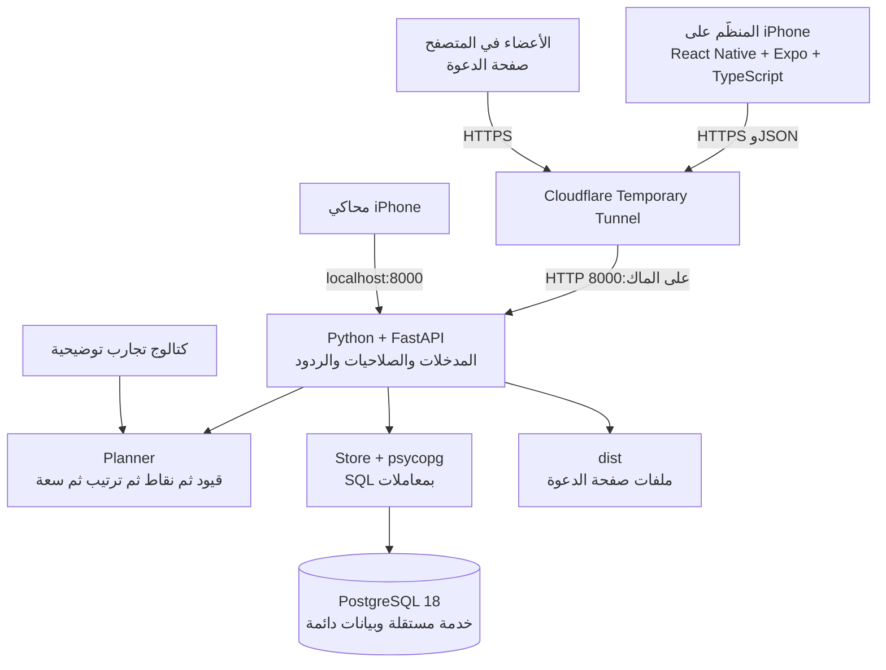
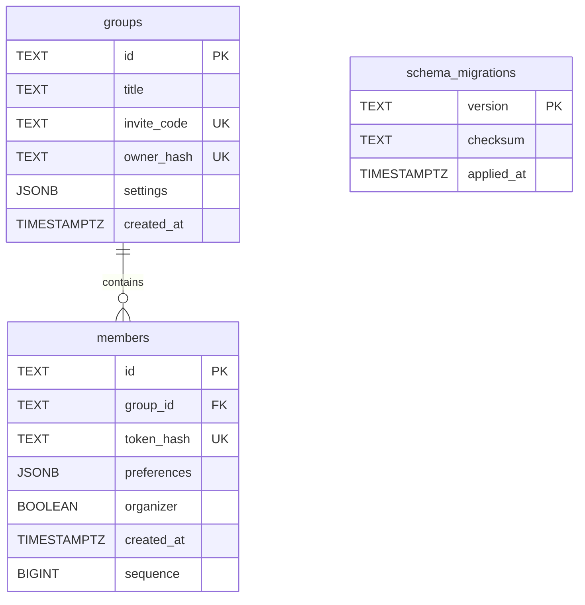
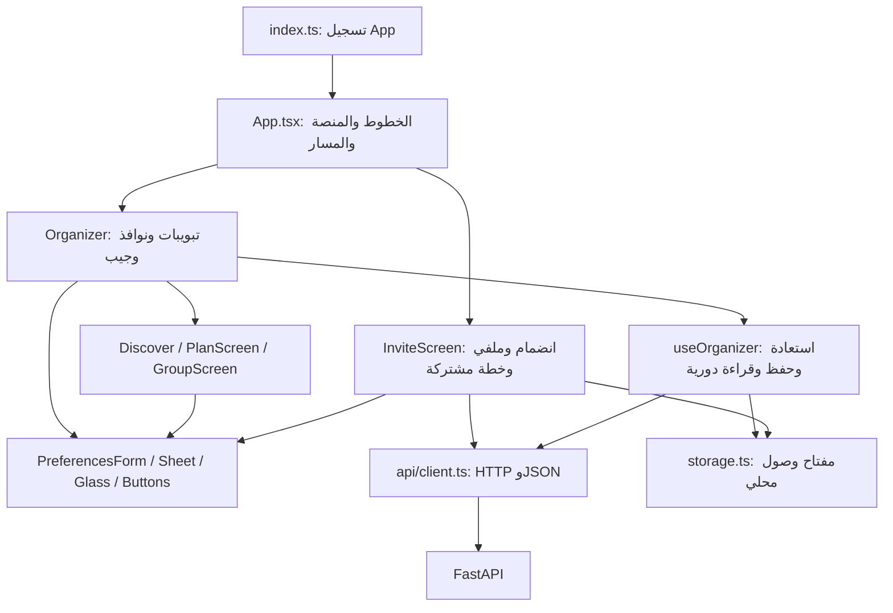
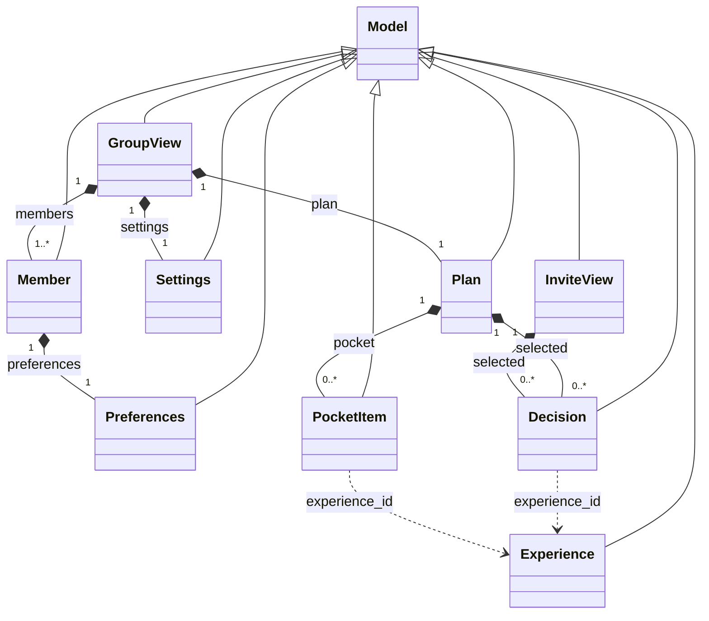
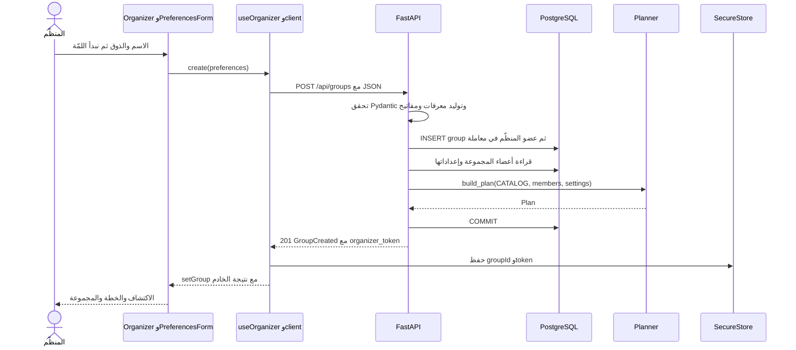
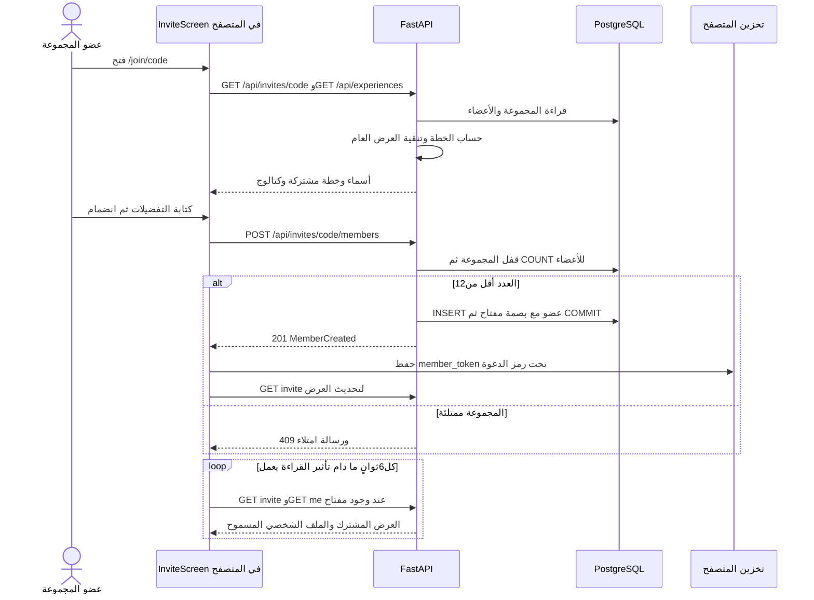
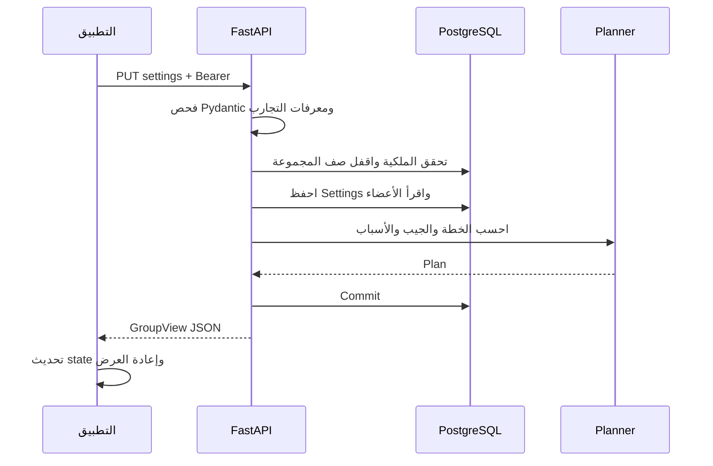
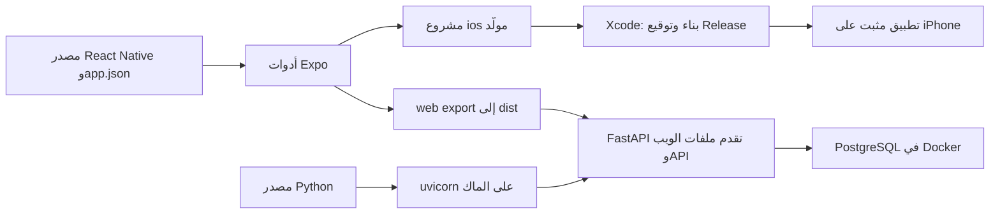

# معمارية حاتم — Python وPostgreSQL

الفرع: `codex/python-postgres`. هذه هي النسخة الحالية بعد العودة إلى Python. نسخة .NET ودليلها محفوظان في [فرع مستقل](https://github.com/shathaaa1110-arch/hatim-app/tree/codex/dotnet-backend).

الرسوم مبنية على قراءة الكود في النسخة `59d45d3`، وليست وصفًا لخدمات مقترحة. [دليل البناء للمبتدئة](learning-python-postgres/README.ar.md) يشرح كل طبقة، و[مرجع الكود](learning-python-postgres/code/README.ar.md) يربطها بالأسطر الفعلية.

الإضافة قيد النقاش: [قروبات ثابتة وطلعات وتصويت وأدوار وقرعة ومزاح](proposals/persistent-groups.ar.md). لها معمارية مستهدفة وERD وتسلسل حسم مستقل، وهي **غير منفذة**؛ الجداول والرسوم أدناه ما زالت تصف النسخة العاملة. عند تنفيذ كل مرحلة تُحدّث هذه الصفحة والعقد والشرح مع الكود.

## مكونات النظام

واجهة المستخدم لا تصل إلى PostgreSQL مباشرة. FastAPI يفحص الطلب والمفتاح ثم يقرأ البيانات ويحسب الخطة. النفق يمرر HTTP فقط؛ منفذ DB لا يُنشر عبره. محليًا PostgreSQL تعمل في Docker/OrbStack على `127.0.0.1:5432` بقرص دائم، ويمكن ضبط DATABASE_URL لخادم PostgreSQL مستضاف بدلها.

## الملفات والمسؤوليات

| الملف | وظيفته |
|---|---|
| `App.tsx` | اختيار واجهة المنظّم الأصلية أو صفحة الدعوة على الويب |
| `src/screens/` | الاكتشاف والخطة والمجموعة ورحلة العضو، والجيب داخل Organizer |
| `src/components/` | النموذج والبطاقات والأزرار والوقت والزجاج |
| `src/api/client.ts` | طلبات HTTP ومفاتيح الوصول ورسائل الفشل وعنوان كل منصة |
| `src/useOrganizer.ts` | استعادة المجموعة وتحديثها ومنع قراءة قديمة من استبدال حفظ أحدث |
| `backend/hatim/main.py` | endpoints وصلاحيات المنظّم والعضو والدعوة |
| `backend/hatim/models.py` | نماذج Pydantic والتحقق الصارم من القيم والعلاقات |
| `backend/hatim/planner.py` | قواعد القرار النقية؛ بلا AI أو DB داخل الخوارزمية |
| `backend/hatim/catalog.py` | تسع تجارب تحريرية وهمية ثابتة |
| `backend/hatim/store.py` | اتصال PostgreSQL، معاملات ولقطات قراءة، تنفيذ migrations |
| `backend/migrations/001_groups_and_members.sql` | مخطط PostgreSQL الأول |
| `backend/hatim/middleware.py` | حد جسم الطلب حتى دون Content-Length ورؤوس الرد |
| `backend/hatim/import_sqlite.py` | أداة نقل لمرة واحدة؛ ليست مخزنًا بديلًا للتطبيق |
| `backend/hatim/export_openapi.py` | تصدير عقد API دون تشغيل DB |
| `compose.yaml` و`scripts/database.mjs` | تشغيل PostgreSQL محليًا مع بيانات اتصال خاصة وقرص دائم |
| `scripts/public-test.mjs` | تشغيل النفق والواجهة المبنية والـAPI |

## قاعدة البيانات

Settings تحتوي إجمالي الخانات والركيزة والجيب اليدوي والمكتمل. Preferences تحتوي الاسم والسياق والمطابخ والحساسيات والنباتي والحرارة والميزانية. JSONB قيم JSON يفهمها PostgreSQL، وليست ملفات JSON خارج DB. sequence يحفظ ترتيب الأعضاء عند تساوي وقت الإنشاء. يوجد فهرس لأعضاء المجموعة وفهرس يمنع وجود منظّمين اثنين في مجموعة واحدة.

الخطط تُحسب من البيانات عند الطلب، ولا تُخزن كنسخة قديمة منفصلة. قراءات المجموعة تستخدم REPEATABLE READ، والتعديلات تقفل صف المجموعة بـFOR UPDATE قبل قراءة ما سيُعدّل. لذلك لا تستطيع محاولتا انضمام تجاوز حد ١٢ نتيجة قراءتهما نفس العدد القديم. الإدخال SQL يستخدم parameters، لا دمج نص المستخدم داخل الاستعلام.

Migrations مرقمة؛ بعد تطبيق ملف يُسجل اسمه وبصمته. تعديل migration مطبقة يوقف البدء برسالة واضحة؛ التغيير اللاحق يضاف كملف جديد. قفل بدء يمنع عاملين من إنشاء نفس المخطط في اللحظة نفسها.

هذه ثلاثة جداول فقط: لا يوجد حاليًا جدول users أو sessions أو experiences أو plans. التجارب في Python، والخطة مشتقة. فهرس المنظّم يفرض «منظّم واحد على الأكثر»، بينما إنشاء المجموعة داخل المعاملة يضيفه فعلًا؛ الفهرس وحده لا يفرض وجوده.

## علاقة مكونات الواجهة

React تعيد العرض عندما تتغير state. props تنقل البيانات من الأب، وcallbacks تنقل طلب إجراء مثل الحفظ إليه. useOrganizer ليست خادمًا ثانيًا؛ هي تنظيم لحالة المنظّم داخل العميل. على الويب تخزين المفتاح يتبع نطاق الموقع؛ تغيير نطاق النفق لا ينقل تخزين المتصفح تلقائيًا.

## علاقة نماذج Python

Model ترث Pydantic BaseModel وتضيف قواعد تحقق مشتركة. هذه نماذج طلبات وردود وبيانات داخلية؛ ليست أصناف ORM تنشئ جداول بنفسها. الرسم يركز نماذج المجال؛ ErrorResponse وCreateGroup وGroupCreated وMemberCreated أغلفة خطأ/طلب/نتائج موضحة في [شرح models.py](learning-python-postgres/code/backend-hatim-models.py.ar.md). قائمة أعضاء GroupView تحتوي عمليًا منظّمًا على الأقل عبر تدفق الإنشاء، لكن نوع Pydantic نفسه لا يفرض min_length لها.

## رحلة إنشاء المجموعة

الجهاز يحتفظ بالمفتاح الخام ليستعمله في Authorization. DB تحتفظ ببصمته SHA-256. هذا مفتاح عشوائي يمنح قدرة إدارة المجموعة، وليس كلمة مرور شخص أو حسابًا يمكن تسجيل الدخول إليه من جهاز آخر.

## رحلة انضمام العضو

الرسم يختصر القراءة المتوازية للكتالوج والدعوة والتخزين في البداية. التحديث الدوري يتوقف أثناء الحفظ ويمنع طلبين متداخلين. مسار me يفحص دعوة المجموعة ومفتاح العضو معًا. العرض العام يستبدل الأسباب الشخصية بالنص التحريري ويزيل adaptations ويعمم مشكلة الركيزة قبل إرسالها.

## رحلة تقليص الخطة

الأعضاء يحصلون على نسخة مشتركة عبر GET invite كل ٦ ثوانٍ، دون تفضيلات الآخرين أو التعديلات الشخصية. يملك كل عضو مفتاح تعديل ملفه، ويملك المنظّم مفتاح الإدارة. المفاتيح عشوائية وبصماتها محفوظة؛ ليست حسابات كلمات مرور أو JWT.

تقليل slots وحدها لا يغير ترتيب المرشحين: يأخذ planner مقدمة أقصر من نفس الترتيب. تغيير الأعضاء أو القيود قد يغير الأهلية والترتيب. قفل DB يحمي العمليات داخل المعاملة، لكنه لا يدمج تعديلين من جهازين؛ آخر PUT كاملة قد تستبدل إعدادات سبقتها. حارس epoch في العميل يمنع رد GET قديم من إفساد عرض حفظ أحدث محليًا.

## أين تعيش البيانات؟

| البيانات | مصدرها | هل تبقى بعد إغلاق التطبيق؟ |
|---|---|---|
| المجموعة والأعضاء وSettings وPreferences | PostgreSQL | نعم مع بقاء قرص DB |
| الكتالوج | catalog.py في إصدار الخادم | نعم، ثابت حتى تعديل الكود |
| Plan والجيب المشتق والأسباب | build_plan | تُحسب مجددًا من المصدر |
| الجيب اليدوي والمكتمل | حقول Settings في DB | نعم |
| مفاتيح الإدارة/العضوية الخام | التخزين المحلي للجهاز/المتصفح | وفق بقاء التخزين المحلي |
| بصمات المفاتيح | أعمدة DB | نعم |
| التبويب المفتوح والبحث ومسودة النموذج | React state | لا، ما لم يُحفظ جزء منها صراحة |

## البناء والتشغيل والنشر

Xcode يبني تطبيق الهاتف فقط. Python وPostgreSQL تعملان خارج الهاتف. Metro أداة تطوير JavaScript، لا قاعدة بيانات ولا API، ونسخة Release تضم JavaScript والأصول دون حاجتها إلى Metro. عنوان الهاتف العام يدخل الحزمة عند البناء، فتغييره يتطلب إعادة بناء هذه النسخة.

| السطح | الاتصال الحالي |
|---|---|
| محاكي iOS | HTTP مباشر إلى localhost:8000 على الماك |
| iPhone حقيقي | HTTPS إلى EXPO_PUBLIC_API_URL ثم النفق إلى8000 |
| عضو في المتصفح | صفحة وAPI من نفس نطاق النفق |
| FastAPI إلى PostgreSQL | psycopg وDATABASE_URL؛ محليًا127.0.0.1:5432 |

للنشر المستمر يمكن وضع FastAPI وdist على استضافة خادم وربطها بـPostgreSQL مستضافة بعنوان HTTPS ثابت. هذا مسار نشر مقترح، وليس بنية منشورة حاليًا. [درس النسخة الدراسية](learning-python-postgres/11-school-build.ar.md) يشرح إضافة الحسابات والكتالوج المخزن كخطوات مستقلة.

## نقل البيانات السابقة

أداة النقل تقرأ SQLite السابقة دون تغييرها، وتصنع نسخة متسقة تشمل WAL، ثم تكتب إلى PostgreSQL فارغة داخل معاملة واحدة. تُبقي المعرفات ورموز الدعوة وبصمات المفاتيح والخيارات والأزمنة والترتيب، وتقارن كل سجل قبل Commit. ترفض قاعدة وجهة مستخدمة، وأي فشل في بيانات المصدر يعيد التراجع عن الصفوف المستوردة كلها. مصدر SQLite والنسخة الاحتياطية يبقيان محليين للمراجعة أو الرجوع.

التشغيل الطبيعي للـAPI يتطلب DATABASE_URL، ويُرجع health بعد فحص PostgreSQL فعلًا. لا يوجد fallback إلى SQLite. إعدادات التشغيل والأوامر وأسلوب النسخ الاحتياطي موضحة في [README](../README.md).

## حدود النسخة

البنية خادم واحد بسيط ومنظم إلى وحدات. لا حاجة إلى Redis أو queue أو Temporal لهذه الرحلة. الكتالوج توضيحي، ولا توجد حجوزات أو توفر مباشر أو نظام حسابات كامل. PostgreSQL المحلية خدمة قاعدة بيانات فعلية؛ Cloudflare المؤقت يحتاج استمرار الماك والخدمات ولا يكفي وحده كنشر مستمر.

المدرسة تطلب قاعدة بيانات حقيقية، وتطلب خطة الاجتماعات نشر الأنظمة وتدفق تسجيل ودخول وخروج. الحسابات غير موجودة في هذه اللقطة؛ لذلك لا نصفها بأنها مستوفية لكل التسليمات. راجعي [مطابقة المتطلبات ومصادرها](learning-python-postgres/00-requirements.ar.md) قبل اعتماد نطاق مشروعك.
