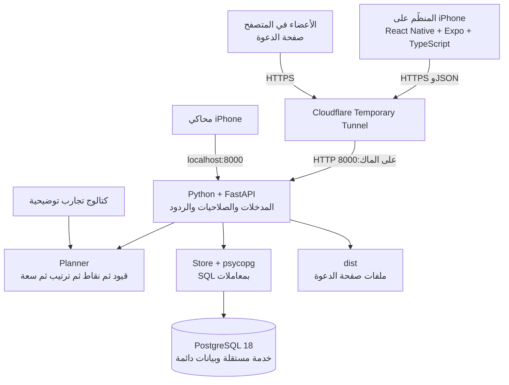
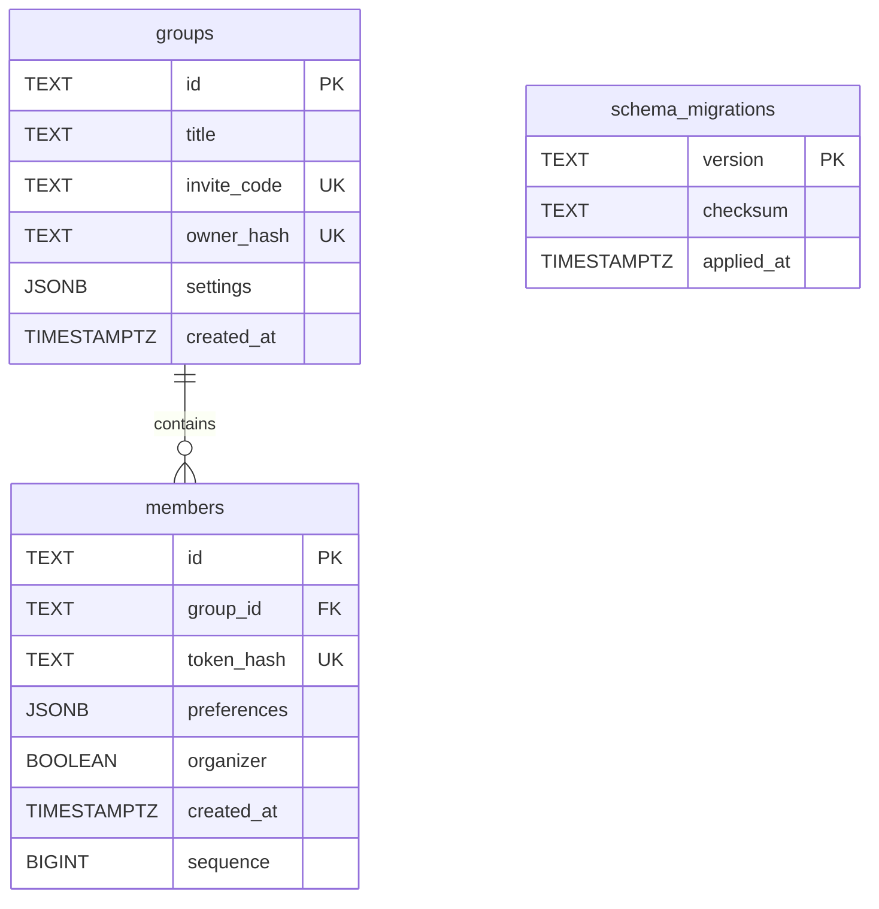
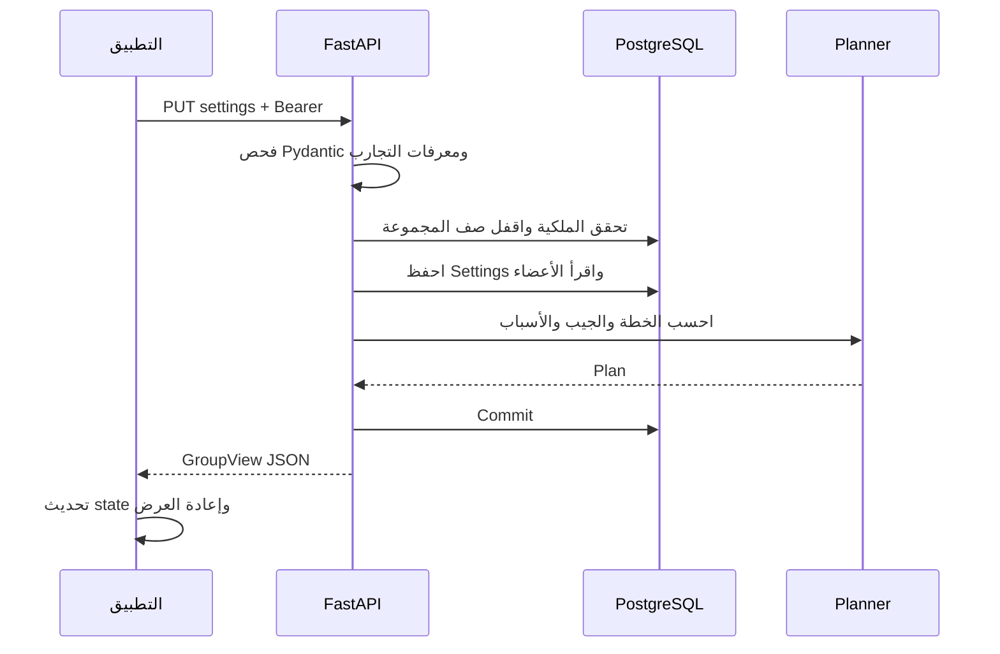

# معمارية حاتم — Python وPostgreSQL

الفرع: `codex/python-postgres`. هذه هي النسخة الحالية بعد العودة إلى Python. نسخة .NET ودليلها محفوظان في [فرع مستقل](https://github.com/shathaaa1110-arch/hatim-app/tree/codex/dotnet-backend).

## مكونات النظام

واجهة المستخدم لا تصل إلى PostgreSQL مباشرة. FastAPI يفحص الطلب والمفتاح ثم يقرأ البيانات ويحسب الخطة. النفق يمرر HTTP فقط؛ منفذ DB لا يُنشر عبره. محليًا PostgreSQL تعمل في Docker/OrbStack على `127.0.0.1:5432` بقرص دائم، ويمكن ضبط DATABASE_URL لخادم PostgreSQL مستضاف بدلها.

## الملفات والمسؤوليات

| الملف | وظيفته |
|---|---|
| `App.tsx` | اختيار واجهة المنظّم الأصلية أو صفحة الدعوة على الويب |
| `src/screens/` | الاكتشاف والخطة والمجموعة ورحلة العضو، والجيب داخل Organizer |
| `src/components/` | النموذج والبطاقات والأزرار والوقت والزجاج |
| `src/api/client.ts` | طلبات HTTP ومفاتيح الوصول ورسائل الفشل وعنوان كل منصة |
| `src/useOrganizer.ts` | استعادة المجموعة وتحديثها ومنع قراءة قديمة من استبدال حفظ أحدث |
| `backend/hatim/main.py` | endpoints وصلاحيات المنظّم والعضو والدعوة |
| `backend/hatim/models.py` | نماذج Pydantic والتحقق الصارم من القيم والعلاقات |
| `backend/hatim/planner.py` | قواعد القرار النقية؛ بلا AI أو DB داخل الخوارزمية |
| `backend/hatim/catalog.py` | تسع تجارب تحريرية وهمية ثابتة |
| `backend/hatim/store.py` | اتصال PostgreSQL، معاملات ولقطات قراءة، تنفيذ migrations |
| `backend/migrations/001_groups_and_members.sql` | مخطط PostgreSQL الأول |
| `backend/hatim/middleware.py` | حد جسم الطلب حتى دون Content-Length ورؤوس الرد |
| `backend/hatim/import_sqlite.py` | أداة نقل لمرة واحدة؛ ليست مخزنًا بديلًا للتطبيق |
| `backend/hatim/export_openapi.py` | تصدير عقد API دون تشغيل DB |
| `compose.yaml` و`scripts/database.mjs` | تشغيل PostgreSQL محليًا مع بيانات اتصال خاصة وقرص دائم |
| `scripts/public-test.mjs` | تشغيل النفق والواجهة المبنية والـAPI |

## قاعدة البيانات

Settings تحتوي إجمالي الخانات والركيزة والجيب اليدوي والمكتمل. Preferences تحتوي الاسم والسياق والمطابخ والحساسيات والنباتي والحرارة والميزانية. JSONB قيم JSON يفهمها PostgreSQL، وليست ملفات JSON خارج DB. sequence يحفظ ترتيب الأعضاء عند تساوي وقت الإنشاء. يوجد فهرس لأعضاء المجموعة وفهرس يمنع وجود منظّمين اثنين في مجموعة واحدة.

الخطط تُحسب من البيانات عند الطلب، ولا تُخزن كنسخة قديمة منفصلة. قراءات المجموعة تستخدم REPEATABLE READ، والتعديلات تقفل صف المجموعة بـFOR UPDATE قبل قراءة ما سيُعدّل. لذلك لا تستطيع محاولتا انضمام تجاوز حد ١٢ نتيجة قراءتهما نفس العدد القديم. الإدخال SQL يستخدم parameters، لا دمج نص المستخدم داخل الاستعلام.

Migrations مرقمة؛ بعد تطبيق ملف يُسجل اسمه وبصمته. تعديل migration مطبقة يوقف البدء برسالة واضحة؛ التغيير اللاحق يضاف كملف جديد. قفل بدء يمنع عاملين من إنشاء نفس المخطط في اللحظة نفسها.

## رحلة تقليص الخطة

الأعضاء يحصلون على نسخة مشتركة عبر GET invite كل ٦ ثوانٍ، دون تفضيلات الآخرين أو التعديلات الشخصية. يملك كل عضو مفتاح تعديل ملفه، ويملك المنظّم مفتاح الإدارة. المفاتيح عشوائية وبصماتها محفوظة؛ ليست حسابات كلمات مرور أو JWT.

## نقل البيانات السابقة

أداة النقل تقرأ SQLite السابقة دون تغييرها، وتصنع نسخة متسقة تشمل WAL، ثم تكتب إلى PostgreSQL فارغة داخل معاملة واحدة. تُبقي المعرفات ورموز الدعوة وبصمات المفاتيح والخيارات والأزمنة والترتيب، وتقارن كل سجل قبل Commit. ترفض قاعدة وجهة مستخدمة، وأي فشل في بيانات المصدر يعيد التراجع عن الصفوف المستوردة كلها. مصدر SQLite والنسخة الاحتياطية يبقيان محليين للمراجعة أو الرجوع.

التشغيل الطبيعي للـAPI يتطلب DATABASE_URL، ويُرجع health بعد فحص PostgreSQL فعلًا. لا يوجد fallback إلى SQLite. إعدادات التشغيل والأوامر وأسلوب النسخ الاحتياطي موضحة في [README](../README.md).

## حدود النسخة

البنية خادم واحد بسيط ومنظم إلى وحدات، وليست microservices. لا حاجة إلى Redis أو queue أو Temporal لهذه الرحلة. الكتالوج توضيحي، ولا توجد حجوزات أو توفر مباشر أو نظام حسابات كامل. PostgreSQL المحلية خدمة فعلية، لكن مطلب قاعدة مستضافة ونشر دائم يحتاج إعداد خادم/استضافة؛ Cloudflare المؤقت لا يحقق ذلك وحده.
