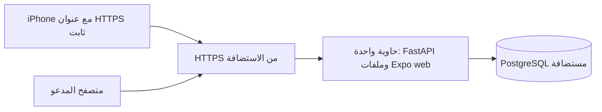

# تجهيز نشر حاتم

ملفات النشر جاهزة للاختبار؛ اختيار الاستضافة والنشر الدائم مؤجلان بطلب صاحبة المشروع. هذا لا يعني أن قاعدة البيانات المحلية أصبحت مستضافة.

## الشكل



الحاوية لا تحتوي PostgreSQL أو أسرارها. `DATABASE_URL` يُمرر وقت التشغيل، وAPI يستخدم psycopg والترحيلات الخاصة بالتطبيق. يمكن أن تكون DB خدمة مُدارة أو خادمًا تديرينه. استضافة DB لا تستبدل كود المصادقة أو API.

## الملفات

- `Dockerfile`: مرحلة Node22 تثبت npm ci وتبني الويب. مرحلة Python3.14 وuv0.11.7 تثبت uv.lock دون أدوات التطوير، وتنسخ API والترحيلات وdist. التشغيل بمستخدم غير root ومنفذ8000.
- `.dockerignore`: يستبعد الأسرار والبيانات المحلية وبيئة التطوير ومخرجات البناء من سياق Docker.
- `deploy/compose.yaml`: خدمة التطبيق فقط، منفذ على loopback خلف HTTPS reverse proxy، نظام ملفات للقراءة ومجلد /tmp مؤقت، وإعادة تشغيل عند تعطل الخدمة.
- `deploy/.env.example`: أسماء متغيرات وأمثلة مكانية؛ انسخيها إلى deploy/.env.local وأدخلي القيم محليًا. لا تضعي كلمة المرور في EXPO_PUBLIC_API_URL.

## البناء والتشغيل

من جذر المستودع:

```sh
docker build -t hatim:local .
cp deploy/.env.example deploy/.env.local
```

املئي DATABASE_URL في الملف المحلي. استخدمي إعداد TLS وشهادة CA اللذين توفرهما الاستضافة؛ المثال sslmode=require بداية إعداد، ويمكن استخدام verify-full مع شهادة الخادم للتحقق من هويته. تأكدي أن دور DB يستطيع إنشاء الجداول والترحيلات. لا تنشري منفذ PostgreSQL للعامة.

```sh
docker compose --env-file deploy/.env.local -f deploy/compose.yaml up --build -d
docker compose --env-file deploy/.env.local -f deploy/compose.yaml ps
curl --fail http://127.0.0.1:8000/api/health
```

في منصة تستقبل Dockerfile مباشرة: حددي جذر المستودع وDockerfile، منفذ الحاوية8000، فحص الصحة /api/health، وDATABASE_URL من مخزن أسرارها. ضعي خدمة الويب وAPI خلف العنوان نفسه حتى تبقى طلبات المتصفح /api محلية للمصدر. اتركي HATIM_CORS_ORIGINS فارغًا في هذا الوضع؛ إن فصلتِ الواجهة اسمحي بعنوانها المحدد فقط.

على VPS: يجب إعداد HTTPS وشهادة صالحة وreverse proxy يتصل بـ127.0.0.1:8000. Compose لا ينشئ نطاقًا أو شهادة، ولا يدّعي أنه نشر آمن مكتمل بمفرده. عند الاستضافة المُدارة استخدمي HTTPS الذي توفره المنصة.

## iPhone

بعد تثبيت العنوان النهائي ضعي EXPO_PUBLIC_API_URL في ملف .env.local بجذر التطبيق، ثم أعيدي بناء Release عبر Xcode. هذا العنوان عام وليس سرًا. المحاكي يظل يستخدم localhost8000؛ الهاتف الفعلي والدعوات يستخدمان العنوان المضمّن في البناء.

Cloudflare Quick Tunnel يبقى لاختبار روابط الرفقة مؤقتًا، وليس بديلًا عن تشغيل دائم للتسليم. تغير العنوان لا يغير معرفات الخطط في PostgreSQL.

## تحديث ونسخ احتياطي

قبل migrations خذي نسخة pg_dump بصيغة custom، واحفظيها في مكان خاص خارج Git. اختبري استرجاعها إلى قاعدة فارغة مخصصة للاختبار باستخدام pg_restore قبل اعتبار النسخ موثوقًا. ملفات الترحيل القديمة لا تتغير؛ initialize يطبق الجديدة في معاملة مع قفل وبصمات.

الترحيل003 يضيف عمود ملكية nullable وفهرسًا فقط، ويبقي بيانات الضيف كما هي. عند التراجع عن إصدار لا تحذفي العمود أو بيانات الحساب؛ راجعي توافق الإصدار السابق مع الخطط المرتبطة أولًا، أو استرجعي نسخة إلى بيئة منفصلة للمراجعة.

الحاوية تتضمن فحص صحة يقرأ DB فعليًا. جرّبي التسجيل والدخول والخروج وإنشاء/تعديل/حذف خطة تجريبية ورابط دعوة من جهاز خارجي بعد النشر. أخطاء API لا تعرض DATABASE_URL أو كلمات المرور. السجل داخل الحاوية لا يطبع روابط الدعوات عبر access log افتراضيًا.

إعداد المراحل مبني على [دليل uv الرسمي للحاويات](https://docs.astral.sh/uv/guides/integration/docker/) و[دليل FastAPI للحاويات](https://fastapi.tiangolo.com/deployment/docker/). شرح قرارات المشروع واختباراته يخص هذا المستودع.
