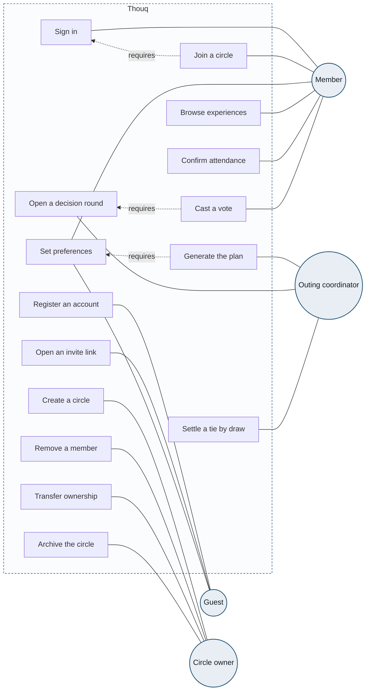

[← Back to index](README.md)

# 1 · Use Cases

Answers one question: **who can do what?**

Circles are actors, rectangles are actions, and the dashed frame is the system boundary.

## The four actors

An actor here is not an imagined persona. It is **a distinct way the system identifies a caller and authorises the request**. There are four because the code contains four separate checks.

| Actor | How the system identifies them | Where in the code |
|---|---|---|
| Guest | Invite code in the URL, no account | `groups.invite_code`, `members.token_hash` |
| Member | Bearer session token, SHA-256 hashed at rest | `account_sessions`, `features/accounts/access.py` |
| Outing coordinator | Caller's member id matches the coordinator column | `outings.coordinator_id` |
| Circle owner | Caller's account id matches the owner column | `circles.owner_id` |

One person often holds several roles at once. They are drawn separately because the authorisation checks read from different columns, and each check can fail independently.

## Include relationships

The dashed arrows are `«include»`: the first action cannot run without the second, and the constraint is enforced server-side rather than only in the UI.

| Action | Requires | Why the constraint exists |
|---|---|---|
| Join a circle | Sign in | Membership binds to an account id in `circle_members.account_id` |
| Generate the plan | Set preferences | The planner reads every attending member's preferences to evaluate each experience |
| Cast a vote | Open a decision round | `votes` carries a foreign key into `round_options`, so a vote without a round cannot be written |

## A note on 404 versus 403

Where a caller has no relationship to a resource at all, the API returns **404**, not 403. `circle_access` raises "not available to your account" whether the circle is missing or the caller simply is not a member. This is deliberate: a 403 would confirm that a given circle id exists, which lets an attacker enumerate resources. 403 is reserved for cases where membership is already established but the specific action needs a higher role.

## What was left out

The repository exposes 47 API routes. Fifteen actions remain after removing:

- `GET` routes that read without changing state.
- Undo actions such as withdrawing a vote or cancelling a round, which are implementation details of an existing use case rather than use cases of their own.
