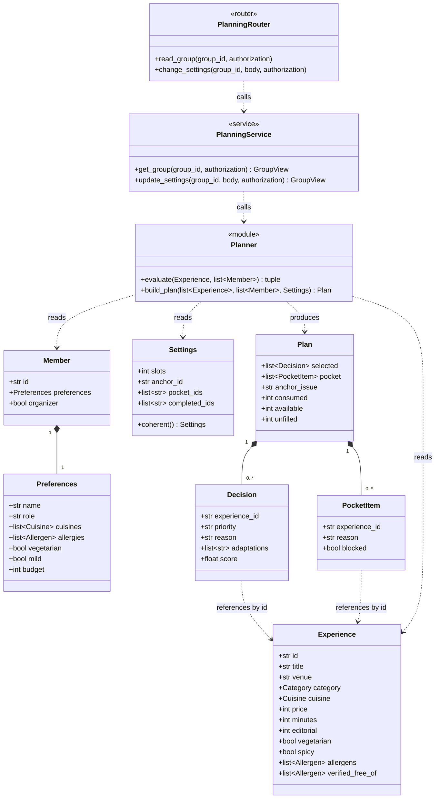

[← Back to index](README.md)

# 2 · Class Diagram

Answers: **what entities does the system work with?**

The first seven classes are taken directly from `backend/hatim/domain/models.py`. They are pure: they know nothing about the database or about HTTP, and they can be constructed and tested on their own.

## Two kinds of class

| Kind | Classes | What they hold |
|---|---|---|
| Data entities | `Preferences` · `Member` · `Experience` · `Settings` · `Decision` · `PocketItem` · `Plan` | Fields only. They carry values and make no decisions. |
| Behaviour | `Planner` · `PlanningService` · `PlanningRouter` | Functions that operate on the data entities. |

`Planner` is not a class in the code — it is a module holding two functions. It is marked `<<module>>` rather than drawn as a class so the diagram does not misrepresent the code.

All seven data entities inherit from a shared `Model` base configured with `extra="forbid"` and `strict=True`, so unknown fields are rejected rather than silently ignored, and type coercion is off.

## Two kinds of relationship

| Notation | Meaning | Test in the code |
|---|---|---|
| `*--` composition | The part does not exist without the whole and is destroyed with it | The field's type is a class: `preferences: Preferences` |
| `..>` dependency | Refers to the entity; the entity is independent | The field is a string id: `experience_id: str` |

The clearest contrast: `Member` holds a whole `Preferences` object, so deleting the member deletes their preferences. `Decision` holds only the experience id as text; the experience lives in a shared catalogue and outlives any plan that references it.

## Design decision: two allergen fields

`Experience` carries two separate lists, and the separation is the point.

| Field | Meaning |
|---|---|
| `allergens` | Allergens known to be present in this experience |
| `verified_free_of` | Allergens whose absence has been verified, including handling of cross-contact |

Absence from `allergens` is **not** treated as safety. `evaluate()` in `planner.py` excludes an experience when a member's allergen is present *or* when it is simply not listed in `verified_free_of`, on the basis that undocumented is not the same as safe.

This is the most conservative rule in the system and it has a visible consequence in the current dataset — see [the design review](06-review.md#finding-1).
