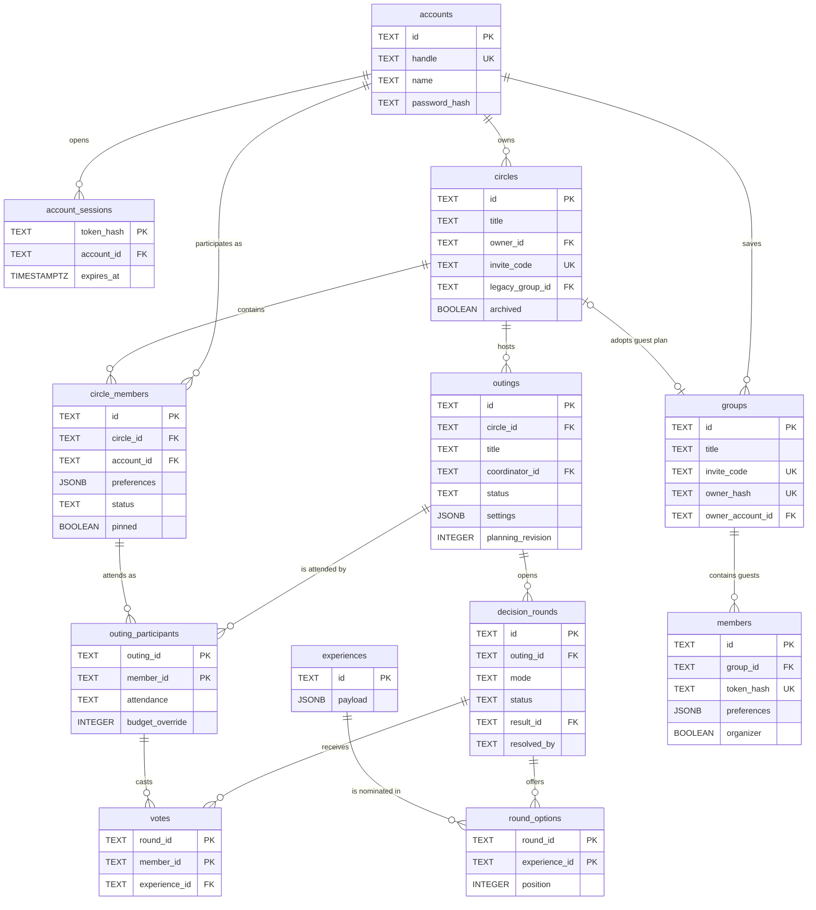

[← Back to index](README.md)

# 3 · Database

Answers: **how is data stored and related?**

Tables are taken from the migration files in `backend/migrations/`. Secondary constraints such as `NOT NULL` and `DEFAULT` are omitted from the diagram as implementation detail; they remain documented in the SQL itself. The notable constraints are listed below the diagram.



## Reading the notation

| Symbol | Meaning |
|---|---|
| `PK` | Primary key — the row's identity, never duplicated |
| `UK` | Unique — the value appears at most once across rows |
| `FK` | Foreign key — points at a row in another table |
| `\|\|--o{` | One to many |
| `\|o--o\|` | Optional on both sides |

## Design decisions

### Why `groups` and `circles` both exist

They look alike but serve different paths through the product.

| Table | Purpose | How a caller is identified |
|---|---|---|
| `groups` | A one-off plan opened from an invite link, no account needed | Hashed token in `owner_hash` and `members.token_hash` |
| `circles` | A durable circle tied to real accounts | `owner_id` referencing `accounts` |

The `circles.legacy_group_id` column lets a guest plan be adopted into a durable circle without losing its data, which is why the relationship between the two tables is optional on both sides. When a guest plan is claimed by an account, `owner_hash` is rewritten to the digest of a fresh random token, which invalidates the old organiser link rather than leaving it live.

### Why the catalogue is a single JSONB column

`experiences` holds one `JSONB` column instead of separate columns, because the catalogue is editorial content read in full and never queried by column. A check constraint keeps the row id and the payload id from drifting apart:

```sql
CHECK(jsonb_typeof(payload) = 'object' AND payload->>'id' = id)
```

The trade-off is real and worth stating: querying by price or cuisine in SQL is awkward, and there is no schema enforcement on the payload beyond the Pydantic validation applied when it is read. It is a reasonable choice for a fixed editorial catalogue and a poor one for a catalogue that grows or needs filtering in the database.

### Why a vote cannot cross circles

`votes` does not reference a member directly. It references `outing_participants`, which is itself constrained by a composite foreign key on `(member_id, circle_id)`. A member of one circle therefore cannot vote in an outing belonging to another — and the rejection happens in PostgreSQL, not in application code.

### Constraints worth knowing

| Constraint | Purpose |
|---|---|
| `one_organizer_per_group` | Partial unique index guaranteeing exactly one organiser per guest group |
| `one_current_round` | Partial unique index preventing more than one live decision round per outing |
| `budget_override BETWEEN 30 AND 500` | Keeps per-outing budget overrides inside the allowed range |
| `round_result_option` | Deferrable foreign key ensuring a round's result is one of its own options |
| `handle = lower(handle)` | Forces handles to canonical lowercase, so `Shatha` and `shatha` cannot both be registered |

## Schema migrations

Migrations are applied at startup by `core/db.py`, not by a separate tool. Two properties are worth noting for a reviewer:

- Each applied migration's SHA-256 checksum is stored in `schema_migrations`. If a migration file changes after being applied, startup fails rather than silently diverging.
- Startup takes `pg_advisory_xact_lock`, so several workers booting at once cannot race to create the schema.
