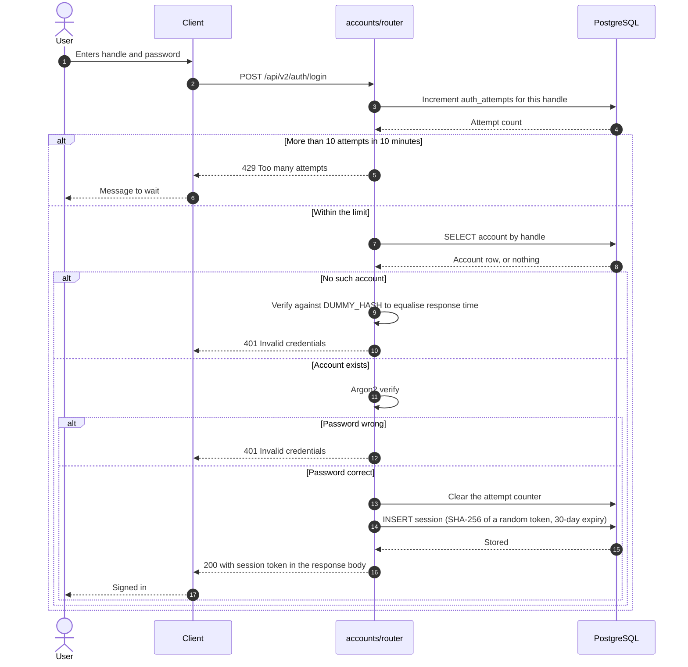
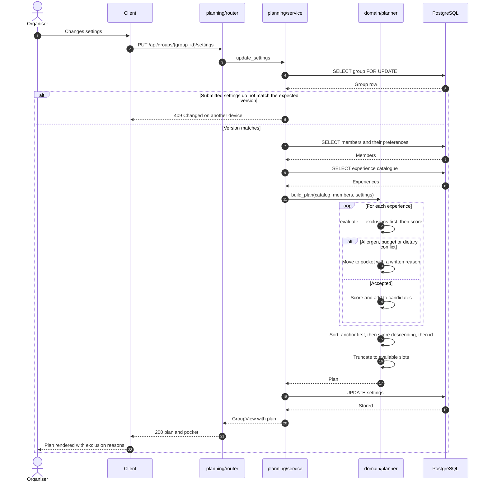

[← Back to index](README.md)

# 4 · Sequence Diagrams

Answers: **what happens, step by step?**

Two flows are drawn: one that carries the security decisions, one that carries the product's core logic. Solid arrows are requests, dashed arrows are responses, and `alt` boxes are alternative paths.

## 4.1 Sign-in

Source: `backend/hatim/features/accounts/router.py`



### Security decisions visible in this flow

**One failure message.** Every failure path returns `401` with identical text. If the message varied by cause, an attacker could distinguish an unregistered handle from a registered one with a wrong password and enumerate valid accounts.

**Verifying `DUMMY_HASH`.** When no account matches, the server still runs an Argon2 verification against a throwaway hash before responding. Without it, the "no such account" path returns in microseconds while the real path spends tens of milliseconds hashing — a gap large enough to enumerate accounts without reading the message at all.

**Rate limiting is committed separately.** `throttle()` opens its own connection and commits before the login transaction proceeds. This matters: if the counter shared the login transaction, a rejected login would roll the counter back and the limit would never take effect.

**Sessions are tokens, not cookies.** The server returns a random token in the response body; the client sends it back as `Authorization: Bearer <token>`. Only the SHA-256 digest is stored, so a database disclosure does not yield usable sessions. Cookie-based auth was not used, which also means CSRF is not an applicable threat for these endpoints.

## 4.2 Generating a plan

Source: `backend/hatim/features/planning/service.py` and `backend/hatim/domain/planner.py`



### Order of operations inside the engine

Exclusion runs **before** scoring, and the order is the point. An experience that conflicts with any attending member's allergen leaves the competition before its score is computed, so a high score can never outrank a safety constraint. Reversing the order would make it possible for a strong editorial score to carry an unsafe option into the plan.

### Exclusion criteria

| Criterion | Behaviour |
|---|---|
| Confirmed allergen conflict | Excluded; removing the ingredient is explicitly not offered as a workaround |
| Allergen not listed in `verified_free_of` | Excluded; undocumented is not treated as safe |
| Price above any member's budget | Excluded |
| Vegetarian member, no vegetarian option | Excluded |
| Spicy dish, member prefers mild, no mild option | Not excluded — affinity drops by 20 and a note is attached |

The last row is the deliberate line between safety and taste: safety constraints exclude, taste preferences only re-rank.

### Scoring

```
score = editorial + 0.7 × mean(affinity) + 0.3 × min(affinity)
```

The third term gives explicit weight to the least well-served member, so the average cannot rise at the expense of one person for whom nothing fits.

### Deterministic ordering

```python
candidates.sort(key=lambda item: (
    item.experience_id != settings.anchor_id,
    -item.score,
    item.experience_id,
))
```

Three keys in order: the anchor experience first, then score descending, then id alphabetically. The third key is what makes the engine deterministic — identical input produces identical output on every run — which is what allows the 189 planner tests to assert on exact plans.

### Concurrency

Two mechanisms work together. `SELECT ... FOR UPDATE` serialises writers on the same group, and writers always take locks in a fixed order — circle, then outing, then round — so two concurrent operations cannot deadlock by acquiring the same pair in opposite orders. On top of that, `update_settings` compares the client's `expected` settings against the stored row and returns `409` on mismatch, so a stale client cannot overwrite a newer change. The equivalent for outings is the `planning_revision` counter, which invalidates decision rounds whose basis has changed.
