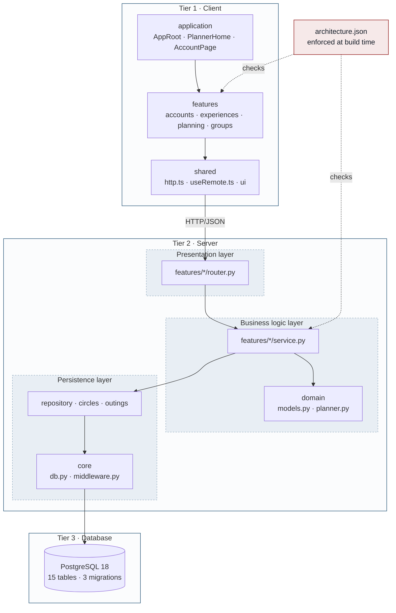

[← Back to index](README.md)

# 5 · Architecture

Answers: **what depends on what?**

Thouq is a modular monolith: one server process containing four features with import boundaries that are enforced by a build check rather than by convention.

## Tier versus layer

Two terms that are often conflated, and the distinction matters here.

| Concept | Kind of separation | In this system |
|---|---|---|
| Tier | Physical — separate machines or processes | Three: the user's device, the FastAPI server, the PostgreSQL server |
| Layer | Logical — separation inside one codebase | Three inside the server, all running in the same process |

## Two dependency rules

**Dependencies point downward only.** Presentation calls business logic; business logic calls persistence. Never the reverse: `planner.py` knows nothing about routes, and the persistence layer knows nothing about HTTP.

**Features interact only through public interfaces.** No feature imports an internal module of another feature.

## Enforced import boundaries

`architecture.json` at the repository root declares what each feature may import:

| Feature | May import from |
|---|---|
| `accounts` | nothing |
| `experiences` | nothing |
| `planning` | `accounts`, `experiences` |
| `groups` | `accounts`, `experiences` |

`scripts/check-architecture.mjs` fails the build on any violation. The architecture is a constraint, not a guideline — which is the difference between a diagram that describes the system and one that merely describes an intention.

### What this buys on extension

Adding a feature such as reservations or dish suggestions means adding a full vertical slice — router, service, repository, table — without editing the existing features. That is the reason features are split vertically instead of collecting every route in one module.

## Cross-cutting concerns

Three behaviours live outside any single feature:

| Concern | Where | What it does |
|---|---|---|
| Body size limit | `core/middleware.py` | Rejects requests over 16 KB with `413`, including chunked bodies that declare no `Content-Length` |
| Response headers | `core/middleware.py` | Sets `X-Content-Type-Options: nosniff` and `Referrer-Policy: no-referrer`; adds `Cache-Control: no-store` on `/api` and `/join` so invite pages are not cached |
| Error translation | `main.py` | Maps validation failures to `422` and database failures to `503` with a generic message, so internal error text never reaches a client |

## Deployment

`deploy/compose.yaml` runs the application container with `read_only: true`, `no-new-privileges`, and a `tmpfs` for `/tmp`. PostgreSQL in local development binds to `127.0.0.1:5432` rather than all interfaces. The deployment example requires `sslmode=require` on the database URL.

## Open item

The persistence layer is not fully separated in the current code: some SQL still lives inside `service.py` and `circles.py`. The diagram above represents the intended design; moving those queries into dedicated repository modules is planned and not yet done. See [the design review](06-review.md#finding-4).
