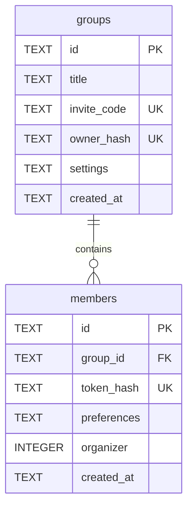
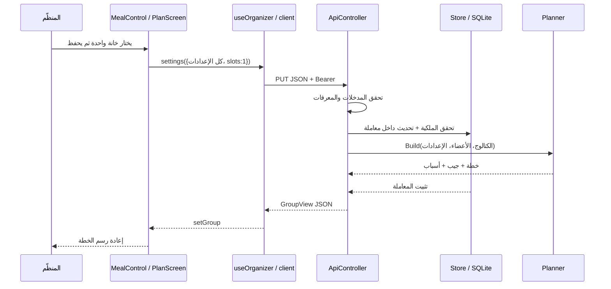

# ٣ — قاعدة البيانات والـAPI وتشغيل الخادم

[الفهرس](README.md) · [التالي: بيانات الواجهة](04-app-data-and-state.md)

الملفات: [Store.cs](../../backend/Hatim.Api/Store.cs)، [ApiController.cs](../../backend/Hatim.Api/ApiController.cs)، [Program.cs](../../backend/Hatim.Api/Program.cs).

## الفرق بين الحفظ والحساب

المخطّط يحسب نتيجة من المدخلات. Store تحفظ المدخلات كي لا تضيع عند إغلاق التطبيق. لا نخزن `Plan` كاملة في DB؛ نستخرجها من الإعدادات والأعضاء والكتالوج عند الطلب. هذا يمنع وجود خطة مخزنة قديمة لا تطابق ذوق عضو عدّله للتو.

SQLite محرك قاعدة بيانات حقيقي مضمّن في عملية الخادم، وملفه الحالي `backend/data/hatim.sqlite3`. ليس برنامج DB server منفصلًا على الشبكة. هذا مناسب لفهم النسخة التجريبية، لكنه يحتاج تغييرًا لنطاق المدرسة الموصوف سابقًا.

## Store.cs: الأسطر ١–٢٠، الاتصال

`System.Security.Cryptography` للمفاتيح والتجزئة، و`System.Text` لترميز النص، و`Microsoft.Data.Sqlite` هو driver يخاطب SQLite. `Store` تحتفظ بنص اتصال `connectionString`، لا باتصال مفتوح مشترك دائمًا.

الباني يستقبل `databasePath`، يحوله لمسار مطلق، وينشئ مجلد الأب إذا لم يوجد. `SqliteConnectionStringBuilder` يركب النص دون دمج يدوي هش. `DataSource` الملف، `ForeignKeys=true` يفعّل العلاقات، و`DefaultTimeout=10` زمن الانتظار الافتراضي لأوامر المزود عند انشغال القاعدة؛ ليس مهلة HTTP للواجهة.

## الأسطر ٢٢–٢٤: Token وDigest

```csharp
public static string Token(int bytes) => Convert.ToBase64String(RandomNumberGenerator.GetBytes(bytes))
    .TrimEnd('=').Replace('+', '-').Replace('/', '_');
public static string Digest(string token) => Convert.ToHexStringLower(SHA256.HashData(Encoding.UTF8.GetBytes(token)));
```

الدالة الأولى تحصل على bytes عشوائية من مولّد تشفيري. Base64 يحولها إلى نص، ثم تُستبدل الرموز التي تربك الرابط وتُحذف حشوة النهاية. **Base64 ترميز، وليس تشفيرًا**. يُستعمل ١٢ بايت للمعرف، و١٨ لرمز الدعوة، و٣٢ لمفاتيح المنظّم والعضو.

الدالة الثانية تحول المفتاح إلى bytes بترميز UTF-8 ثم SHA-256 ثم نص hexadecimal صغير الحروف. يحتفظ الخادم بالبصمة ويقارن بها بصمة المفتاح الذي يصله. لا يوجد فك تجزئة لاستعادة المفتاح. لا تُطبّقي هذا السطر نفسه على كلمات مرور بشرية؛ المفاتيح هنا عشوائية عالية العشوائية، وكلمات المرور تحتاج آلية تجزئة مخصصة ذات كلفة وsalt عبر مكتبة مناسبة.

ثلاث قيم مختلفة: معرف المجموعة يحدد الشيء، رمز الدعوة يمنح العرض المشترك والانضمام، ومفتاح المنظّم يمنح إدارة المجموعة. معرف المجموعة وحده لا يمنح الإدارة. كذلك `Role.Resident` ليس دورًا أمنيًا.

## الأسطر ٢٦–٤٨: إنشاء الجداول

نفتح اتصالًا داخل `using`، ننشئ أمرًا، نضع SQL متعدد الأسطر في `CommandText`، ثم `ExecuteNonQuery` لتنفيذه دون انتظار صفوف نتيجة.



جدول مثل صفحة منظمة في دفتر: الصف كيان واحد، والعمود معلومة. `PRIMARY KEY` هوية الصف، و`UNIQUE` يمنع التكرار، و`NOT NULL` يمنع غياب القيمة، و`DEFAULT` يملأ قيمة لم تُرسل. `REFERENCES groups(id)` لا تسمح لعضو بالإشارة إلى مجموعة غير موجودة. `ON DELETE CASCADE` يعني أن حذف المجموعة بالـSQL يحذف أعضاءها؛ **لا يعني وجود endpoint لحذف المجموعة**.

`settings` و`preferences` نص JSON داخل DB؛ ليست لكل تفضيل علاقة مستقلة. هذا يبقي النسخة صغيرة، لكن البحث والتحليلات والعلاقات المتقدمة تصبح أصعب من تصميم جداول منفصلة. `organizer` يخزن boolean عمليًا كعدد. `created_at` نص زمني يولده SQLite.

`CREATE INDEX ... members(group_id)` يجعل الوصول إلى أعضاء مجموعة أكثر كفاءة. `IF NOT EXISTS` يمنع تكرار إنشاء الموجود عند التشغيل. `PRAGMA journal_mode=WAL` يستعمل سجل كتابة منفصلًا يساعد على تعايش القراءات مع الكتابة؛ لا يجعل كل عمليات الكتابة متزامنة بلا حدود. `user_version=1` رقم للنسخة، لكن الملف لا يحتوي خطوات ترقيات مرقمة؛ لا تسميه نظام migrations مكتملًا.

## الأسطر ٥٠–٥٩: Run والمعاملة

```csharp
public T Run<T>(Func<Database, T> operation, bool write = false)
{
    using var connection = new SqliteConnection(connectionString);
    connection.Open();
    using var transaction = connection.BeginTransaction(deferred: !write);
    var result = operation(new Database(connection, transaction));
    transaction.Commit();
    return result;
}
```

المعاملة transaction تجمع عدة أوامر في وحدة: إما تنجح كلها فنثبتها بـ`Commit`، أو يقع استثناء قبلها فيتخلص `using` من المعاملة غير المثبتة. مثال: إنشاء المجموعة ثم إنشاء عضوها المنظّم يجب أن ينجحا معًا.

`operation` دالة يمررها controller. Store تعطيها كائن Database يستخدم **نفس الاتصال والمعاملة**. T نوع النتيجة، مثل GroupView. `write: true` يجعل `deferred` false للحصول على قفل الكتابة قبل فحص السعة. وإلا قد يقرأ طلبان «يوجد ١١ عضوًا» ثم يضيف كل منهما عضوًا فتصبح ١٣. القراءة أيضًا داخل معاملة كي تنتمي أجزاء الرد إلى لقطة متسقة. [توثيق معاملات Microsoft.Data.Sqlite](https://learn.microsoft.com/en-us/dotnet/standard/data/sqlite/transactions).

## الأسطر ٦٢–١١٨: Database والاستعلامات والصلاحيات

`GroupRow` يمثل المعلومات المقروءة من صف المجموعة. الباني المختصر لـDatabase يستقبل الاتصال والمعاملة، فلا يعيد كل endpoint فتحهما.

| الدالة | تفكيك ما بداخلها |
|---|---|
| `Command`، ٦٦–٧٣ | تنشئ SqliteCommand، تربطه بالمعاملة، تضع SQL، ثم تضيف كل parameter. `params` يسمح بعدة أزواج اسم/قيمة. `DBNull.Value` هو تمثيل null في DB |
| `Execute`، ٧٤–٧٨ | تستخدم Command، تنفذ INSERT/UPDATE/DELETE وتعيد عدد الصفوف المتأثرة |
| `Group`، ٧٩–٨٥ | تنفذ SELECT وتقرأ أول صف، أو تعيد null. `GetString(0..3)` تقرأ أعمدة حسب ترتيب SELECT. الإعدادات تعود من JSON إلى Settings |
| `RequireOwner`، ٨٦–٨٩ | تبحث عن مجموعة يطابق معرفها ومعها بصمة المفتاح. عدم المطابقة يرمي 404 برسالة عامة |
| `RequireInvite`، ٩٠–٩٢ | تبحث برمز الدعوة، وترمي 404 إن لم يوجد |
| `Members`، ٩٣–١٠٠ | تقرأ أعضاء المجموعة بترتيب وقت الإنشاء ثم rowid، وتحول كل صف إلى Member |
| `RequireMember`، ١٠١–١٠٩ | تتحقق من الدعوة ثم مفتاح عضو في **نفس المجموعة** و`organizer=0`، وإلا 404 |
| `ReadMember`، ١١٠–١١١ | تحول الأعمدة الثلاثة إلى id وتفضيلات من JSON وboolean |
| `Bearer`، ١١٢–١١٣ | تتوقع بادئة `Bearer ` بالمقارنة المحددة، وتأخذ النص بعدها، أو نصًا فارغًا عند غيابها |
| `ApiException`، ١١٥–١١٨ | استثناء متوقع يحمل status ورسالة، يعالجه Program بشكل موحد |

### لماذا `$id` بدل لصق المدخل في SQL؟

```csharp
Group("SELECT id,title,invite_code,settings FROM groups WHERE id=$id AND owner_hash=$hash",
    ("$id", id), ("$hash", Store.Digest(Bearer(authorization))))
```

الكود الثابت يصف الاستعلام. parameters تحمل القيم كبيانات؛ لا تصبح تعليمات SQL حتى لو تضمنت اقتباسات. هذا يمنع حقن SQL عبر هذه القيم. `WHERE` يحدد الصفوف، و`AND` يطلب تحقق الشرطين. وجود parameter لا يعوّض فحص الصلاحية؛ كلاهما موجود هنا.

## ApiController.cs: كل المسارات

الأسطر ١–٨ تستورد MVC وتضع سمات: `[ApiController]` يفعّل سلوك API ومنه model validation، و`[Route("api")]` بادئة المسار، و`[Produces("application/json")]` يصف المخرجات. ASP.NET Core ينشئ controller ويمرر Store وCatalog عبر Dependency Injection. لا تحتاجين `new Store(...)` في كل فعل.

الأسطر ١٠–١٦ تقرأ Authorization، ثم `View` تجمع أعضاء المجموعة وخطتها في GroupView. كل endpoint يحتاج خطة كاملة يستعملها، فلا تتكرر كتابة تركيب الرد.

| HTTP والمسار بعد `/api` | الدالة | المدخل/الصلاحية | المخرج |
|---|---|---|---|
| GET `/health` | `Health` | لا شيء | حالة الخدمة، نسخة العقد، كتالوج توضيحي، backend=dotnet |
| GET `/experiences` | `Experiences` | لا شيء | الكتالوج |
| POST `/groups` | `Create` | CreateGroup | 201، مفتاح منظّم وGroupView |
| GET `/groups/{group_id}` | `Get` | مفتاح المنظّم | GroupView |
| PUT `/groups/{group_id}/settings` | `UpdateSettings` | مفتاح المنظّم وSettings | GroupView بعد إعادة الحساب |
| PUT `/groups/{group_id}/profile` | `UpdateProfile` | مفتاح المنظّم وPreferences | GroupView بعد تحديث المنظّم |
| DELETE `/groups/{group_id}/members/{member_id}` | `Remove` | مفتاح المنظّم | GroupView بعد حذف عضو |
| GET `/invites/{code}` | `Invite` | رمز الدعوة | InviteView المختصرة |
| POST `/invites/{code}/members` | `Join` | رمز الدعوة وPreferences | 201، مفتاح عضو وMember |
| GET `/invites/{code}/me` | `Me` | رمز الدعوة ومفتاح العضو | ملف هذا العضو |
| PUT `/invites/{code}/me` | `UpdateMe` | رمز الدعوة ومفتاح العضو وPreferences | ملف هذا العضو بعد الحفظ |

`{group_id}` و`{code}` أماكن متغيرة في URL. يستخرج الإطار القيمة ويمررها للدالة. الجسم body يقرأ من JSON إلى نوعه، ويُفحص قبل تنفيذ الفعل عند الوصول عبر API.

### Create، الأسطر ٢٤–٤١

تعلن استجابة 201 في التوثيق. داخل معاملة كتابة تُنشئ معرف المجموعة ومفتاح صاحبها، ثم INSERT للمجموعة مع رمز دعوة وبصمة المفتاح وإعدادات افتراضية. INSERT الثاني يضيف المنظّم كعضو، مع بصمة مفتاح داخلي لا يُعاد للواجهة. مفتاح إدارة المنظّم هو owner، ولا يعتمد endpoint المنظّم على مفتاح العضو الداخلي. يقرأ `RequireOwner` ما أنشأناه، وتبني View الخطة. تُثبت المعاملة ثم `StatusCode(201, result)` يرسل النتيجة. لا تحفظي المفاتيح في Git أو في الرسائل العامة.

### Get وUpdateSettings، الأسطر ٤٣–٥٧

Get يطلب الملكية ثم View. UpdateSettings يجمع معرفات الجيب والمكتمل والركيزة بـ`Concat`، ويتحقق أن كلها معروفة بالكتالوج؛ خلاف ذلك 422. بعده يفحص الملكية داخل معاملة كتابة، يحفظ Settings كـJSON، ويعيد الحساب.

هذا PUT **يستبدل Settings**. إذا أرسلتِ `{ "slots": 1 }` فقط، تحصل بقية الخصائص على افتراضيات DTO، لا يحتفظ الخادم تلقائيًا بكل اختياراتك القديمة. لهذا ترسل الواجهة `{...group.settings, slots}`. فهم هذا الفرق يحمي الركيزة والجيب والمكتمل من إعادة تعيين غير مقصودة.

### UpdateProfile وRemove، الأسطر ٥٩–٧٦

تعديل المنظّم يفحص مفتاحه، ثم يحدّث عضوًا من نفس المجموعة بشرط `organizer=1`. لا يستقبل member_id لتعديل الآخرين. الحذف يقيد المعرف بالمجموعة و`organizer=0`. إذا لم يتأثر صف واحد، يرسل 404؛ بذلك لا يحذف المنظّم نفسه ولا عضو مجموعة أخرى. كلاهما يعيد خطة محسوبة بعد التغيير.

### Invite، الأسطر ٧٨–٩٢

تحصل على الخطة الكاملة داخليًا، ثم تنشئ نسخًا من Decisions بواسطة `with`: تفرغ Adaptations وتبدل Reason بالسبب التحريري العام. تستخرج أسماء الأعضاء فقط. إذا وجدت مشكلة ركيزة، ترجع تنبيهًا عامًا بلا اسم الحساسية أو الشخص. إخفاء هذه البيانات يحدث **على الخادم قبل الإرسال**؛ إخفاؤها بصريًا في المتصفح لا يحميها لو بقيت في الرد. الرابط يتيح أسماء وخطة المجموعة لمن يحمله؛ ليس رابط إدارة.

### Join وMe وUpdateMe، الأسطر ٩٤–١٢٢

Join يفحص الدعوة وعدد الأعضاء داخل معاملة كتابة، وبحد ١٢ يشمل المنظّم. إذا اكتملت المجموعة، يرفض بـ409. ينشئ معرفًا ومفتاحًا ويحفظ بصمته وتفضيلاته. يعيد المفتاح مرة حتى يحفظه متصفح العضو. Me يتحقق من المفتاح وانتمائه للدعوة. UpdateMe يستخدم المعرف المشتق من المفتاح، لا معرفًا اختاره العميل، ثم يرجع نسخة Member بالتفضيلات الجديدة.

لا توجد هنا كلمة مرور، ولا JWT، ولا ASP.NET Identity، ولا endpoint لاستعادة الحساب أو انتهاء المفاتيح/إبطال الدعوة. لا تخلطي الصلاحيات البسيطة الموجودة مع نظام حسابات كامل.

## Program.cs: لماذا يحتاج الخادم ملف بدء؟

هذا الملف يركّب كل القطع ثم يبدأ الاستماع. التعليمات أعلى الملف top-level statements، فلا تحتاجين كتابة `Main` مطولة. ترتيب إعداد الخدمات قبل `Build`، ثم middleware ومسارات بعده، مقصود.

| الأسطر | الشرح |
|---|---|
| ١–٤ | استيراد أنواع التطبيق وMVC وخدمة الملفات |
| ٥–٨ | إنشاء builder من arguments والإعدادات، اختيار loopback:8000 إن لم يعطَ عنوان آخر، وحد Kestrel للجسم ١٦٣٨٤ بايت |
| ٩–١٢ | Catalog وStore كـsingletons. اختيار HATIM_DB أو مسار DB الافتراضي. Singleton Store يحتفظ بالإعداد؛ كل Run تفتح اتصالًا خاصًا |
| ١٣–١٤ | إضافة controllers وضبط JSON لها ولردود HTTP المباشرة |
| ١٥–١٩ | جعل خطأ model validation يرجع 422 وشكل ApiError بدل الرد الافتراضي |
| ٢٠–٢٥ | توليد OpenAPI وتحديد الاسم والنسخة. `Task.CompletedTask` نتيجة جاهزة لأن التعديل لا ينتظر I/O |
| ٢٦–٢٨ | سياسة CORS بعناوين من إعداد أو localhost8081 و19006، وبطرق وheaders محددة |
| ٣٠–٣١ | بناء التطبيق وإنشاء جداول DB عند الحاجة |
| ٣٢–٧٦ | middleware للرؤوس وحد الحجم وتوحيد الأخطاء |
| ٧٧–٨٠ | تفعيل CORS وربط controllers ومسار OpenAPI وتحويل `/api/docs` إلى JSON |
| ٨٢–٩٥ | إن وجد مجلد web export، خدمة ملفاته وindex عند `/` و`/join/{code}` |
| ٩٦ | API مجهولة ترجع JSON 404، فلا ترجع صفحة HTML بدل خطأ API |
| ٩٧ | `app.Run()` يبدأ خدمة الطلبات ويظل يعمل |
| ٩٩–١٠٠ | `public partial class Program` تجعل نقطة الدخول متاحة لاختبارات WebApplicationFactory |

CORS سياسة يطبقها المتصفح على قراءة ردود ذات أصل مختلف؛ ليست مصادقة ولا تمنع عميلًا مباشرًا من إرسال طلب. أصل origin هو البروتوكول والمضيف والمنفذ. لذلك `localhost:8081` غير `localhost:8000`، و`127.0.0.1` ليس نفس اسم المضيف `localhost` للمتصفح.

### تفكيك middleware، الأسطر ٣٢–٧٦

`context` يمثل الطلب والرد. `next` هو الجزء التالي في سلسلة المعالجة. قبل تمريره نضيف `nosniff` كي لا يخمّن المتصفح نوع الملف، و`no-referrer` لتقليل تسرب URL في الإحالات، و`no-store` لردود API حتى لا تخزنها caches كنسخ عامة.

يفحص ContentLength إن وُجد. لكن الطلب قد يأتي دون طول معروف؛ لذلك طلبات POST/PUT/PATCH تُقرأ على دفعات ٤٠٩٦ بايت إلى MemoryStream مع حساب المجموع. عند تجاوز ١٦KB يرمي 413. يُعاد موضع stream للصفر ويصبح body الذي سيقرأه controller. `finally` يعيد stream الأصلي، و`using` ينظف المؤقت. فحص PATCH هنا لا ينشئ endpoint PATCH.

عند نجاح الفحص ينفذ `await next(context)`. عند فشل معروف ApiException يرسل status ورسالة. حد الحجم القادم من Kestrel يُعالج أيضًا. إلغاء العميل يوقف العمل دون تحويله لرسالة خطأ داخلية. خطأ غير متوقع قبل بدء الرد يُسجل على الخادم وتصل للمستخدم رسالة عامة 500. لا نرسل stack trace أو تفاصيل DB للمستخدم.

### الملفات الثابتة وOpenAPI

`HATIM_WEB_ROOT` أو `dist` يحدد ملفات المتصفح. `PhysicalFileProvider` يتيح ملفات ذلك المجلد، و`Results.File(index, "text/html")` يقدم صفحة التطبيق. بعد تحميلها يقرأ App.tsx مسار `/join` ويختار شاشة العضو. لا يرسل الخادم JSX خامًا؛ `expo export` سبق وحوّله إلى ملفات المتصفح.

`/api/openapi.json` وصف قابل للمعالجة للمسارات والأنواع. `/api/docs` يحوّل إليه؛ لا توجد صفحة Swagger UI تفاعلية مضافة حاليًا. وصف المسارات لا يعني أن توثيق جميع حالات الخطأ والمفاتيح كامل تلقائيًا.

## تتبّعي ضغطة واحدة



حددي بنفسك أين يجب التوقف إن كانت الميزانية نصًا، أو المفتاح خطأ، أو DB لا يمكن كتابتها. ستجدين أن الوصول إلى شاشة جميلة ليس وحده دليلًا على عمل رحلة الحفظ كاملة.
