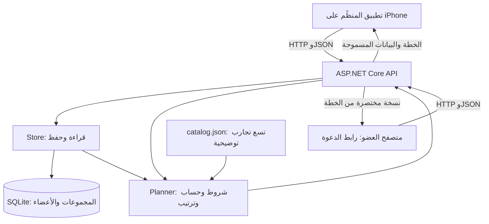

# تعلّمي بناء حاتم من الصفر — نسخة C# و.NET

هذا دليل قراءة وبناء مستقل للمبتدئة، مبني على **الكود الموجود فعلًا** في فرع `codex/dotnet-backend`، عند الالتزام `508219d326ec2f2ec5fa8c18dba3b35d49ef5fc0`، بتاريخ ١٤ سبتمبر ٢٠٢٦. لا تحتاجين تعلّم لغة الباك إند السابقة. أسماء بعض اختبارات التوافق تشير إلى تاريخ النقل فقط.

**الفكرة التي ستبنينها:** تدخل مجموعة أذواقها وقيودها، وتختار تجربة أساسية «ركيزة»، ثم يختار الخادم تجارب تناسب عدد خانات الوجبات. إذا نقص الوقت، يبقى الأهم وتذهب بقية التجارب إلى الجيب مع سبب واضح.

الكود الحالي بُني بمساعدة الذكاء الاصطناعي. هذا الشرح أيضًا مساعدة تعليمية مولّدة، وليس دليلًا على أنك كتبتِ المشروع بنفسك. لتحقيق هدفك، استخدمي المراجع الأصلية، اكتبي تطبيقك من مجلد فارغ، واحتفظي بتجاربك وأخطائك واختباراتك الحقيقية. لا تقدّمي الكود الحالي على أنه عمل كتبته بنفسك. راجعي حدود المساعدة التعليمية مع المدرسة إذا كانت تعليماتها الإضافية تمنعها.

## كيف تقرئين هذا الدليل؟

كل فصل يشرح ملفات محددة، وتراكيبها، والدوال، والشروط، وسبب وجودها. أرقام الأسطر تشير إلى نسخة الكود أعلاه. افتحي الملف بجانب الفصل في المحرّر، وفعّلي أرقام الأسطر. الخصائص المتكررة، مثل الألوان والأقواس و`padding`، لها معجم واحد بدل تكرار التعريف مئات المرات. ملفات الحزم المولّدة والصور تُشرح بوظيفتها وبنيتها؛ لا تُكتب يدويًا سطرًا سطرًا.

| الترتيب | الفصل | ما تستطيعين فعله بعده |
|---|---|---|
| ٠ | [متطلبات المدرسة وحدود النسخة](00-school-and-scope.md) | تمييز المنتج التجريبي عن التسليم الأكاديمي |
| ١ | [الأساسيات وخريطة النظام](01-foundations.md) | فهم المتغير والدالة وHTTP وReact وC# |
| ٢ | [نماذج البيانات ومحرك القرار](02-models-and-planner.md) | حساب خطة يدويًا وقراءة `Models` و`Planner` |
| ٣ | [قاعدة البيانات والـAPI وتشغيل الخادم](03-database-and-api.md) | تتبّع كل endpoint وفهم الصلاحيات والمعاملات |
| ٤ | [بدء التطبيق والاتصال والحالة](04-app-data-and-state.md) | فهم `App` و`client` و`storage` و`useOrganizer` |
| ٥ | [المكونات والتصميم](05-components-and-style.md) | بناء نموذج وزر وبطاقة وواجهة زجاجية |
| ٦ | [الشاشات ورحلات المستخدم](06-screens.md) | فهم كل شاشة وكل فعل يضغطه المستخدم |
| ٧ | [الإعدادات والتشغيل وXcode والنفق](07-tooling-and-running.md) | تشغيل الطبقات وفهم الملفات والسكريبتات |
| ٨ | [الاختبارات وتصحيح الأخطاء](08-tests-and-debugging.md) | كتابة دليل أن القواعد تعمل وتشخيص العطل |
| ٩ | [البناء بنفسك خطوة خطوة](09-build-it-yourself.md) | البدء من الصفر وتمييز كل مرحلة مكتملة |
| مرجع | [فهرس جميع ملفات النسخة](10-file-index.md) | الوصول إلى شرح أي ملف دون التخمين |

لا يلزم إنهاء فصل طويل في جلسة واحدة. بعد كل دالة: اشرحي مدخلاتها بصوتك، توقّعي النتيجة، شغّلي مثالًا صغيرًا، ثم غيّري مدخلًا واحدًا. إذا احتجتِ حفظ السطر حرفيًا لكي تشرحيه، ارجعي للمثال الأصغر.

## الصورة الكاملة في دقيقة

`React Native` يرسم الواجهة. `Expo` يوفّر أدوات البناء ومكتبات الجهاز. `TypeScript` يفحص أنواع كود الواجهة. `C#` لغة الخادم، و`.NET` بيئة تشغيله، و`ASP.NET Core` إطار الويب فوقها. `SQLite` تحفظ بيانات المجموعة. `Cloudflare Tunnel` يوصل طلبات الإنترنت إلى الخادم الذي يعمل على الماك؛ لا ينقل قاعدة البيانات إلى استضافة دائمة.

محرك القرار لا يستدعي نموذج ذكاء اصطناعي. هو خوارزمية قواعد واضحة تقرئينها كاملة في الفصل الثاني.

ابدئي الآن بالفصل صفر، ثم خذي تمرين «ثلاث تجارب على ورقة» في الفصل التاسع. الشرح القديم في `docs/learning/` يخص النسخة السابقة؛ المرجع التعليمي لهذه النسخة هو هذا المجلد.
