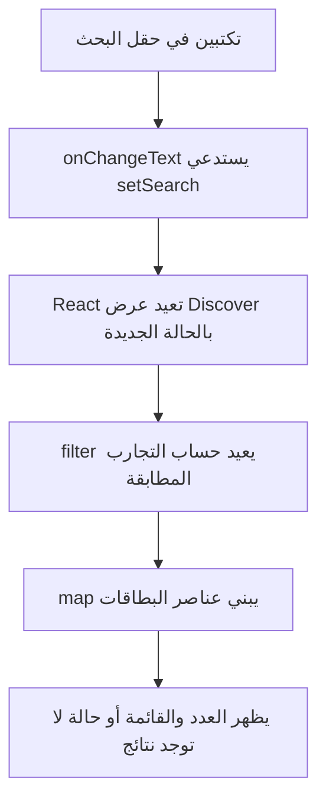
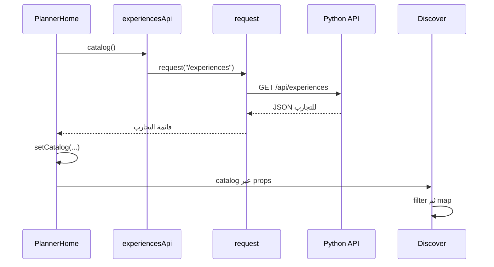

# تعلّم واجهة حاتم بالهندسة العكسية

هذا الدليل يشرح الواجهة في المصدر `50d218c` بتاريخ29سبتمبر2026. هو مسار تعلّم جديد مرتبط بالكود الحالي، وليس تعديلًا لكتاب شرح الأسطر التاريخي `59d45d3`. الأمثلة المختصرة موصوفة بأنها مختصرة؛ ليست ملفات كاملة جاهزة للاستبدال.

هدفك أن تستطيعي النظر إلى جزء في التطبيق، العثور على كوده، تفسيره، تغيير سلوكه بتوقع واضح، ثم إعادة بناء نسخة صغيرة منه بنفسك. قراءة الملف وحدها لا تكفي للتحقق من الفهم.

## كيف سنستخدم الهندسة العكسية؟

في كل درس اتبعي هذه الدورة:

1. **شاهدي سلوكًا واحدًا:** بطاقة، بحث، حفظ في الجيب، أو تعديل شخصية.
2. **صفيه بكلماتك:** ما الذي يظهر؟ ماذا يتغير بعد الضغط؟
3. **اعثري على المسؤول:** ابحثي عن النص الظاهر أو اسم المكوّن في المشروع.
4. **تتبعي البيانات:** من أين جاءت؟ وأين تُحفظ؟ ومن يملك تغييرها؟
5. **توقعي ثم جرّبي:** اكتبي النتيجة المتوقعة قبل تعديل صغير.
6. **أعيدي بناء الجزء:** اغلقي المصدر واكتبي نسخة أبسط في مشروع تدريبي، ثم قارني السلوك.

مثال: لا تقولي «فهمت البحث» فقط؛ اشرحي لماذا يتغير عدد البطاقات عند الكتابة، ولماذا لا نحتاج طلب شبكة جديدًا لكل حرف في التنفيذ الحالي.

## الأدوات التي ترين أسماءها

| الاسم | دوره في حاتم |
|---|---|
| JavaScript | تعليمات مثل الشروط والدوال والتعامل مع قائمة التجارب |
| TypeScript | يضيف أوصافًا لأنواع البيانات حتى يكشف أخطاء قبل التشغيل |
| React | يبني الواجهة من مكونات، ويعيد حساب عرضها عند تغير الحالة |
| React Native | يوفر عناصر الهاتف مثل View وText وTextInput وPressable |
| Expo | يوفر أدوات التشغيل والبناء وحزمًا مثل الخطوط والزجاج والمشاركة |
| JSX | طريقة كتابة وصف العناصر داخل كود JavaScript/TypeScript |
| ملف tsx | ملف TypeScript يمكنه احتواء JSX |

المشروع المثبت يستخدم React19.2.3 وReact Native0.86.3 وExpo57.0.20 بحسب package.json. تعلّمي من [مرجع Expo57](https://docs.expo.dev/versions/v57.0.0/) عند الرجوع لحزم Expo. مكونات React Native لها [مرجع رسمي](https://reactnative.dev/docs/intro-react-native-components). كتابة JSX على الهاتف لا تعني أن View وText عناصر HTML؛ توجد أيضًا نسخة ويب من المشروع تستخدم react-native-web.

قبل أول درس يكفي أن تتعلمي بالتطبيق: `const`، النصوص والأرقام، كائنًا مثل `{ title: "تجربة" }`، مصفوفة مثل `[a, b]`، قراءة الخاصية بالنقطة، والدالة. ثم أضيفي الشروط وfilter وmap أثناء درس الاكتشاف؛ لا يلزم حفظ اللغة كاملة أولًا.

## خريطة ملفات الواجهة

```text
index.ts                         يسجّل المكوّن الرئيسي لدى Expo
App.tsx                          يعيد تصدير AppRoot
src/application/AppRoot.tsx      يحمّل الخطوط ويختار الصفحة العليا
src/application/PlannerHome.tsx  يجمع الاكتشاف والخطة والجيب والتنقل
src/features/experiences/        شاشة الاكتشاف وبطاقة التجربة وجلب الكتالوج
src/features/planning/           سلوك الخطة والجيب والرفقة المباشرة
src/features/skins/              اختيار الشخصية وتركيب رسوماتها
src/shared/ui/                   الأزرار والنصوص والعناصر المتكررة
src/shared/theme.ts              الألوان والخطوط وربط صور التجارب
src/shared/api/http.ts           إرسال طلبات HTTP ومعالجة أخطائها
```

المجلد `application` يركّب الصفحات. `features` يجمع ملفات الميزة الواحدة. `shared` للأدوات العامة التي تستخدمها أكثر من ميزة. عند استعمال ميزة من خارجها نستورد من مدخلها `index.ts`، كما يستورد PlannerHome مكونات experiences؛ لا نحتاج حفظ كل الملفات لبدء التعلم.

المشروع الحالي لا يستخدم Expo Router. اختيار الصفحات والتبويبات يتم بالحالة والدوال في AppRoot وPlannerHome. هذه طريقة مستخدمة هنا وليست قاعدة مفروضة على كل تطبيق React Native.

## ترتيب الدروس وإثبات فهم كل درس

| الدرس | ندرسه من حاتم | ما تكتبينه بنفسك |
|---|---|---|
| 1. مكوّن ونص وتنسيق | ExperienceCard وT وtheme | بطاقة واحدة بعنوان ومكان وسعر |
| 2. البيانات الداخلة Props | experience وsaved في البطاقة | ثلاث بطاقات بنفس المكوّن وبيانات مختلفة |
| 3. الحالة والأحداث | category وsearch داخل Discover | تصنيف وبحث يغيران القائمة |
| 4. تركيب الصفحات | AppRoot وPlannerHome | انتقال بين قائمتين وفتح تفاصيل بطاقة |
| 5. طلب البيانات | experiences/api وshared/api/http | قائمة من الخادم مع انتظار وخطأ وإعادة محاولة |
| 6. تغيير بيانات مشتركة | حفظ التجربة في الجيب وuseOrganizer | زر حفظ تعكس نتيجته البطاقة وقائمة المحفوظات |
| 7. نموذج ومسودة | SkinEditor وSkinPicker | تعديل مسودة، إلغاء، وحفظ صريح |
| 8. عرض متكيف وإتاحة | useWindowDimensions وأسماء الأزرار وGlass | واجهة تعمل على شاشة ضيقة وعريضة وبأزرار مفهومة |
| 9. التحقق | اختبارات رحلات الواجهة في tests | اختبار سلوك ظاهر وسبب فشله، ثم إصلاحه |

ابدئي بالبطاقة والاكتشاف، ثم انتقلي للأجزاء الأخرى بهذا الترتيب. يمكن فهم البحث والرسم دون دراسة SQL؛ ندرس عقد البيانات عندما نصل إلى الاتصال بالخادم.

## الدرس الأول: من البطاقة الظاهرة إلى المكوّن

افتحي [ExperienceCard.tsx](../src/features/experiences/ExperienceCard.tsx). المكوّن هو دالة تصف جزءًا من الواجهة. هذه **نسخة مختصرة تعليمية** من الفكرة داخل البطاقة، وليست النص الكامل للملف:

```tsx
export function ExperienceCard({ experience: e }) {
  return (
    <View>
      <T>{e.title}</T>
      <T>{e.venue}</T>
    </View>
  );
}
```

| السطر أو الرمز | معناه |
|---|---|
| `export` | يسمح لملف آخر باستعمال المكوّن |
| `function ExperienceCard` | تعريف دالة باسم المكوّن؛ اسم مكوّن JSX يبدأ بحرف كبير |
| `{ experience: e }` | أخذ الخاصية experience من البيانات الداخلة وتسميتها e داخل الدالة |
| `return` | إرجاع وصف ما سيظهر |
| `<View>` | حاوية تجمع العناصر وتساعدنا على ترتيبها |
| `<T>` | مكوّن نص صنعناه داخل حاتم |
| `{e.title}` | قراءة عنوان التجربة وإظهار قيمته؛ الأقواس هنا تدخل تعبير JavaScript داخل JSX |
| `</View>` | نهاية الحاوية التي بدأناها |

في الملف الحقيقي يوجد وصف TypeScript هو `experience: Experience`. معناه أن البيانات الداخلة يجب أن توافق النوع Experience. لا يتحقق TypeScript وحده من صحة الرد القادم من الشبكة أثناء التشغيل، ولا ينشئ البيانات أو يجلبها.

**من أين جاءت T؟** افتحي [primitives.tsx](../src/shared/ui/primitives.tsx). المكوّن T يعرض Text من React Native ويضيف خط حاتم الافتراضي. لذلك لا تحتاج كل بطاقة إلى إعادة كتابة إعداد الخط. الألوان والخطوط تُعرّف في [theme.ts](../src/shared/theme.ts).

**ومن أين يأتي العنوان؟** افتحي [Discover.tsx](../src/features/experiences/Discover.tsx). ستجدين داخل تكرار القائمة:

```tsx
<ExperienceCard
  experience={e}
  onOpen={() => onOpen(e)}
  onSave={() => onSave(e)}
  saved={pocketIds.has(e.id)}
  priority={
    group?.plan.selected.find((d) => d.experience_id === e.id)?.priority
  }
/>
```

هذا استخدام للمكوّن وليس تعريفه. `experience={e}` يعطي البطاقة بيانات تجربة واحدة. `saved` يخبرها إن كانت في الجيب. `onOpen` و`onSave` دالتان تمرران لها؛ البطاقة تستدعيهما عند الضغط. فتح التفاصيل وحفظ البيانات يحدثان عبر من مرر الدالتين، وليس بطلب مباشر داخل ExperienceCard.

`group` في هذا المسار اسم قديم لبيانات الخطة المباشرة ورفقتها؛ لا يعني أن المستخدم ملزم بإنشاء قروب دائم لتصفح التجارب.

**تمرينك الأول:** اقرئي عنوان بطاقة في المحاكي، وابحثي عن `{e.title}` داخل ExperienceCard. حددي كيف تصل e إلى البطاقة من Discover. اكتبي هذا المسار بكلماتك قبل محاولة أي تعديل.

## الدرس الثاني: تتبع البحث خطوة بخطوة

في Discover توجد هذه الأسطر الفعلية:

```tsx
const [category, setCategory] = useState("الكل");
const [search, setSearch] = useState("");
```

`useState` يعطي قيمتين: القيمة الحالية ودالة تحديثها. `search` نص البحث الحالي، و`setSearch` يطلب تحديثه. البداية نص فارغ `""`. تحفظ React الحالة بين مرات عرض المكوّن؛ لا يعود البحث فارغًا مع كل إعادة عرض. تحديث الحالة يجعل React تحسب العرض بالقيمة الجديدة، وليس إعادة تشغيل التطبيق كله. [شرح الحالة الرسمي](https://react.dev/learn/state-a-components-memory).

حقل الإدخال في الملف متصل بها. هذا مقطع مختصر مع حذف خصائص الشكل والإتاحة للتوضيح فقط:

```tsx
<TextInput
  placeholder="وش خاطرك فيه؟"
  value={search}
  onChangeText={setSearch}
/>
```

`placeholder` تلميح يظهر عندما يكون الحقل فارغًا. `value` هو النص الفعلي المعروض. عندما تكتبين يستدعي TextInput دالة onChangeText بالنص الجديد. مررنا setSearch نفسها لأنها تستقبل نصًا؛ فيتحدث search.

ثم ينفّذ المكوّن الفلترة الموجودة في الملف:

```tsx
const filtered = catalog.filter(
  (e) =>
    (category === "الكل" || e.category === category) &&
    `${e.title} ${e.venue} ${e.cuisine} ${e.neighborhood}`.includes(
      search.trim(),
    ),
);
```

- `catalog` قائمة التجارب التي وصلت إلى الشاشة.
- `filter` تمر على كل تجربة وتنتج قائمة جديدة مما نجح في الشرط، دون حذف عناصر الكتالوج الأصلي.
- `e` اسم مؤقت للتجربة التي نفحصها الآن.
- `===` مقارنة تساوٍ. `||` تعني «أو»: التصنيف الكل، أو تصنيف التجربة يساوي المختار.
- `&&` تعني أن شرط التصنيف وشرط النص يجب أن ينجحا معًا.
- العلامتان الخلفيتان تصنعان نصًا يجمع العنوان والمكان والمطبخ والحي، و`${...}` تُدخل قيمة داخل ذلك النص.
- `trim()` يزيل الفراغات من طرفي البحث.
- `includes()` يفحص وجود البحث في النص المجمع. البحث الحالي مطابقة نصية مباشرة؛ لا يصحح الأخطاء الإملائية أو يوحد أشكال الحروف.

وأخيرًا تعرض `filtered.map(...)` بطاقة لكل تجربة في القائمة الناتجة. `map` تحوّل عناصر البيانات إلى عناصر واجهة هنا. `key={e.id}` يعطي كل عنصر هوية مستقرة تساعد React عند تغير ترتيب القائمة.



هذه العملية كلها تحدث في الواجهة بعد تحميل الكتالوج. لا يوجد طلب جديد إلى الخادم داخل حقل البحث أو filter في التنفيذ الحالي. إذا غيّرتِ النص إلى كلمة لا تطابق شيئًا، يظهر Empty وزر «عرض كل التجارب». هذا الزر يمسح search ويعيد category إلى الكل.

## الدرس الثالث: ارجعي خطوة أخرى لمعرفة مصدر الكتالوج

المسار الفعلي:



في [PlannerHome.tsx](../src/application/PlannerHome.tsx) توجد حالة catalog ودالة loadCatalog. عند النجاح تنفذ `setCatalog(await experiencesApi.catalog())`، وعند الفشل تضع رسالة في catalogError. وفي عرضه يمرر `catalog={catalog}` إلى Discover.

[experiences/api.ts](../src/features/experiences/api.ts) يحدد المسار `/experiences`. [http.ts](../src/shared/api/http.ts) يضيف `/api` وأصل الخادم، ثم يستخدم fetch ويتحقق من نجاح الرد ويقرأ JSON. عنوان المحاكي هو localhost:8000؛ نسخة الويب تستعمل أصل الصفحة، والهاتف الحقيقي يستخدم العنوان المضبوط في البيئة.

`async` و`await` يساعدان على كتابة العملية التي تنتظر رد الشبكة. الانتظار لا يعني أن الخادم صار جزءًا من React. الشاشة تعرض البيانات الواردة؛ Python وPostgreSQL لهما دور منفصل وراء عقد HTTP.

عند التعلم فرّقي بين ثلاث حالات: انتظار الرد، وصول قائمة فارغة فعلًا، وفشل الاتصال. التطبيق الحقيقي يستحق قراءة نقدية؛ إذا رأيتِ عرضًا مؤقتًا ملتبسًا أو ملفًا طويلًا، اكتبي ملاحظتك ولا تفترضي أن كل اختيار معماري هنا هو الطريقة الوحيدة الصحيحة.

## كيف تقرئين الشكل بدل حفظ قيمه؟

من Discover:

```tsx
const { width } = useWindowDimensions();
const wide = width >= 900;
```

التطبيق يسأل عن عرض النافذة ويحدد هل هي واسعة. حاوية البطاقة تستخدم عرضًا100% للشاشة الصغيرة، و48.4% عند600 فأكثر، و31.9% للشاشة الواسعة. هذه أرقام اختارها التصميم الحالي وليست قواعد React Native.

اقرئي خصائص التنسيق بهذه المعاني:

| الخاصية | السؤال الذي تجيب عنه |
|---|---|
| `padding` | كم مسافة نترك داخل العنصر؟ |
| `margin` | كم مسافة نترك خارجه؟ |
| `gap` | كم فراغًا نضع بين عناصر الحاوية؟ |
| `flexDirection` | هل ترتب الحاوية أبناءها في صف أو عمود، وبأي اتجاه؟ |
| `borderRadius` | ما مقدار استدارة الزوايا؟ |
| `fontSize` | ما حجم النص؟ |
| `backgroundColor` | ما لون خلفية العنصر؟ |

قيم الأبعاد الرقمية في React Native وحدات تخطيط مستقلة عن كثافة الشاشة، وليست عدد بكسلات الصورة المادية. `row-reverse` يعكس ترتيب العناصر في الصف؛ وحده لا يحل جميع مسائل العربية واتجاه النص والإتاحة.

## كيف تتدربين على نسخة تعمل؟

النسخة التي فُتحت في المحاكي Release، أي نسخة مبنية. حفظ تغيير في ملف tsx لا يحدثها تلقائيًا. للتدريب مع تحديثات أثناء التطوير، شغّلي من جذر المشروع `npm run ios` لبناء وتشغيل وضع التطوير بدل `npm run ios:release`. يجب أن يبقى خادم التطوير يعمل. عند تشغيل مشروع كان متوقفًا تحتاجين أيضًا قاعدة البيانات والخادم: `npm run db:up` ثم `npm run api` في نافذة منفصلة. الأوامر موجودة في package.json؛ كل أمر له دور مختلف.

اعملي تجارب الكود في نسخة أو فرع تدريبي، وغيّري شيئًا واحدًا كل مرة. لا تستبدلي ملف Discover الكامل بالمقاطع المختصرة في هذا الدليل. بعد التعديل شغّلي `npm run typecheck`؛ نجاحه لا يغني عن رؤية النتيجة في المحاكي. عند تغيير حدود المجلدات والاستيرادات استخدمي `npm run check:architecture`.

## تمارين متدرجة بلا نسخ الحل

1. **نص:** ابحثي عن «وش خاطرك فيه؟»، غيّري التلميح إلى عبارة تختارينها، ثم فسري لماذا لم يتغير منطق البحث.
2. **تتبّع:** اكتبي اسم دالة التحديث المرتبطة بحقل البحث، ثم موضع استخدام قيمتها في filter.
3. **توقع:** ماذا يحدث لو بحثتِ عن مسافات فقط؟ جرّبي بعد كتابة توقعك.
4. **تصنيف:** اختاري تصنيفًا ثم اكتبي عنوان تجربة من تصنيف آخر؛ اشرحي النتيجة باستخدام && و||.
5. **شكل:** غيّري حجم عنوان بطاقة في مشروعك التدريبي، وقارني أثره بتغيير حجم عنوان شاشة الاكتشاف.
6. **استقلال:** أعيدي كتابة بطاقة بسيطة من الذاكرة تستقبل title وprice، ثم اعرضي ثلاث نسخ منها من مصفوفة بيانات محلية.
7. **حالة:** أضيفي إلى نسختك التدريبية بحثًا في العنوان فقط. قبل الخادم، تحققي من البحث الفارغ والنتيجة الواحدة وعدم وجود نتيجة.
8. **شبكة:** عند الوصول إلى درس الاتصال، فرّقي عمليًا بين خطأ الخادم والنتائج الفارغة، وضعي إجراء إعادة محاولة مفهومًا.

في كل تمرين اكتبي ثلاثة أشياء: الملف الذي غيرتِه، توقعك قبل التشغيل، وما حدث فعلًا. إذا لم يتطابقا، ابدئي من آخر خطوة في المسار التي تأكدتِ من صحتها. بهذا يكون التطبيق مصدر أمثلة تتعلمين منه وتناقشينه، ثم تستطيعين بناء واجهة مشابهة بيدك.
