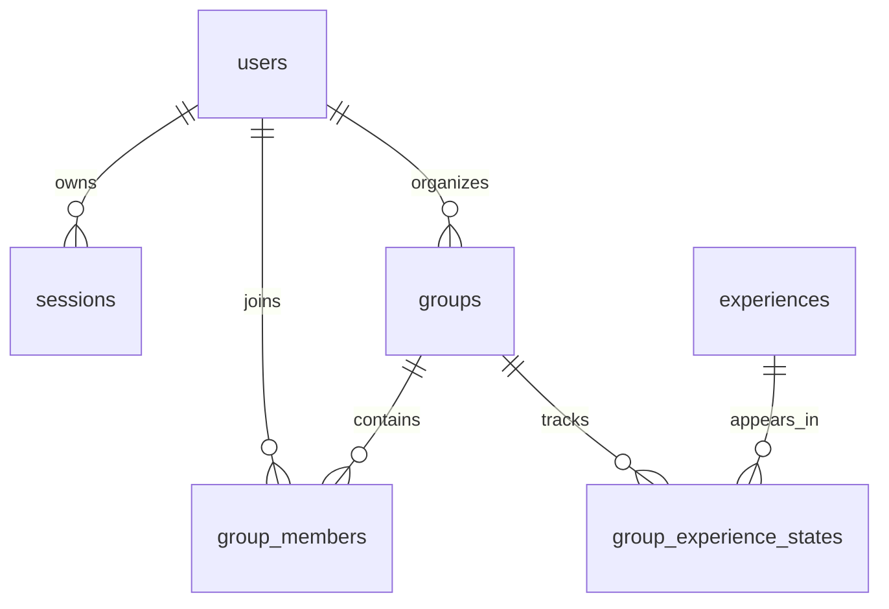

# 11 · كيف تطورين نسختك الدراسية؟

[الفهرس](README.ar.md) · [التالي: التمارين](12-practice.ar.md)

**هذا الفصل تصميم مقترح، غير منفذ في التطبيق الحالي.** الفصل 00 يربط المتطلبات بمصادر المدرسة. لا تنسخي الرسم التالي تحت عنوان «معمارية النسخة الحالية»؛ الحالية فيها groups وmembers وschema_migrations فقط.

## الحسابات أولًا

اختاري حسابًا باسم دخول أو بريد وكلمة مرور، ثم قرري sessions أو JWT. لتطبيق صغير، session عشوائية محفوظة في جدول مع تاريخ انتهاء وإبطال مفهوم خيار يمكن شرحه بسهولة. JWT ليست شرطًا، وليست بديلًا لفحص ملكية المجموعة.

التسجيل: تحقق المدخلات، رفض الاسم المكرر، تجزئة كلمة المرور بمكتبة مناسبة، ثم حفظ المستخدم. الدخول: قراءة المستخدم والتحقق من التجزئة ثم إنشاء جلسة. الطلب المحمي: فحص الجلسة وانتهائها وهوية صاحبها ثم إذنه على المورد. الخروج: إبطال الجلسة في الخادم وإزالة نسخة العميل. حذف النص من الجهاز وحده لا يمنع إعادة استعمال نسخة مسروقة منه.

لا تستعملي digest الحالية لكلمات المرور. هي SHA-256 لرموز عشوائية عالية العشوائية، بينما كلمات المرور تحتاج آلية مخصصة مثل Argon2 عبر مكتبة موثوقة. [شرح FastAPI لتجزئة كلمات المرور وتدفق المصادقة](https://fastapi.tiangolo.com/tutorial/security/oauth2-jwt/) مرجع تقني؛ استخدامه لا يجبرك على JWT.

إذا استخدمتِ cookies في المتصفح، تعلمي HttpOnly وSecure وSameSite وحماية CSRF المناسبة. وإذا خزنتِ bearer في تطبيق native فتعلّمي التخزين الآمن وانتهاء الجلسة. هذه قرارات تصميم تتبع وسيلة المصادقة؛ لا تجمعي مقتطفات حلول مختلفة بلا فهم.

## علاقات مقترحة

users تمثل الشخص، group_members تمثل عضويته في مجموعة معينة؛ لذلك يمكن للشخص دخول أكثر من مجموعة مع ملف تفضيلات خاص بكل مجموعة. sessions ليست عضويات؛ وظيفتها إثبات الدخول لفترة. groups يمكن أن تحمل owner_user_id، وexperiences تحمل الكتالوج، وgroup_experience_states تمثل جيبًا يدويًا أو إكمالًا بعلاقة حقيقية مع تجربة.

صممي UNIQUE للمستخدم داخل المجموعة، وforeign keys، ومعنى حذف مجموعة أو تجربة مستخدمة. حددي هل تفضيلات الشخص عامة أم مرتبطة بالمجموعة، ولا تخزني نسختين متناقضتين دون حاجة. قرار الحفاظ على خوارزمية الترتيب مستقلة يبقى مناسبًا حتى بعد تغيير DB.

## خطة تنفيذ ومعايير قبول

| العمل | إثباته المطلوب في نسختك |
|---|---|
| الحساب والجلسة | تسجيل، دخول صحيح وخاطئ، انتهاء، خروج، ورفض الجلسة القديمة |
| صلاحيات المجموعة | حساب ثانٍ لا يقرأ/يعدل بيانات مجموعة لا يملك إذنها |
| الكتالوج في PostgreSQL | seed مصطنعة، قراءة من DB، وتدفق تحرير بصلاحية مناسبة إذا ضمن النطاق |
| CRUD للمجموعة | إنشاء وقراءة وتعديل الاسم/السعة وحذف وفق سلوك موثق |
| الدعوة | رمز دعوة منفصل عن session، وانضمام يربط العضو بالحساب وفق تصميمك |
| الخطة | نفس قواعد القيود والوقت والركيزة والجيب مع أمثلة واختبارات مستقلة |
| النشر | خدمة API وقاعدة متاحتان للفريق، وشرح إعادة التشغيل وbackup |

لا حاجة لإضافة Temporal أو Redis أو microservices لمجرد جعل الرسم كبيرًا. الطلب الحالي قرارات قصيرة وCRUD وتحديث دوري. إذا أضفتِ انتظارًا طويلًا أو سير إجراءات جديدًا لاحقًا، قيّمي حاجته بدل تحويله إلى شرط لم تفرضه المدرسة.

## تسليمات من عملك

قصص مستخدم بأولويات ومعايير قبول. Figma لحالات البداية والنموذج والخطة والجيب والتحميل والخطأ. ERD يطابق SQL فعلية، وsequence diagrams تطابق endpoints. مواصفات API بأمثلة وهمية وأخطاء وصلاحيات. خطة SCM: فروع صغيرة ومراجعة وcommits حقيقية. خطة QA: اختبارات وحدات وتكامل ورحلات ومعايير فشل. سجل تعلم أسبوعي يعكس العمل المنفذ، ثم العرض والبوستر وصفحة تعريف.

يمكن أن يكون التنفيذ في مستودع واحد بمجلدَي frontend/backend، لكن راجعي مع المدرّبة شكل تسليم المستودعات؛ لا أستنتج أن تنظيم هذا المرجع هو التنظيم الوحيد المقبول. قبول المشروع يتطلب مراجعة النطاق والتأليف والتسليمات، وليس اختيار Python وPostgreSQL وحده.
