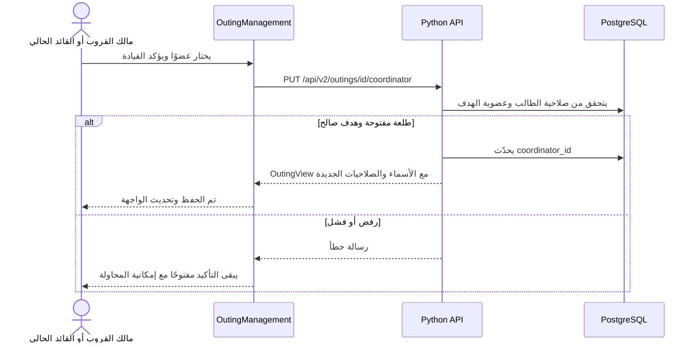

# ١٤. توضيح القيادة وإظهار الطرد

> فصل تاريخي للسلوك قبل إعادة الهيكلة. روابط الكود أدناه مثبتة على النسخة94f2277؛ للمسارات الحالية وطريقة التوسعة اقرئي [الفصل17](17-extensible-architecture.ar.md).

هذا الفصل يشرح إصلاح تجربة الإدارة بعد إضافة القروبات في [الفصل ١٣](13-social-groups.ar.md). يخص React Native وPython وPostgreSQL على فرع `codex/persistent-groups`، ولا يغيّر نسخة الكتاب القديمة الموثقة عند `59d45d3`.

## ما المشكلة؟

كانت تسمية المسؤول غير واضحة، وتعيين قائد الطلعة مخفيًا في تبويب الحضور، ومتاحًا لمالك القروب فقط. وكان اختيار القائد يشترط حضوره، رغم أن المسؤولية والحضور قراران مختلفان. زر الطرد الحقيقي كان داخل إدارة العضو، وزر المزاح يختفي تمامًا إذا لم تتحقق شروطه. عندما تكون وحدك في القروب، لا يوجد عضو آخر تظهر عليه الإجراءات؛ الواجهة القديمة لم تشرح هذا السبب.

القاعدة الآن: **نعرض المسؤول باسمه، ونضع الإدارة في مكان واضح، ونشرح سبب تعطيل الإجراء.**

## كيف تستخدمها؟

1. افتح القروب ثم «طلعة جديدة». بعد الاسم والخانات يظهر «مين قائد الطلعة؟». اختر نفسك أو عضوًا مرتبطًا بحساب. المنشئ هو الاختيار الافتراضي.
2. داخل الطلعة تظهر بطاقة «قائد الطلعة» و«مالك القروب» باسميهما، وزر «إدارة الطلعة والطرد» أعلى التبويبات.
3. من هذا الزر اختر «تغيير قائد الطلعة»، ثم الشخص، ثم «تأكيد تعيين القائد». القائد الحالي أو مالك القروب يستطيعان النقل. اختيار شخص لا يؤكد حضوره تلقائيًا.
4. في الإدارة يظهر «الطرد الفكاهي 😄». فعّل موافقتك، واطلب من العضو الآخر تفعيل موافقته وتأكيد حضوره. يظهر زر طرده الفكاهي حتى قبل اكتمال الشروط، ومعه السبب الذي يمنع تشغيله.
5. الطرد الحقيقي هو «طرد اسم العضو من القروب»، ثم «تأكيد الطرد». يظهر أيضًا في صفحة القروب تحت «الأعضاء والطرد». للمالك فقط صلاحية تنفيذه، ويمكنه لاحقًا «إعادة اسم العضو للقروب».
6. إذا كنت وحدك ستقرأ «أنت وحدك في الطلعة حاليًا» وبجانبها طريق واضح لدعوة أعضاء. لا يوجد شخص يمكن طرده أو نقل القيادة إليه بعد.

## المالك والقائد ليسا الدور نفسه

| الدور | مسؤوليته | كيف يتغير؟ |
|---|---|---|
| مالك القروب | العضوية، الطرد والإعادة، ملكية القروب، وإدارة طلعاته | نقل ملكية صريح من صفحة القروب إلى عضو نشط له حساب |
| قائد الطلعة | خطة هذه الطلعة، التصويت، القرعة، نقل قيادتها | يختاره المنشئ، ثم يستطيع القائد الحالي أو المالك تغييره |
| عضو | تفضيلاته وحضوره وصوته وموافقته على المزاح | الانضمام إلى القروب |

إذا نقل القائد القيادة، يفقد صلاحياتها مباشرة. إن كان أيضًا مالك القروب، تبقى له صلاحيات المالك. العضو الجديد لا يكتسب حق الطرد الحقيقي بمجرد تعيينه قائدًا. أما حقل `preferences.role` القديم، فيعني «مقيم أو زائر» ولا يمنح أي صلاحية إدارية.

## مسار البيانات

لا جدول جديد ولا ترحيل جديد لقاعدة البيانات. حقل `outings.coordinator_id` وعلاقة العضو بالطلعة كانا موجودين. لذلك [ERD الحالي](../architecture-python-postgres.ar.md) لا يتغير؛ التعديل في التحقق من القواعد وعرضها. نقل القيادة وحده لا يغيّر الحضور أو التصويت أو الركيزة أو مراجعة الخطة.

## شرح التغييرات في Python

### `models.py`: شكل الطلب والجواب

في [models.py](https://github.com/shathaaa1110-arch/hatim-app/blob/94f227750c0179145345bb669635a731bcd6d676/backend/hatim/social/models.py)، أضفنا إلى `OutingCreate` الحقل `coordinator_id`. النوع `str | None` يعني معرفًا نصيًا أو عدم اختيار. القيمة الافتراضية `None` تحافظ على عمل العميل القديم: إذا لم يرسل اختيارًا، يبقى المنشئ هو القائد. `min_length=1` يرفض النص الفارغ.

الجواب الآن يعيد `owner_name` و`coordinator_name` و`coordinator_id`؛ فلا تخمّن الواجهة المسؤول من أول اسم في القائمة. كل مشارك يحمل `is_owner` إلى جانب `is_coordinator`، وبطاقة ملخص الطلعة تحمل اسم القائد أيضًا. هذه معلومات يحسبها الخادم من قاعدة البيانات.

### `domain.py`: قاعدة مشتركة بدل تكرار الشرط

الدالة `coordinator_target` في [domain.py](https://github.com/shathaaa1110-arch/hatim-app/blob/94f227750c0179145345bb669635a731bcd6d676/backend/hatim/social/domain.py) تبحث عن عضو نشط في **القروب نفسه** وله حساب. إذا لم تجده، تعيد خطأ409 برسالة واضحة. نستخدمها عند إنشاء الطلعة وعند نقل القيادة، حتى يطبق المساران الشروط نفسها.

لا تتحقق الدالة من `attendance == "going"`؛ فالحضور محفوظ بشكل مستقل. وتُجهّز `outing_view` و`circle_view` أسماء المسؤولين من سجلات الأعضاء وتفضيلاتهم، وتحددان العلامات الإدارية بحسب الحساب الحالي.

### `outings.py`: الصلاحية أولًا ثم التغيير

في [outings.py](https://github.com/shathaaa1110-arch/hatim-app/blob/94f227750c0179145345bb669635a731bcd6d676/backend/hatim/social/outings.py)، الإنشاء يختار المعرف المرسل أو معرف المنشئ، ويتحقق منه بالدالة المشتركة قبل الحفظ. يبقى المنشئ حاضرًا، وبقية الأعضاء في انتظار التأكيد، حتى لو كان أحدهم القائد المختار.

في مسار نقل القيادة، `manage_outing` يتحقق من أن طالب التعديل هو المالك أو القائد الحالي. ثم نتأكد أن الطلعة مفتوحة وأن الهدف صالح، ونحدّث المعرف ونبني جوابًا جديدًا. بعد التحديث يحسب الخادم الصلاحيات من المعرف الجديد، فلا يحتفظ القائد السابق بحق قديم.

العقد الكامل في [مرجع API](../api-social.ar.md). ملفات [OpenAPI](https://github.com/shathaaa1110-arch/hatim-app/blob/94f227750c0179145345bb669635a731bcd6d676/backend/openapi.json) و[أنواع TypeScript](https://github.com/shathaaa1110-arch/hatim-app/blob/94f227750c0179145345bb669635a731bcd6d676/src/api/schema.d.ts) مولدة بالأمر `npm run types:api`؛ لا نعدل النوع المولد يدويًا ثم ننسى الخادم.

## شرح التغييرات في React Native

| الملف | مسؤوليته بعد الإصلاح |
|---|---|
| [CircleScreen.tsx](https://github.com/shathaaa1110-arch/hatim-app/blob/94f227750c0179145345bb669635a731bcd6d676/src/social/CircleScreen.tsx) | تبويبا الطلعات والأعضاء، اسم المالك، اختيار القائد عند الإنشاء، الطرد والإعادة ونقل الملكية |
| [OutingScreen.tsx](https://github.com/shathaaa1110-arch/hatim-app/blob/94f227750c0179145345bb669635a731bcd6d676/src/social/OutingScreen.tsx) | أسماء المسؤولين، نقطة الدخول الثابتة للإدارة، فتحها من بطاقة المشارك |
| [OutingManagement.tsx](https://github.com/shathaaa1110-arch/hatim-app/blob/94f227750c0179145345bb669635a731bcd6d676/src/social/OutingManagement.tsx) | شاشة إدارة واحدة للقيادة والمزاح والطرد وأسباب تعطيلها وحالة العضو الوحيد |
| [ui.tsx](https://github.com/shathaaa1110-arch/hatim-app/blob/94f227750c0179145345bb669635a731bcd6d676/src/social/ui.tsx) | محتوى تأكيد قابل لإعادة الاستخدام يعرض الفشل داخل النافذة ويمنع الطلب المكرر |
| [client.ts](https://github.com/shathaaa1110-arch/hatim-app/blob/94f227750c0179145345bb669635a731bcd6d676/src/social/client.ts) | إرسال معرف القائد الاختياري مع طلب إنشاء الطلعة |

في `OutingManagement`، المتغير `picker` يحدد هل نعرض قائمة اختيار القائد. `confirmation` إما `null` أو وصف العملية المطلوب تأكيدها: عنوانها ونصها وزرها والدالة التي تنفذها. `success` نص يظهر بعد النجاح. هذه حالات عرض مؤقتة بـ`useState`، أما المسؤول الحقيقي والعضوية فيأتيان من الخادم.

الدالة `funBlock` ترجع سببًا نصيًا إذا كانت المزحة ممنوعة، و`null` إذا أمكن تنفيذها. يفحص ترتيبها إغلاق الطلعة واستهلاك المزحة وموافقة الطرفين وحضورهما. الزر يستعمل السبب في `disabled` ويعرض النص تحته؛ لذلك يعرف المستخدم أين الميزة وكيف يفعّلها.

للعضو الآخر زران واضحان: فكاهي وحقيقي. سبب تعطيل الحقيقي قد يكون أنه مالك القروب أو أن المستخدم الحالي ليس المالك. هذا العرض يساعد الفهم؛ الحماية الفعلية تبقى في Python، لأن أي شخص يستطيع محاولة إرسال طلب API خارج الواجهة.

### لماذا نافذة واحدة؟

`Sheet` مبنية على `Modal` في React Native. إغلاق نافذة ثم فتح نافذة تأكيد أخرى مباشرة قد يتداخل مع انتقال العرض على iPhone. الآن تبقى نافذة الإدارة نفسها مفتوحة، ونغير **محتواها** إلى `ConfirmationContent` عند التأكيد، ثم نرجع إلى الإدارة بعد النجاح. إدارة العضو في صفحة القروب تستخدم الأسلوب نفسه.

داخل `ConfirmationContent`، `saving` يغيّر العرض أثناء الطلب، ومرجع `inFlight` يمنع ضغطتين سريعتين من بدء طلبين قبل إعادة رسم الشاشة. `try` ينفذ العملية؛ النجاح يستدعي `done`، والفشل يحفظ رسالة الخطأ ويترك النافذة مفتوحة للمحاولة. `finally` يعيد حالة الانتظار. لا تظهر رسالة نجاح إذا رفض الخادم الطلب.

## الفرق بين نوعي الطرد

الفكاهي بطاقة «مقعد الاحتياط» لمدة٣٠ثانية، مرة واحدة لكل مستهدف في الطلعة. لا يحذف العضو ولا صوته ولا حساسيته أو تفضيلاته. العضو المستهدف يستطيع إغلاقها فورًا. موافقة المزاح محفوظة على عضويته في القروب، وليست موافقة تلقائية لكل شخص جديد.

الحقيقي يوقف العضوية في القروب ويزيل العضو من الطلعات المفتوحة ويعيد حساب الخطة. يحتفظ التطبيق بالسجل والطلعات المغلقة، ويتيح للمالك إعادة العضو. نافذة التأكيد توضح الأثر قبل التنفيذ. هذا الإصلاح أعاد إظهار المسارات الموجودة ولم يضف حذفًا نهائيًا للأعضاء.

## كيف نتحقق؟

[اختبارات Python](https://github.com/shathaaa1110-arch/hatim-app/blob/94f227750c0179145345bb669635a731bcd6d676/backend/tests/test_social.py) تتحقق من اختيار قائد ينتظر الحضور، ونقل القيادة بواسطة القائد الحالي، وفقدان صلاحياته بعدها، وبقاء الحضور والتصويت والخطة كما هي. ترفض أيضًا عضوًا من قروب آخر أو عضوًا مزالًا أو عضوية بلا حساب أو طلعة مغلقة.

[اختبار الإدارة في المتصفح](../../tests/management.spec.ts) يستخدم حسابين: ينشئ طلعة بقائد آخر، ويفتح الأزرار ويقرأ أسباب تعطيلها، ثم يحاكي خطأ503 عند نقل القيادة ويتحقق أن التأكيد بقي في نافذة واحدة وأن إعادة المحاولة تنجح. ويتحقق من منع غير المالك من الطرد، ومن تنفيذ المالك له ومنع وصول العضو بعد إزالته.

[رحلة القروب الكاملة](../../tests/social.spec.ts) تغطي أيضًا المزاح والتصويت والقرعة والطرد والإعادة. التشغيل على PostgreSQL في مخطط اختباري مستقل، مع تنظيفه بعد الانتهاء.

### ماذا يرى العضو المطرود؟

في [useRemote.ts](https://github.com/shathaaa1110-arch/hatim-app/blob/94f227750c0179145345bb669635a731bcd6d676/src/social/useRemote.ts)، إذا أعادت قراءة القروب أو الطلعة401 أو404 نمسح البيانات المعروضة ونظهر سبب عدم الإتاحة. تختفي معها نافذة الإدارة وأزرار الطلعة عند التحديث التالي، الذي يحدث كل٦ثوانٍ أثناء نشاط التطبيق أو عند الرجوع إليه. أخطاء الشبكة و5xx تبقي آخر عرض مع رسالة تعذّر التحديث؛ انقطاع الخدمة لا يعني طردًا أو حذف جلسة الحساب. الاختبار يفرّق بين الحالتين، ويختبر الطرد بينما نافذة العضو مفتوحة.

### نتيجة التحقق — ١٥ سبتمبر٢٠٢٦

نجحت٢٤٠ حالة Python مع فحص TypeScript والتنسيق وRuff. نجحت رحلات المتصفح الخمس على PostgreSQL. اجتاز بناء Release وتشغيله على محاكي iPhone17Pro. في قروب فحص مستقل، اخترنا عضوًا آخر قائدًا عند الإنشاء، ثم نقلنا القيادة عبر نافذة التأكيد، ونفذنا الطرد الفكاهي ورأينا العدّاد، ثم أكدنا الطرد الحقيقي. تحقق فحص PostgreSQL من المعرف الجديد وبطاقة المزاح وحالة العضوية removed، وأعاد طلب العضو المزال404. حُذفت بيانات الفحص وحدها بعدها. فحص الروابط ومخططات Mermaid مرّ بنجاح.

تحقق المحاكي يغطي تصرف المالك في الإجراءات المذكورة. فقدان صلاحية القائد السابق، وفشل الشبكة وإعادة المحاولة، واختفاء عرض العضو بعد الطرد اختُبرت أيضًا بحسابين في المتصفح؛ لا نستنتج هذه السيناريوهات من لقطة شاشة فقط.
