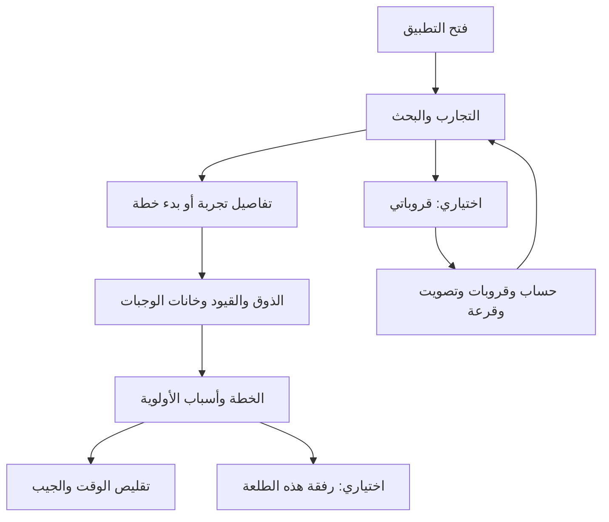

# ١٥. التجارب والخطة أولًا، والقروبات إضافة

هذا الفصل يشرح تصحيح مسار البداية على `codex/persistent-groups` بعد ملاحظة أن التطبيق أصبح يفتح القروبات فقط. نسخة Python وPostgreSQL هي المقصودة. مرجع الأسطر القديم عند `59d45d3` يبقى لقطة تاريخية كما هو.

## لماذا كان التطبيق يبدو كأنه قروبات فقط؟

إضافة القروبات جعلت `App.tsx` يختار `SocialApp` للهاتف. هذا المكون يستعيد الحساب ثم يعرض التسجيل أو قائمة القروبات. أصبح المستخدم يمر بحساب ثم قروب ثم طلعة قبل رؤية التجارب؛ صارت ميزة تنظيم الرفقة تتحكم في مدخل المنتج كله.

أساس حاتم هو اختيار تجربة تحت وقت متغيّر: قيود صلبة، تفضيلات مرنة، وخانات وجبات محدودة. لذلك البداية هي الاكتشاف، ثم الركيزة والخطة والجيب. القروب الدائم مفيد لحفظ الرفقة وتكرار الطلعات والتصويت، لكنه ليس شرطًا للبدء.

## الرحلة بعد التصحيح

1. يفتح التطبيق على «الطعم يبقى. والخطة تتغيّر.» والتجارب والبحث والتصنيفات، بلا تسجيل أو إنشاء بيانات لمجرد التصفح.
2. تفتح تفاصيل تجربة وتقرأ سبب اختيارها تحريريًا. تختار بدء خطة أو تحديد ركيزة أو حفظ تجربة في الجيب.
3. عند أول إنشاء يسألك عن الذوق والقيود وخانات الوجبات. يبقى اختيار التجربة أثناء النموذج وحتى عند إعادة المحاولة بعد الفشل.
4. تظهر الخطة مع سبب كل أولوية. تقليص الخانات يحافظ على الركيزة وينقل الباقي إلى الجيب. تُراجع القيود دائمًا؛ الحساسية لا تصبح تفضيلًا قابلًا للتجاهل.
5. من «خطّتنا → رفقة الطلعة وذوقي» تدعو أشخاصًا لهذه الخطة بالمتصفح دون حساب. ومن «قروباتي» تدخل القروبات الدائمة اختياريًا.
6. الرجوع من القروبات أو إعادة تشغيل التطبيق يعيد الاكتشاف ويستعيد الخطة المباشرة. لا يحوّل مجرد فتح القروبات خطتك إلى قروب دائم.

## مفاهيم قبل قراءة الكود

| المفهوم | المعنى | الحفظ |
|---|---|---|
| التجربة | طبق أو لحظة، مطبخ جديد، كنز أو افتتاح | الكتالوج، والمعرف داخل Settings |
| الخطة المباشرة ورفقتها | تخطيط دون حساب مع مفتاح للمنظم ودعوة للرفقة | groups وmembers |
| القروب الدائم | عضويات وتفضيلات تُستعمل في طلعات متعددة | circles وcircle_members وoutings |

اسم جدول groups لا يعني إنشاء قروب دائم. أبقينا الأسماء والمسارات لتعمل الخطط والدعوات الموجودة. [المعمارية وERD](../architecture-python-postgres.ar.md) يوضحان دور كل مسار؛ العلاقات والأعمدة لم تتغير.

## ملفات الواجهة

### App.tsx: ما الشاشة التي تظهر؟

في [App.tsx](../../App.tsx) أضفنا `groupsOpen` بحالة ابتدائية false. `useState` يخزن قرار العرض داخل React؛ ليس صلاحية أو بيانات محفوظة في DB. الهاتف ومعاينته يفتحان Organizer. الضغط على قروباتي يجعل الحالة true، فيظهر SocialApp. زر الرجوع يستدعي onExit ليعيدها false.

رابط الدعوة يفتح المسار المناسب للعضو. الويب دون دعوة أو معاينة يبقى مدخل الرفيق. `?preview=organizer` يعرض رحلة الهاتف في المتصفح، و`?preview=legacy` اسم بديل متوافق للمعاينة نفسها. وجود حساب محفوظ لا يغيّر البداية إلى إدارة القروبات.

### Organizer.tsx: التجربة قبل التسجيل

[Organizer.tsx](../../src/screens/Organizer.tsx) يعرض الاكتشاف حتى عندما تكون group مساوية null، أي لم تُنشأ خطة مباشرة بعد. لم نضع مجموعة وهمية ولم نرسل POST عند فتح التطبيق.

التبويبات هي اكتشف، خطّتنا، الجيب، قروباتي. رفقة الخطة الحالية شاشة مرتبطة بالخطة وببطاقة الرفقة في الاكتشاف. openGroups دالة يمررها الأب لفتح الإضافة؛ لا يحتاج Organizer معرفة جلسات الحساب أو التصويت.

`startIntent` يحفظ الاختيار قبل الإنشاء: kind يساوي anchor أو pocket وid معرف التجربة. `initialSlots` يحفظ الخانات المختارة. عند نجاح النموذج نرسل preferences وSettings في طلب واحد. يبدأ anchor_id بقيمة null ما لم يختر المستخدم ركيزة بنفسه.

تفاصيل التجربة ونموذج التخصيص يستخدمان Sheet واحدة تتغير محتوياتها. الانتقال من اختيار الركيزة إلى الذوق لا يفتح نافذتين أصليتين فوق بعضهما على iPhone. إذا فشل الحفظ تبقى النافذة والاختيار والذوق وتظهر رسالة لإعادة المحاولة.

### Discover.tsx: تصفح يعمل قبل وجود خطة

في [Discover.tsx](../../src/screens/Discover.tsx) أصبح نوع group هو `Group | null`. الرمز `?.` يقرأ الخاصية إذا كانت موجودة. دون خطة تكون معرفات الجيب فارغة ولا تظهر أولويات محسوبة من تفضيلات لم يُدخلها المستخدم.

الكتالوج والبحث والتصنيفات والتفاصيل تعمل مستقلة عن الإنشاء. بطاقة الرفقة تظهر بعد وجود الخطة، وزر البداية يتغير من ابدأ خطتك إلى نشوف خطّتنا عند وجودها.

### useOrganizer.ts وclient.ts: الحفظ والاستعادة

[client.ts](../../src/api/client.ts) يرسل Settings الاختيارية مع التفضيلات. [useOrganizer.ts](../../src/useOrganizer.ts) يحفظ المفتاح والبيانات بعد النجاح بالآلية الموجودة. إذا لم يجد مفتاحًا عند الاستعادة يمسح حالة الخطة القديمة في الذاكرة بدل إبقائها بعد نقلها صراحة إلى قروب دائم.

عند الخروج من القروبات يعود Organizer ويقرأ المفتاح المحفوظ. فتح القروبات وإغلاقها لا ينسخان الخطة ولا يغيران الركيزة أو الجيب.

إذا تعذرت استعادة خطة محفوظة بسبب الاتصال، تبقى التجارب قابلة للتصفح ويظهر زر إعادة المحاولة. لا تسمح الواجهة بإنشاء خطة جديدة فوق مفتاحها أثناء هذا الفشل. اختبار مستقل يحاكي503 ثم يتحقق من استعادة الخطة نفسها.

### SocialApp.tsx وGroupsScreen.tsx: ميزة يمكن الخروج منها

[SocialApp.tsx](../../src/social/SocialApp.tsx) يقبل onExit اختياريًا ويمرره للدخول وصفحة القروبات وخطأ الاستعادة. [GroupsScreen.tsx](../../src/social/GroupsScreen.tsx) يعرض الرجوع عند وجوده. الدعوات المستقلة لا تحتاج زر خروج إلى إدارة المنظم.

التصويت والقرعة والأدوار والطردان باقية داخل القروبات وطلعاتها. لم تتغير حدود الصلاحية بسبب تصحيح مدخل التطبيق.

## تغيير Python

في [models.py](../../backend/hatim/models.py)، أصبح CreateGroup يتضمن `settings: Settings` بقيمة افتراضية مولدة بـdefault_factory. هذا يحافظ على توافق العملاء الذين يرسلون التفضيلات فقط.

في [main.py](../../backend/hatim/main.py)، تفحص validate_settings المشتركة معرفات الركيزة والجيب والمكتمل عند الإنشاء والتعديل. يرفض الخادم معرفًا مجهولًا422 قبل إدخال سجل.

يحفظ الإنشاء الإعدادات مع ملف المنظم في المعاملة نفسها. لو أنشأنا الخطة أولًا ثم أرسلنا الركيزة بطلب ثانٍ، قد يفشل الثاني وتظهر خطة لا تحمل اختيار المستخدم. الطلب الواحد يحفظ الاختيار والتفضيلات والخانات معًا.

افتراضات الخادم القديمة باقية للعملاء السابقين؛ الواجهة الجديدة ترسل null لعدم وجود ركيزة. لم نعدل خططًا قائمة تلقائيًا. الأمثلة والمسارات في [عقد الخطة المباشرة](../api-planning.ar.md).

## الاختبارات

[اختبار الرحلة الأساسية](../../tests/core-flow.spec.ts) يبدأ بمتصفح جديد ويتأكد أن الاكتشاف لا ينشئ بيانات ولا يطلب حسابًا. يجرب الركيزة والجيب كلًا على حدة، ويفتح القروبات ثم يرجع، ويحاكي503 أثناء الإنشاء ثم يعيد المحاولة. يفحص حفظ الخانات والتجربة وبقاءهما بعد الرجوع وإعادة التحميل وتقليص الخطة إلى وجبة واحدة.

[اختبار رفقة الطلعة](../../tests/group-flow.spec.ts) يدعو عضوًا بلا حساب، ويغير قيوده، ويتحقق من إعادة حساب الخطة والجيب. [اختبار القروبات](../../tests/social.spec.ts) و[الإدارة](../../tests/management.spec.ts) يبدأان الآن من قروباتي ويغطيان الإضافة كما سبق.

[اختبارات Python](../../backend/tests/test_api.py) تحفظ الركيزة والخانات مع الحساسية وتثبت أن الركيزة غير الملائمة لا تستبدل بصمت. ترفض المعرفات المجهولة دون إنشاء سجل، وتسمح بخطة دون ركيزة مفترضة.

للتعلم: ارسمي الحالات أولًا: تصفح بلا خطة، تخصيص، خطة محفوظة، دخول القروبات، ثم رجوع. اكتبي شرط كل شاشة واختبري الانتقالات قبل إضافة تصميم أو ميزات أخرى.

## نتيجة التحقق — ١٥ سبتمبر٢٠٢٦

نجحت٢٤٢ حالة Python على PostgreSQL، وثماني رحلات متصفح تشمل البداية دون حساب وخطة، والرفقة بالدعوة، والقروبات الاختيارية وإدارتها. مرّ فحص TypeScript والتنسيق وRuff والروابط و١٩ مخطط Mermaid. بُنيت نسخة Release وشُغلت على محاكي iPhone17Pro؛ فتحت الاكتشاف مباشرة، واستعادت الخطة القائمة وخاناتها والمكتمل، ونجح دخول قروباتي والرجوع إلى الاكتشاف والخطة. لم تُمسح بيانات المستخدم لإجراء هذا الفحص. البداية بمتصفح جديد والتخصيص وفشل الطلب وإعادة المحاولة اختُبرت في Playwright، ولا ننسبها إلى فحص المحاكي الذي استعمل خطة قائمة.
