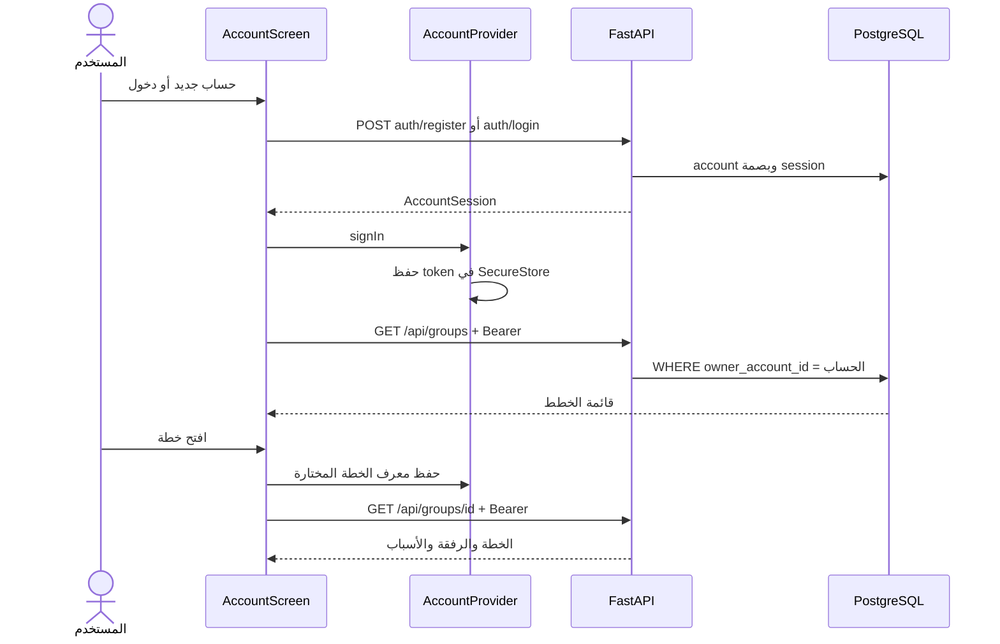

# 16 · الحساب والخطط ومتطلبات المدرسة

هذا الفصل يصف الإضافة الحالية إلى نسخة Python + PostgreSQL على codex/persistent-groups. الدروس00–12 ومرجع48 ملفًا تبقى لقطة59d45d3 التاريخية. أرقام الاختبارات هنا تخص النموذج المرجعي، ولا تثبت أن الطالب كتبه مستقلًا.

الهدف: الحساب يخدم خطتك وتجاربك. لا يلزم قروب دائم للتسجيل أو حفظ خطة، ولا يلزم حساب لتصفح التجارب. [المعمارية الحالية](../architecture-python-postgres.ar.md) و[مراجعة المدرسة](../school-readiness.ar.md) و[خطة التسليم](../school-delivery-plan.ar.md) تكمّل هذا الفصل.

## 1. جرّبي الرحلة قبل قراءة الكود

1. افتحي التطبيق: تظهر «اكتشف» كالعادة. من الأعلى افتحي «حسابي».
2. اختاري حسابًا جديدًا أو تسجيل الدخول. اسم المستخدم للدخول مختلف عن الاسم الذي يظهر للناس.
3. بعد التسجيل تظهر خططك، وتعديل اسم الحساب، والخروج. «خطة جديدة» تفتح الذوق والخانات ثم تحفظ الخطة للحساب.
4. من «خطّتنا → إدارة الخطة» غيّري الاسم، أو افتحي قائمة خططك، أو احذفي الخطة بعد قراءة التأكيد.
5. إذا كانت لديك خطة من قبل التسجيل، يظهر «احفظ خطة الجهاز في حسابي». هذا إجراء صريح يحفظها دون إنشاء قروب دائم.
6. سجلي الخروج ثم ادخلي بالحساب من متصفح آخر: قائمة الخطط تأتي من PostgreSQL، ثم اختاري ما تريدين فتحه.

## 2. ما معنى الحساب والجلسة والملكية؟

الحساب سجل للشخص داخل accounts: id عشوائي، handle فريد، name، وpassword_hash. كلمة المرور الأصلية لا تدخل DB. مكتبة pwdlib تنفذ Argon2 للتحقق من الكلمة مقابل البصمة.

الجلسة إثبات دخول مؤقت. بعد نجاح التسجيل أو الدخول، ينشئ الخادم قيمة عشوائية ويعيدها مرة للعميل، ويحفظ SHA-256 لها في account_sessions مع account_id وexpires_at. عند كل طلب خاص يرسل العميل القيمة في Authorization. يحسب الخادم بصمتها ويبحث عن جلسة لم تنتهِ. SHA-256 هنا لمفتاح عشوائي قوي؛ كلمات المرور البشرية تستخدم Argon2، وهما وظيفتان مختلفتان.

ملكية الخطة تربط موردًا بحساب. مجرد معرفة id الخطة لا يمنح صلاحية قراءتها أو تعديلها. يمتلك الضيف capability خاصة قبل ربطها بحساب. بعد الربط لا تعود تلك capability صالحة؛ يلزم حساب المالك بجلسة سارية.



## 3. ترحيل قاعدة البيانات

الملف [003_account_plans.sql](../../backend/migrations/003_account_plans.sql) يحتوي قرارين:

```sql
ALTER TABLE groups ADD COLUMN owner_account_id TEXT REFERENCES accounts(id);
CREATE INDEX groups_account ON groups(owner_account_id, created_at DESC, id)
    WHERE owner_account_id IS NOT NULL;
```

ALTER TABLE يعني تعديل بنية جدول موجود. العمود اختياري: NULL يعني خطة ضيف. REFERENCES يمنع ربطها بحساب غير موجود. لم نستخدم CASCADE لحذف الحساب، ولم نضف مسار حذف حساب؛ حذف خطة واحدة لا ينبغي أن يحذف صاحبها.

الفهرس يسرّع قائمة خطط الحساب مرتبة بالأحدث. شرط WHERE يجعله جزئيًا، فلا يضيف خطط الضيوف إلى فهرس لا تحتاجه. لا يوجد جدول plans جديد لأن groups هو جدول الخطة المباشرة الموجود بالفعل. circles اسم القروبات الدائمة، وهو كيان منفصل.

initialize في store.py يقرأ ملفات SQL بالترتيب ويفحص بصماتها. نضيف003 بدل تعديل001 أو002 لأن قاعدة زميلك قد طبقت الملفين. قبل تشغيل الترحيل على قاعدة التطبيق أُخذت نسخة احتياطية؛ مقارنة بصمات بيانات الخطط والرفقة قبل وبعد أثبتت بقاء8 خطط و12 عضوًا كما كانت. هذا عدّ لحالة بيئة التطوير وقت التحقق، وليس رقمًا مطلوبًا للمشروع.

## 4. التغييرات في الخادم

| الملف/الدالة | ماذا تفعل ولماذا؟ |
|---|---|
| models.py: GroupView.owner_account_id | يوضح للواجهة هل الخطة مرتبطة، دون تخمين اسم المالك من أول عضو. الدعوة العامة لا تعرض هذا الحقل. |
| GroupCreated.organizer_token | قيمة للضيف، وnull لخطة الحساب؛ لا نصدر مفتاحًا دائمًا يتجاوز تسجيل الخروج. |
| PlanSummary | قائمة خفيفة: id والعنوان والخانات والمكتمل، دون تحميل تفاصيل كل رفقة. |
| SaveToAccount | يستقبل owner_token كـSecretStr لإخفائه عند تمثيل النموذج. لا يغني ذلك عن HTTPS. |
| PlanSettingsChange | Settings المعتادة مع expected اختياري للتوافق. نتحقق من الحالة التي بنى عليها العميل تغييره. |
| main.py: require_owner | يقرأ الخطة، ثم يفحص جلسة مالكها إن ارتبطت، أو بصمة capability إن بقيت ضيفًا. يرفض404 دون كشف المورد للآخرين. الكتابة تقفل الصف. |
| create_group | وجود Authorization يستلزم جلسة صالحة؛ لا ننشئ خطة ضيف بدل رفض جلسة منتهية. نحفظ حساب المالك مع الإعدادات والرفيق المنظم في معاملة واحدة. |
| account_plans | SELECT بشرط حساب المستخدم الذي أثبته الخادم، لا معرف يختاره العميل. |
| save_to_account | يقفل الخطة، يثبت ملكية الضيف ويرفض الربط لحساب آخر، ثم يربط الحساب ويلغي البصمة القديمة. إعادة نفس الطلب من المالك لا تنشئ نسخة أخرى. |
| rename_plan | يتحقق من المالك ومن عنوان1–60 حرفًا، يحدّث الصف ويعيد GroupView الجديدة. |
| delete_plan | يتحقق من المالك، يحذف الخطة، وON DELETE CASCADE يحذف members التابعة. غياب الخطة يلغي دعوتها تلقائيًا. |
| update_settings | يقارن expected بالحالة داخل القفل، ويرفض409 إن تغيّرت. يحذف expected من بيانات التخزين لأنها شرط طلب وليست إعدادًا. |
| experience_store.catalog | يقرأ experiences.payload من PostgreSQL ويحوّل كل سجل إلى Experience متحقق منها. |
| social/domain.py | يستخدم نفس قارئ الكتالوج؛ لم يعد للاكتشاف كتالوج حي منفصل في الذاكرة. catalog.py يحتفظ بالبيانات المرجعية للاختبارات. |
| social/auth.py: update_profile | PUT /auth/me يغيّر الاسم المعروض للحساب المثبت بالجلسة. لا يغيّر كلمة المرور أو أسماء الأعضاء السابقة. |
| social/circles.py: claim_legacy | يقبل خطط الضيف فقط، فلا يمكن استخدام مفتاح قديم لتجاوز الحساب وربط خطة بشخص آخر. |
| import_sqlite.py | التحقق من السجل المنقول يتوقع owner_account_id=null لأن المصدر السابق لا يعرف الحسابات. هذا مستورد قديم فقط؛ التطبيق الجاري لا يستعمل SQLite. |

تُكتب القيم في SQL باستخدام %s وتمرير parameters منفصلة. لا تركّبي استعلامًا من اسم المستخدم مباشرة. المعاملة تعني أن جميع خطوات العملية تنجح معًا أو تعود كما كانت. قفل FOR UPDATE يجعل طلب الربط الثاني ينتظر نتيجة الأول؛ عند استئنافه يعرف أن الخطة أصبح لها مالك.

مثال تعديل آمن من جهازين:

```json
{
  "slots": 1,
  "anchor_id": "sushi",
  "pocket_ids": [],
  "completed_ids": [],
  "expected": {"slots": 3, "anchor_id": "sushi", "pocket_ids": [], "completed_ids": []}
}
```

إذا أضاف الجهاز الآخر fire إلى الجيب بعد القراءة، ترفض API هذا الطلب409 كي لا يمحو الإضافة. تعرض الواجهة الخطأ وتحدّث القراءة، ثم يراجع المستخدم رغبته. العملاء الأقدم الذين لا يرسلون expected يظلون متوافقين، لكنهم لا يستفيدون من هذه المقارنة.

## 5. جلسة مشتركة في React

[AccountProvider.tsx](../../src/account/AccountProvider.tsx) يستخدم React Context. تخيليه مكانًا واحدًا تعود له الشاشات لمعرفة جلسة الدخول. App.tsx يضع AccountProvider حول التطبيق؛ الحساب والقروبات والمنظم يقرؤون useAccount بدل نسخ منطق الدخول في كل شاشة.

- useAccountState يملك session وloading وerror. state تعيد رسم الشاشات عند تغيرها.
- restore تقرأ token من التخزين وتتحقق عبر GET auth/me.401 يلغي القيمة المحلية، لكن503 يحتفظ بها ويتيح إعادة المحاولة.
- signIn تحفظ token أولًا ثم تحدّث state؛ فشل التخزين يظهر خطأ بدل ادعاء أن الدخول محفوظ.
- signOut تطلب من الخادم إلغاء الجلسة، ثم تزيلها محليًا. الخطط تبقى في PostgreSQL.
- updateName تستدعي PUT auth/me وتضع الاسم العائد من الخادم في state.
- planKey يبني مفتاح اختيار خاصًا بمعرف الحساب: hatim.plan.ID. قيمته معرف خطة أو new لبداية جديدة؛ لا يحتوي كلمة مرور.

SecureStore يُستخدم في iPhone، وAsyncStorage في نسخة الويب. التخزين المحلي يحتفظ بمفتاح الدخول واختيار الخطة؛ ليس قاعدة بيانات المشروع. تغيير نطاق الويب، مثل نفق Cloudflare جديد، يعني مخزن متصفح مختلف؛ تسجيل الدخول يعيد قائمة الخطط من DB.

## 6. شاشة الحساب والتنقل

[AccountScreen.tsx](../../src/account/AccountScreen.tsx) تفصل حالتين. دون جلسة تعرض AuthScreen. بوجودها تعرض SignedIn، الذي يقرأ قائمة الخطط ومعها خطة الضيف إن احتفظ الجهاز بمفتاحها.

SignedIn يستعمل useRemote للقراءة والتحديث. لو رُفضت جلسة أثناء قراءة الخطط، تعاد مراجعتها عبر AccountProvider كي يعود المستخدم إلى الدخول. r.mutate يمنع رد قراءة قديم من استبدال نتيجة تعديل أحدث. run يمنع تكرار الضغط أثناء عملية ويعرض رسالتها بدل ابتلاع الفشل.

edit اتحاد من ثلاث حالات: name أو rename أو delete. Sheet واحدة تعرض إما حقل الاسم أو تحذير الحذف؛ لا توجد نافذتا Modal متداخلتان. بعد نجاح الحفظ تُغلق النافذة. عند الفشل تبقى مفتوحة لتصحيح الإدخال أو إعادة المحاولة.

اختيار خطة يخزن id ويفتح Organizer على تبويب الخطة. «خطة جديدة» يخزن new ويفتح نموذج الخانات والذوق، واسم الحساب يملأ خانة اسم المنظم مبدئيًا. حفظ خطة الجهاز يرسل الجلسة ومفتاح الضيف، ثم يحفظ id للحساب ويزيل مفتاح الضيف بعد نجاح الربط.

AuthScreen.tsx بقي نفس نموذج التسجيل والدخول، لكن نصوصه أصبحت عن الحساب والخطط، وأصبح زر الدخول «ادخل إلى حسابي». إذا جاء المستخدم من دعوة قروب، يبقى اسم الدعوة ظاهرًا ويكمل بعدها الانضمام.

SocialApp.tsx أصبح يستهلك الجلسة المشتركة بدل استعادتها وتخزينها بنفسه. هذا يمنع أن ترى شاشة القروبات شخصًا مسجلًا بينما شاشة الحساب لا تعرفه. يبقى القروب إضافة اختيارية له تنقله ودعوته.

## 7. إدارة الخطة المباشرة

[useOrganizer.ts](../../src/useOrganizer.ts) يعرف ثلاث حالات: خطة حساب مختارة، خطة ضيف محفوظة، أو بداية جديدة. اختيار الحساب يخزن id فقط وتأتي صلاحية الطلب من جلسة AccountProvider. إذا لم توجد خطة مختارة للحساب يمكن عرض خطة الضيف الموجودة على الجهاز حتى يقرر صاحبها حفظها.

create ترسل token إذا وُجد، ثم تحفظ المرجع المناسب. rename تعيد اسم الخطة من API. deletePlan تنتظر نجاح DELETE ثم تزيل مرجعها المحلي وتعود للاكتشاف. settings ترسل الإعدادات الجديدة ومعها آخر group.settings في expected.

التحديث الدوري كل6 ثوانٍ يحمل رقم epoch. عند بدء كتابة يتغير الرقم؛ رد GET بدأ قبلها لا يستبدل نتيجتها. رفض الوصول في قراءة لاحقة يزيل عرض الخطة، بينما فشل اتصال عابر يبقي الرسالة والبيانات. الرجوع من503 أثناء استعادة الحساب يستعمل restore الخاصة بالحساب.

Organizer.tsx يضيف زر «حسابي» في الرأس وزر «إدارة الخطة» داخل خطتنا. إدارة الخطة تسمّي وتحذف وتفتح قائمة الحساب. تغيير عدد الخانات والجيب والركيزة بقي في مكوناته السابقة. لا تغيّر هذه الإضافة خوارزمية النقاط أو قواعد الحساسية.

api/client.ts يضيف plans وsaveToAccount وrename وdeletePlan، ويوسع create/settings. social/client.ts يضيف updateMe. كل الدوال تستخدم request الموجود: URL واحد وJSON ومهلة وحدود أخطاء. backend/openapi.json وsrc/api/schema.d.ts مخرجات آلية من نماذج ومسارات Python؛ أعيدي توليدهما بـnpm run types:api.

## 8. كيف تتحققين بنفسك؟

ملف test_account_plans.py يختبر API مع PostgreSQL حقيقية في schema خاصة بكل اختبار. ينشئ حسابين، ويثبت أن الثاني لا يرى خطة الأول أو يحذفها. يختبر الخروج ثم الدخول بجلسة جديدة، والحذف مع إلغاء الدعوة، ومحاولتي ربط متزامنتين، والتحديث القديم، وتعديل الاسم. يضيف تجربة غير موجودة في catalog.py إلى DB ليبرهن أن الاكتشاف والتخطيط يقرآنها فعلًا.

account-plans.spec.ts يضغط الأزرار في متصفح: تسجيل، تغيير اسم الحساب، إنشاء خطة وتسميتها، الخروج، ثم دخول من متصفح نظيف وفتحها وحذفها. اختبار آخر يربط خطة ضيف بعد503 ويقارن الإعدادات والأعضاء والجيب قبل وبعد. اختبار الاستعادة يثبت أن503 لا يمسح الجلسة.

scripts/e2e-server.py يشغل خادمًا على8002 بمخطط عشوائي منفصل. يحتفظ الأب بملكية المخطط، ويوقف عملية Uvicorn عند SIGTERM أو Ctrl+C، ثم يحذف مخططه فقط. لا يستعمل TRUNCATE على جداول التطبيق، ولا يفترض أن جدول الاختبار فارغ أصلًا.

التحقق المنفذ:253 اختبار Python و11 رحلة متصفح، وفحص TypeScript وPrettier وRuff. نجح بناء Docker وتشغيله بمستخدم10001 ونظام ملفات للقراءة مع PostgreSQL مؤقتة، ثم تسجيل وحفظ وتسمية وحذف وخروج. أزيلت حاويات وقرص فحص Docker بعده.

نجح بناء Release وتشغيله على iPhone17Pro في iOS26.4. تحقق الفحص الأصلي من زر حسابي، استعادة الحساب الموجود، عرض خطة الجهاز دون ربط تلقائي، نافذة تعديل اسم الحساب، ثم الرجوع إلى الخطة الأصلية وإدارة اسمها وإظهار تأكيد الحذف وإلغائه. بقيت الخطة5 خانات، منها1 مستهلكة و4 متبقية. لم يُحذف شيء أو يُغيّر اسم المستخدم الحقيقي أثناء الفحص. إنشاء/حذف الحسابات والخطط التجريبية جرى في اختبارات المتصفح وDB المعزولة؛ لم يُختبر النشر على iPhone فعلي في هذه الإضافة.

تحذير مكتبة Starlette في pytest عن alias قديم داخل anyio ما زال يظهر؛ الاختبارات ناجحة، والتحذير ليس من كود حاتم. لم نخفه بإعدادات كي يبدو السجل خاليًا.

## 9. ملفات النشر وما بقي للمدرسة

Dockerfile يبني الويب في مرحلة Node ثم API في مرحلة Python. COPY --from ينقل dist بين المرحلتين. uv sync --locked يستعمل القفل نفسه؛ --no-dev يحذف أدوات الاختبار من بيئة التشغيل. USER10001 يمنع تشغيل التطبيق بصلاحيات root. HEALTHCHECK يختبر endpoint يصل إلى DB فعلًا.

deploy/compose.yaml يقرأ الأسرار من بيئة التشغيل، ويعرض API على loopback خلف HTTPS. لا يوجد وعد بنطاق أو قاعدة مستضافة دون إعدادها. صاحبة المشروع اختارت تجهيز الملفات الآن واختيار الاستضافة لاحقًا. [دليل النشر](../deployment.ar.md) يشرح الخطوات وحدودها.

متطلبات Figma والتقديم النهائي وسجل مساهمة كل طالب تحتاج عملًا فعليًا من الفريق. لا تُنشئ هذه الإضافة سجل تعلم مستقلًا ولا حساب استضافة ولا لوحة مهام للفريق. المدرسة هي مرجع قبول استخدام النموذج المساعد بالذكاء الاصطناعي.

## تمرين بدون نسخ

ابني مشروعًا صغيرًا فيه users وsessions وplans فقط. اكتبي تسجيلًا ودخولًا، ثم اختبري أن مستخدمًا ثانيًا لا يستطيع GET أو DELETE لخطة الأول. بعدها أضيفي نافذة تأكيد حذف، وتحققي من DB بعد الضغط. أخيرًا افتحي متصفحين وغيّري الخطة من كليهما: اشرحي لماذا يجب أن يُرفض التعديل القديم. إذا قدرتِ تفسير هذه الرحلة وكتابة اختبارها، تكونين فهمتِ الجزء الأساسي بدل حفظ أسماء الدوال.
