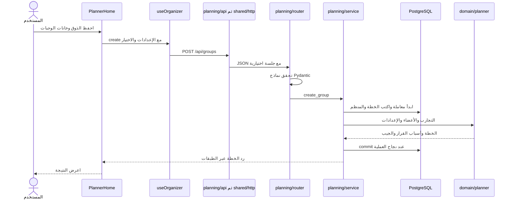

# 17 · كيف تضيفين ميزة دون تشبيك التطبيق كله؟

هذا الفصل يشرح إعادة تنظيم الكود المنفذة في16سبتمبر2026 بعد النسخة94f2277. الخادم Python وقاعدة البيانات PostgreSQL. [المخططات وخريطة الملفات الجديدة](../architecture-modules.ar.md) تكمل هذا الشرح، و[معمارية المنتج](../architecture-python-postgres.ar.md) تشرح العلاقات والصلاحيات.

## معنى المعمارية

المعمارية هي توزيع المسؤوليات وقواعد التواصل بينها. لنفترض أنك تضيفين التقييمات: نريد معرفة مكان الطلب ومكان التحقق والحفظ ومكان الشاشة دون البحث في ملف القروبات. ليست المعمارية كثرة المجلدات؛ فائدتها أن تعديل كلمة مرور لا يحتاج فهم التصويت.

سمينا التنظيم Modular Monolith. Monolith يعني أن الخادم برنامج واحد نشغله بأمر واحد، وModular يعني أن داخله أجزاء محددة. ما زلنا نستعمل قاعدة PostgreSQL واحدة ومعاملاتها؛ لم نضف خدمات منفصلة.

## افتحي التطبيق من نقطة البداية

في [App.tsx](../../App.tsx) يوجد الآن سطر:

```tsx
export { default } from "./src/application/AppRoot";
```

`export` يجعل شيئًا متاحًا لمن يستورد الملف. `default` هو المكون الرئيسي. السطر يقول: المكون الرئيسي الموجود في AppRoot هو نفسه مدخل Expo هنا. لم نحذف واجهة التطبيق؛ نقلنا مسؤولية تركيبها إلى مكان واضح.

في [AppRoot.tsx](../../src/application/AppRoot.tsx) تعيش الخطوط وSafeAreaProvider وAccountProvider واختيار الصفحة. عند اختيار حسابي تعرض AccountPage، وعند اختيار قروباتي تعرض SocialApp، والبداية PlannerHome التي تفتح الاكتشاف. صفحة تجمع ميزتين تعيش في application؛ لا تصبح كل ميزة مسؤولة عن بقية التطبيق.

اسم المجلد application مقصود. نحن لا نستعمل Expo Router؛ تجنبنا src/app الذي له معنى خاص عند أدوات Expo.

## ميزة لها باب واضح

افتحي [planning/index.ts](../../src/features/planning/index.ts). تجدين مثلًا:

```tsx
export { PlanScreen } from "./PlanScreen";
export { plansApi, type Session } from "./api";
```

السطر الأول يتيح عرض الخطة خارج المجلد. الثاني يتيح دوال طلبات الخطة واسم نوع Session. `type` يصف شكل القيمة لمدقق TypeScript؛ لا ينشئ جلسة ولا يرسل طلبًا. وجود export لا يجعل كل ملف داخلي واجهة عامة تلقائيًا؛ نختار ما نحتاجه.

الصفحة العليا تستخدم:

```tsx
import { PlanScreen } from "../features/planning";
```

عند استيراد مجلد، يجد TypeScript ملف index.ts. لو غيرنا اسم ملف PlanScreen داخليًا مع إبقاء التصدير نفسه، لا تتغير كل الصفحات. داخل الميزة نفسها نستورد ./api أو ./storage مباشرة؛ لا نرجع إلى index ثم ندور حول أنفسنا.

## فصل الأداة عن الطلب

[shared/api/http.ts](../../src/shared/api/http.ts) يجيب عن أسئلة عامة: ما عنوان الخادم؟ كيف نحول الجسم إلى JSON؟ كيف نضيف Bearer؟ متى تنتهي المهلة؟ ما رسالة فشل الاتصال؟ لا يعرف معنى التصويت أو حذف الخطة.

[planning/api.ts](../../src/features/planning/api.ts) يعرف المسار والجسم والنوع المطلوب للخطة. مثال قائم:

```tsx
plans: (token: string) => request<PlanSummary[]>("/groups", { token }),
```

`plans` اسم دالة. `token: string` يعني أن مدخلها مفتاح جلسة نصي. `PlanSummary[]` قائمة ملخصات خطط. النص `/groups` هو مسارنا التاريخي للخطط المباشرة؛ تغيير المجلد لا يبرر كسر مسار تطبيق iPhone المثبت. request يضيف /api والعنوان، ثم يعيد Promise تنتظر نتيجتها الواجهة.

التسجيل والدخول أصبحا في [accounts/api.ts](../../src/features/accounts/api.ts). جلب التجارب في [experiences/api.ts](../../src/features/experiences/api.ts). بقية القروبات في [groups/api.ts](../../src/features/groups/api.ts). لم ننسخ منطق HTTP أربع مرات.

## ماذا نفعل بالمكونات المشتركة؟

[shared/ui/primitives.tsx](../../src/shared/ui/primitives.tsx) يحتوي الأزرار والنص والنافذة. [layout.tsx](../../src/shared/ui/layout.tsx) يحتوي حاوية الصفحة والحقل وعرض الخطأ. [Logo.tsx](../../src/shared/ui/Logo.tsx) يعرض العلامة. لا تحتاج شاشة دعوة استيراد الصفحة الرئيسية كاملة لمجرد عرض الشعار.

يبقى نموذج التفضيلات مشتركًا لأن الضيف وعضو القروب يعبئان النوع نفسه. أما تفاصيل خطة الضيف وإعداد بدايتها ففي [PlanExperienceContent](../../src/features/planning/PlanExperienceContent.tsx) و[PlanSetupContent](../../src/features/planning/PlanSetupContent.tsx). يتلقيان القيم والدوال عبر props. النافذة الحاوية بقيت واحدة لكي يكون الانتقال من التفاصيل إلى إعداد الخطة داخل نفس Sheet على iPhone.

لا تنقلي كل مكون جديد إلى shared. ابدئي داخل الميزة؛ انقليه حين يكون معناه صالحًا لأكثر من ميزة دون اشتراط قواعدها الخاصة.

## كيف نركب خادم Python؟

افتحي [main.py](../../backend/hatim/main.py). يحتوي:

```python
from .features import accounts, experiences, groups, planning

for router in (accounts.router, experiences.router, groups.router, planning.router):
    app.include_router(router)
```

`from` يستورد أسماء من مكان آخر. النقطة تعني المجلد الحالي في حزمة hatim. الحلقة تمر على أربع مجموعات مسارات، وinclude_router يضيفها إلى تطبيق FastAPI نفسه. ما زال المنفذ8000 واحدًا.

كل ميزة Python لها `__init__.py` كباب معلن. مجلد groups يجمع circles وoutings وrounds داخليًا ويصدر router واحدة، فلا يحتاج main معرفة تفاصيل كل شاشة تصويت.

ما بقي في main: بدء الترحيلات، إعداد HTTP والأخطاء، ربط الوحدات، health وخدمة الويب. منطق إنشاء خطة لم يعد بجانب إعداد CORS.

## تتبعي طلب إنشاء خطة



في [planning/router.py](../../backend/hatim/features/planning/router.py) يحدد decorator مثل `@router.post` عنوان الطلب ونوع الرد. `Header(default=None)` يقرأ Authorization من HTTP إن وجد. تستدعي الدالة الخدمة بالقيم؛ لا تنشئ اتصال SQL هنا.

في [planning/service.py](../../backend/hatim/features/planning/service.py) تعيش العملية: التحقق من الحساب عند تقديم جلسته، إنشاء المعرفات العشوائية، فتح المعاملة، حفظ الخطة والمنظم، وبناء الرد. `with connect()` يضمن إنهاء المعاملة؛ إن رُفع خطأ تُلغى الكتابات بدل حفظ نصف خطة.

`service` ليس اسمًا سحريًا تفسره FastAPI. هو ملف Python عادي اخترنا أن نجمع العملية فيه. لا يلزم إضافة service لكل عملية من سطر واحد. بعض مسارات الحساب والقروبات الحالية تنفذ معاملتها داخل router؛ هذا فصل حسب الميزات، وليس وعدًا بأن كل دالة خالية من تفاصيل الإطار.

## أين المنطق الذي يجب ألا يتكرر؟

[domain/planner.py](../../backend/hatim/domain/planner.py) يستقبل قوائم وقيمًا ويعيد قرارًا. لا يستورد FastAPI أو psycopg. القروبات والخطط المباشرة تستخدمانه مع الأشخاص المناسبين لكل سياق. الحساسية والميزانية وخانات الوجبات لا تتغير لأن المستخدم دخل من شاشة مختلفة.

[domain/models.py](../../backend/hatim/domain/models.py) يحدد هذه البيانات المشتركة. [core/models.py](../../backend/hatim/core/models.py) يوفر قاعدة التحقق والردود البسيطة. لا تضعي كلمة مرور داخل Preferences ولا تضيفي حالة نافذة إلى نموذج Plan؛ لكل جزء معنى مختلف.

## لماذا لم نغير PostgreSQL؟

التغيير هنا في تنظيم الملفات وحدود الاستيراد. الجداول والعلاقات والحقول لم تتغير، لذلك لا يوجد ترحيل004 لهذا العمل. ملفات001–003 بقيت ببصماتها. تغير مكان كود تشغيل الترحيلات إلى [core/db.py](../../backend/hatim/core/db.py)، فعدلنا مسار الوصول إلى مجلد migrations لأن عمق الملف تغير.

قراءة الكتالوج تستخدم اتصال العملية نفسها. التحقق من جلسة مالك الخطة يمر من واجهة الحسابات ويستخدم اتصال المعاملة نفسه. تحويل الضيف إلى قروب دائم له جسر واحد في [legacy_plans.py](../../backend/hatim/integrations/legacy_plans.py) لأنه يحتاج جداول الطرفين. الصلاحيات والأقفال لم تُنقل إلى الهاتف.

## كيف يمنع المشروع التشابك مرة ثانية؟

[architecture.json](../../architecture.json) خريطة للأسماء المسموح لكل ميزة استيرادها. مثلًا planning يمكنها استخدام accounts وexperiences. لا يمكن accounts استيراد planning؛ صفحة الحساب التي تعرض خططًا تكون في application.

[check-architecture.mjs](../../scripts/check-architecture.mjs) يقرأ شجرة TypeScript: يبحث عن import وexport وrequire ذات المسارات الثابتة، يحل المسار، ويفحص الطبقات وباب index. بعد ذلك يزور علاقات الملفات ويكتشف دورة مثل A→B→A. لا يشغل واجهة التطبيق ليعرف ذلك.

[test_architecture.py](../../backend/tests/test_architecture.py) يعمل بالفكرة نفسها مع AST في Python. ويقارن أيضًا عقد OpenAPI المحفوظ بعقد التطبيق الحالي. إذا غيرتِ الطلب ولم تحدثي أنواع الواجهة، يظهر فشل يطلب توليد العقد.

```sh
npm run check:architecture
npm run types:api
npm run check
npm run format:check
```

الأمر الأول سريع ولا يحتاج اتصال PostgreSQL. الأمر check يجمع فحص الحدود وTypeScript واختبارات API التي تحتاج PostgreSQL. وجود فحص للحدود لا يغني عن اختبار رفض عضوية شخص غريب أو تعارض طلبين؛ الأول يفحص تنظيم الكود، والثاني سلوك المنتج.

## تمرين تبنينه بيدك

اختاري ميزة صغيرة مثل ملاحظة خاصة على تجربة. على ورقة اكتبي «صاحب الحساب يرى ملاحظته فقط» و«لا يمكن ربطها بتجربة غير موجودة». حددي جدولها وطلبها وردها. في مشروعك التدريبي أنشئي المجلد والنماذج والمسار، ثم اختبري تلك الشروط، وبعدها أضيفي الشاشة. قارني مع [خطوات إضافة ميزة](../architecture-modules.ar.md) بعد محاولتك، لا تحولي المثال إلى نسخ لكل ملفات حاتم.

ميزة الملاحظات والتقييمات ليست منفذة في هذا التغيير؛ هما تمارين لمعرفة كيف نستعمل الهيكل.

## التحقق من هذه الإعادة

نجح255 اختبار Python و11 اختبار Playwright على PostgreSQL في مخططات مستقلة. بقيت اختبارات المنتج السابقة كما هي عدا تحديث مسارات استيراد Python؛ أضيف اختباران للمعمارية والعقد. نجحت مقارنة OpenAPI قبل الترتيب وبعده، وتوليد TypeScript وفحصه، وتصدير الويب.

نجح أيضًا بناء Release على iPhone17Pro بمحاكيiOS26.4؛ فتح الاكتشاف وتفاصيل التجربة والخطة السابقة والحساب، مع بقاء بيانات المستخدم دون تعديل. نجح بناء حاوية Docker وتشغيلها بمستخدم غير root ونظام ملفات للقراءة فقط، وفحص الترحيلات والدخول وCRUD للخطط على PostgreSQL منفصلة ثم تنظيف بيانات الفحص.

لا تعني هذه النتائج أن كل ميزة مستقبلية صحيحة تلقائيًا. عند إضافتك ميزة اختبري قواعدها وحدودها، وسجلي ما نفذتِه بنفسك. الشرح هنا يصف هذا المشروع بعد إعادة تنظيمه، والكتاب الأصلي ذو48 ملفًا يظل خاصًا باللقطة59d45d3.
