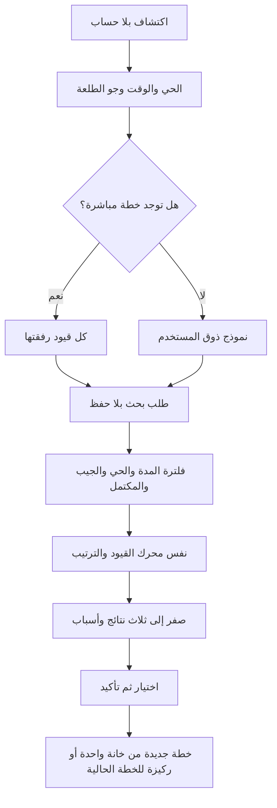

# 18 · ابني القرار السريع وتفضيلات كل طلعة بنفسك

هذا شرح لتغيير24سبتمبر2026 بعد إعادة الهيكلة e8bcc6d، وليس جزءًا من لقطة الكود الأصلية59d45d3. [المعمارية](../architecture-python-postgres.ar.md) و[عقد الطلبات](../api-quick-decision.ar.md) يصفان المنفذ. [الشخصيات skins](../proposals/outing-skins.ar.md) ما زالت اقتراحًا منفصلًا.

## ما الذي نبنيه؟

المستخدمة تفتح الاكتشاف، تضغط «وش يناسبني الحين؟»، تختار الحي والوقت وجو الطلعة. إذا لم تنشئ خطة من قبل تدخل اسمها وقيودها وميزانيتها؛ لا نطلب حسابًا. إذا لديها خطة نستعمل كل رفقة تلك الخطة. تحصل على ثلاث تجارب كحد أقصى مع أسبابها، ثم تختار وتؤكد الحفظ.

المدة هنا مدة التجربة التوضيحية فقط. ليست زمن الوصول، ولا وعدًا أن المطعم مفتوح أو أن الطبق متوفر. البيانات التسع وهمية. هذا التحديد جزء من صحة المنتج، وليس نقصًا نخفيه بتخمين.

## افصلي الشخص عن مناسبة اليوم

Preferences تصف شخصًا: حساسيته، كونه نباتيًا، ميزانيته والمطابخ التي يحبها. OutingContext تصف هذه الطلعة: عائلية أو أصدقاء أو على راحتنا، وما نفضله فيها من هدوء ومشاركة واكتشاف. تحفظ داخل Settings.context للخطة أو الطلعة. لو طلع الشخص اليوم مع عائلته وبكرة مع أصدقائه لا نعيد كتابة ذوقه ولا نزيل حساسيته.

افتحي [domain/models.py](../../backend/hatim/domain/models.py). `Literal` يحصر النص في قيم مسموحة؛ أي نوع غير محدد يرفض422. `Field(default_factory=list)` يصنع قائمة جديدة لكل طلب بدل مشاركة قائمة قابلة للتعديل. `max_length=3` يحدد حجم الأولويات. المدقق unique_priorities يقارن طول القائمة بطول set لمنع تكرار الأولوية وكسب نقاط إضافية منها. `Field(default_factory=OutingContext)` يجعل البيانات القديمة بلا context تقرأ بالقيم المحايدة.

## احسبي الاختيار على ورقة

افتحي [planner.py](../../backend/hatim/domain/planner.py). evaluate القديمة تفحص كل شخص قبل الترتيب. الحساسية أو عدم توثيق السلامة أو تجاوز الميزانية يمنع الاختيار، والنباتي يحتاج طبقًا مناسبًا أو بديلًا واضحًا. هذا الجزء لم يُخفف.

الدالة context_match الجديدة تقارن priorities المطلوبة بصفات التجربة outing_traits. التطابق الواحد يضيف8 نقاط. مثلًا تجربة تشارك أطباقها ولها جلسة هادئة تحصل16 نقطة مع هاتين الأولويتين. تعيد الدالة رقمًا وشرحًا؛ build_plan يضيفهما للنقاط والسبب بعد نجاح فحص القيود. kind يصف النص؛ الأولويات المختارة هي التي تؤثر حسابيًا. sort يبقي الركيزة أولًا مهما زادت نقاط تجربة أخرى. تصغير الخانات يبقى قصًّا لنفس الترتيب.

لا تكتبي نسخة من فحص الحساسية في شاشة القرار السريع؛ نسختان ستختلفان مع الوقت. [quick_decision/service.py](../../backend/hatim/features/quick_decision/service.py) تقوم فقط بتصفية الكتالوج بالمدة والحي والمعرفات المستثناة، وتحويل تفضيلات الأشخاص إلى Member مؤقت، ثم تنادي build_plan بثلاث خانات ودون ركيزة. تضيف للسبب مدة التجربة، وتكتب رسالة مفهومة إذا لم توجد نتائج. لا SQL في هذه الدالة، ولذلك نختبرها بقائمة Python عادية.

## اربطي الخادم

[models.py](../../backend/hatim/features/quick_decision/models.py) يحدد QuickRequest وQuickResult: شكل البيانات الداخلة والخارجة، وحد الأعضاء والمدة. [router.py](../../backend/hatim/features/quick_decision/router.py) يربط POST /api/quick-decisions بالدالة. `with connect(read_only=True)` يفتح معاملة قراءة ويغلقها بأمان. يستدعي catalog من الواجهة العامة لميزة التجارب، ثم decide. [__init__.py](../../backend/hatim/features/quick_decision/__init__.py) يصدر router، وmain يسجلها. لم نضف repository لأن هذه الميزة لا تملك جدولًا.

الكتالوج الحقيقي للتشغيل داخل PostgreSQL؛ تعديل fixtures.py وحده لا يغيره. [الترحيل004](../../backend/migrations/004_outing_traits.sql) يستعمل jsonb_set لإضافة outing_traits إلى التجارب الوهمية المعروفة حين لا يوجد الحقل. الشرط يحافظ على صفات محرر أضيفت مسبقًا. الترحيلات القديمة لها بصمات محفوظة، لذلك نضيف ملفًا جديدًا. إعدادات الخطة موجودة أصلًا في JSONB، فلا نحتاج جدول context أو عمودًا علائقيًا جديدًا. ERD لم يكتسب علاقة جديدة.

## اكتبي الواجهة في أجزاء مفهومة

| الملف | ماذا يفعل؟ |
|---|---|
| [OutingContextForm](../../src/features/planning/OutingContextForm.tsx) | يعرض نوع الطلعة والأولويات؛ اختيار النوع يضع اقتراح بداية قابلًا للتعديل. بلا onChange يعرض ملخصًا للقراءة فقط. لا طلب شبكة داخله. |
| [QuickDecision](../../src/features/quickDecision/QuickDecision.tsx) | يحتفظ بوقت وحي وcontext وذوق محلي ونتائج وخيار قيد التأكيد وخطأ. يعرض PreferencesForm فقط للمستخدم بلا خطة. |
| [api.ts](../../src/features/quickDecision/api.ts) | يرسل الطلب بالاتصال المشترك ويقرأ النوع المولد من OpenAPI. |
| [index.ts](../../src/features/quickDecision/index.ts) | يسمح لبقية التطبيق باستعمال الشاشة دون معرفة ملفاتها الداخلية. |
| [PlannerHome](../../src/application/PlannerHome.tsx) | يفتح النافذة ويربط onChoose بإنشاء الخطة أو تغيير الركيزة. التنسيق بين الميزات هنا. |
| [Discover](../../src/features/experiences/Discover.tsx) | يحتوي زر الدخول؛ يستدعي onQuick فقط، فلا يعتمد على وحدة القرار السريع. |
| [PlanSetupContent](../../src/features/planning/PlanSetupContent.tsx) | يدخل context في الإنشاء العادي أيضًا، لا يجعله حكرًا على القرار السريع. |
| [PlanScreen](../../src/features/planning/PlanScreen.tsx) | يعرض context ويفتح مسودة تعديل للمنظم/القائد؛ فشل الحفظ يبقي المسودة ورسالة الخطأ. |
| [CircleScreen](../../src/features/groups/CircleScreen.tsx) | يختار context عند إنشاء طلعة قروب. |
| [InviteScreen](../../src/features/planning/InviteScreen.tsx) | يعرض جو الطلعة للرفيق دون إعطائه صلاحية تعديله أو كشف بيانات غيره. |

useState يحتفظ بالقيمة حتى إعادة رسم الشاشة. تغيير قيمة يعيد الرسم، ولا يعني حفظها في DB. onChoose دالة تأتي من الصفحة المركبة؛ الميزة لا تستورد الصفحة التي تستعملها، وهذا يمنع اعتمادًا دائريًا. api/schema.d.ts ملف مولد، لا تكتبيه يدويًا؛ شغلي npm run types:api بعد تغيير نماذج الخادم.

في QuickDecision نكوّن signature من المدخلات والرفقة الحالية. إذا غير المستخدم الوقت أو وصلت قيود جديدة من التحديث الدوري تختفي النتائج القديمة، ويُلغى الطلب السابق بواسطة AbortController. نتحقق أيضًا أن توقيع البيانات لم يتغير قبل عرض الرد؛ الرد المتأخر لا يعيد نتيجة غير صالحة. إغلاق النافذة يلغي طلب البحث. اختيار بطاقة وحده لا يكتب؛ زر التأكيد هو الذي يستدعي onChoose. تحفظ الخطة الجديدة خانة واحدة؛ الخطة القائمة تحتفظ بعدد خاناتها والجيب والمكتمل مع إعلان تبديل الركيزة.

## الصلاحيات والتزامن

في [outings.py](../../backend/hatim/features/groups/outings.py)، ينسخ الإنشاء context إلى Settings. التعديل يستعمل الصلاحيات والقفل وexpected نفسها؛ العضو العادي لا يغيره. إذا اختلف السياق نزيد planning_revision ونبطل الجولة حتى لا تُعتمد جولة بدأت بتفضيلات سابقة. لا نغير تفضيلات العضويات أو الحضور. الطلعة المغلقة ترفض التعديل وتبقى إعداداتها ولقطة خطتها كما كانت.

في الدعوة المباشرة نحذف أسباب الأفراد وتعديلاتهم الغذائية من الرد العام، لكن نسمح بالسبب العام المتعلق بالهدوء أو المشاركة. معرفة نوع الطلعة لا تمنح الوصول إلى حساسيات الجميع. بحث القرار السريع نفسه لا يحفظ التفضيلات ولا ينشئ خطة حتى التأكيد.

## ابنيها بنفسك بهذا الترتيب

1. اكتبي ثلاث تجارب على ورقة مع مدة وصفات، وشخصين بميزانيتين مختلفتين. حددي النتيجة المتوقعة.
2. اكتبي دالة تصفية الوقت والحي ثم استعملي محرك القيود القائم. اختبري نتيجة فارغة وحالة كل التجارب تتجاوز الوقت.
3. أضيفي نموذج السياق وحساب التطابق. اختبري أن الركيزة تبقى وأن الحساسية تمنع حتى أعلى نتيجة.
4. أضيفي مسار البحث واختبري JSON يدويًا في /api/docs.
5. اكتبي شاشة حقول ونتائج فقط، ثم اربطي تأكيد النتيجة بإنشاء الخطة الموجود.
6. أضيفي السياق لإنشاء وتعديل الخطط والطلعات، وجرّبي عضوًا بلا صلاحية وطلب حفظ قديمًا.
7. اختبري شبكة بطيئة ثم غيّري الوقت أثناء الطلب. تأكدي أن الرد الأول لا يعود فوق اختيارك الجديد.

## التحقق من هذا التغيير

اختبارات [test_quick_decision.py](../../backend/tests/test_quick_decision.py) تغطي الوقت والحي وكل أعضاء الرفقة، استثناء الجيب والمكتمل، حد ثلاث نتائج وثباتها، أولوية الركيزة، الحساسية، الترحيل والكتالوج، البحث بلا كتابة، المدخلات، الخصوصية، صلاحيات الطلعة، إبطال الجولة والأرشيف. اختبار التحويل إلى قروب يشمل نقل context. اختبارات [quick-decision.spec.ts](../../tests/quick-decision.spec.ts) تغطي الرحلة الجديدة بلا حساب والحفظ والدعوة، النتائج الفارغة وفشل الشبكة، قيود رفيق آخر ومسودة السياق، والرد المتأخر. نجح التحقق من270 اختبار Python، وفحص TypeScript وحدود الوحدات، وبناء الويب وRelease للمحاكي. نجحت الرحلات الـ11 السابقة والرحلات الخمس الجديدة؛ أعيد اختبار رحلة القروب مع اختيار سياق عائلي. راجعنا شاشة البحث ونتائجه فعليًا على iPhone17Pro iOS26.4 دون تعديل خطة المستخدمة. نجحت قراءة health عبر نفق Cloudflare المؤقت. تم فحص25 مخطط Mermaid و467 رابطًا محليًا في الدروس والمعمارية، والتحقق من بقاء ملفات مرجع59d45d3 الـ48 مطابقة. لم تُنفذ إعادة نشر دائم أو تجربة على iPhone فعلي في هذا التغيير.

الواجهة تفصل خطوات البحث والنتائج والتأكيد، وتعيد تمرير النافذة للأعلى عبر scrollRef عام في Sheet. فشل الحفظ يبقي الاختيار قابلًا للمراجعة والمحاولة. إذا كانت كل خانات الخطة مستهلكة، يبقى البحث متاحًا لكن الاعتماد يشرح ضرورة زيادة الخانات أو إنشاء خطة أخرى؛ لا نعيد خانة مستخدمة خفية. العميل القديم الذي لا يعرف context لا يمسح السياق المحفوظ عند تعديل الخانات.
