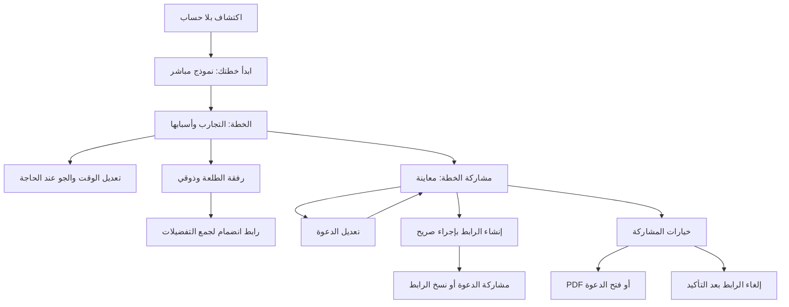

# 21 · ترتيب رحلة المستخدم: من التجربة إلى المشاركة

هذا شرح لتغيير ٢٧ سبتمبر ٢٠٢٦ على فرع `codex/ux-journey`، بعد المصدر `8fd6398`. يشرح الكود الجديد صراحة، ولا يغيّر لقطة الكود التعليمية ذات المرجع `59d45d3`. راجعي [الأدلة المصورة](../ux/2026-09-27/review.ar.md)، و[المعمارية](../architecture-python-postgres.ar.md)، و[عقد المشاركة](../api-plan-sharing.ar.md).

## المشكلة قبل كتابة الكود

المستخدم لا يحتاج رؤية كل قدرة في التطبيق في اللحظة نفسها. عندما يفتح مشاركة الخطة، يريد رؤية ما سيرسله ثم إرساله. تعديل الألوان واستخراج ملف وإلغاء الرابط أعمال مختلفة؛ وضعها جميعًا في عمود أزرار طويل يجبره على فهم النظام قبل إنجاز المهمة.

بدأنا بالتقاط الشاشات الفعلية وتتبع الأزرار. في البداية كان «ابدأ خطتك» يفتح شاشة أخرى فيها «ابنِ خطتك». صفحة الخطة بدأت بإدارة الخطة وحالة الحساب والرفقة قبل التجارب. الدعوة خلطت المعاينة والحقول والحفظ والإرسال والملف والإلغاء. هذه مشكلات تدفق وترتيب، وليست سببًا لتغيير محرك القرار أو PostgreSQL.

## الرحلة الحالية

الدعوة المنشورة موجودة؟ يظهر زر المشاركة مباشرة. دعوة جديدة؟ تبقى المعاينة محلية حتى الضغط على «إنشاء رابط الدعوة». التعديل أثناء وجود رابط يُحفظ على الرابط نفسه. المعاينة المفصلة والأطباق تبقى متاحة، لكن لا تزاحم الإرسال.

## شرح الملفات والتغييرات

### SharePlanButton.tsx: أي شاشة نعرض الآن؟

[الملف](../../src/features/planSharing/SharePlanButton.tsx) يحتوي زرًا يفتح المحرر. `open` قيمة منطقية: true تعني أن النافذة مفتوحة. عند إغلاقها يُزال المحرر، لذلك ننبه أولًا إذا كان لديه تعديل غير محفوظ.

`Stage` نوع TypeScript يقبل ست كلمات فقط: overview للمعاينة المختصرة، edit للحقول، preview للتفاصيل، options للخيارات الثانوية، revoke لتأكيد الإلغاء، discard لتأكيد ترك المسودة. هذا يمنع حالة مثل عرض تأكيد الحذف والحقول معًا. `stage` لا يُرسل إلى الخادم؛ هو وصف للشاشة الحالية فقط.

`move(next)` يغلق لوحة المفاتيح، يغير المرحلة، ويعيد التمرير إلى البداية. `scroll` مرجع إلى ScrollView؛ المرجع يعطينا طريقة للوصول إلى مكوّن موجود بدل البحث عنه بالاسم. `returnStage` يتذكر أين كنا قبل سؤال ترك المسودة.

`draft` ما كتبه المستخدم الآن. `baseline` التصميم ورقم المراجعة اللذان بدأ منهما. `dirty` يقارن الاثنين؛ `stale` يقارن رقم المراجعة بالقراءة الجديدة من الخادم. لا نبدّل كتابة المستخدم تلقائيًا عند وصول قراءة دورية. إذا تغيرت الدعوة من جهاز آخر، يراجعها المستخدم عبر «استخدام أحدث دعوة» قبل الحفظ.

`attempt` يشغّل إجراءً مع حالة انتظار ورسالة خطأ. `inFlight` مرجع يمنع نقرتين متتاليتين من بدء عمليتين قبل أن يعيد React رسم الزر. `working` يجعل الانتظار مرئيًا. `finally` يعيدهما إلى الوضع العادي سواء نجح الإجراء أو فشل. لا نخفي الخطأ، ولا ندعي النجاح بمجرد الضغط.

`save` يرسل التصميم مع `expected_revision` إلى API الموجودة، ثم يعتمد الرد باعتباره النسخة الجديدة ويعود للمعاينة. زر المعاينة في دعوة جديدة لا يستدعي save؛ هذا الفصل يمنع نشر رابط بمجرد تجربة تصميم. الحفظ بعد فشل الشبكة يحتفظ بالمسودة. زر إعادة المحاولة يعيد القراءة قبل محاولة كتابة جديدة.

`requestClose` يسمح بالإغلاق إن لم يوجد تعديل. إن وجد، ينتقل إلى discard، حيث يختار المستخدم المتابعة أو التجاهل. هذا يحمي زر الإغلاق والخلفية وزر الرجوع الذي يصل إلى onRequestClose؛ لا يحفظ المسودة بعد إنهاء التطبيق أو تحديث صفحة المتصفح. لم نضف تخزينًا دائمًا لمسودات الدعوات.

`footer` محتوى أسفل النافذة خارج منطقة التمرير. في المعاينة يحتوي شرح المشاركة العامة وزرًا رئيسيًا: إنشاء، أو حفظ، أو مشاركة بحسب حالة الرابط والمسودة. يظهر النسخ بعد حفظ الرابط. خيارات الملف والإلغاء داخل options؛ الإلغاء يحتاج انتقالًا آخر إلى تأكيد واضح. زر المشاركة يفتح قائمة النظام، ولا يرسل رسالة بنفسه.

### InvitationForm.tsx: نموذج قابل للفهم

[الملف الجديد](../../src/features/planSharing/InvitationForm.tsx) مسؤول عن عرض الألوان والحقول فقط. `value` البيانات، و`onChange` دالة يمررها المحرر لتحديثها، و`disabled` يمنع تغييرها أثناء العمل. ليس لديه اتصال بالخادم أو نسخة مستقلة من البيانات. عندما يتغير العنوان، `{ ...value, title }` ينسخ بقية الحقول ويستبدل العنوان فقط.

الموعد ومكان التجمع اختياريان ومثالاهما نصوص إرشادية لا بيانات محفوظة. لم نضف تاريخًا وهميًا. حدود أطوال النصوص هي نفسها في عقد الخادم.

### InvitationCard.tsx: معاينة أصغر، نفس المعلومات

[البطاقة](../../src/features/planSharing/InvitationCard.tsx) ما زالت تستقبل `details` و`plan`. في الوضع compact تصغر الصورة والمسافات والعنوان، وتُخفى الزخرفة الختامية. الرسالة والموعد ومكان التجمع لا تُحذف إذا كتبها المستخدم. المعاينة الكاملة والصفحة العامة تبقيان على عرض التجارب والأطباق. لا تغيير لقالب PDF أو روابطه.

### primitives.tsx: أدوات عرض مشتركة

[المكونات المشتركة](../../src/shared/ui/primitives.tsx) لا تعرف ما هي خطة أو دعوة. أضفنا `ActionRow`: صف بإشارة بصرية وعنوان وشرح اختياري وسهم، لتمييز الإجراء الثانوي عن الزر الرئيسي. مساحة اللمس لا تقل عن 52 نقطة. `destructive` يغيّر لون إجراء الإلغاء، بينما `disabled` يمنع الضغط عليه.

`Sheet` أصبح يقبل `footer` و`onBack` اختياريين. لذلك النوافذ القديمة تعمل دون تغيير، والدعوة تستطيع إظهار فعل ثابت ورجوع داخلها. المحتوى الطويل يظل في ScrollView، والذيل خارجه داخل SafeAreaView، مع KeyboardAvoidingView للوحة المفاتيح على iOS.

أضفنا حالات الوصول في Button وActionRow وChip. `aria-expanded` يوضح أن خيارات الوقت مطوية أو مفتوحة، و`aria-busy` يوضح الانتظار، و`aria-pressed` يصف الاختيار في الشرائح. أظهر الاختبار أن accessibilityState وحدها لا تنتج aria-expanded في نسخة React Native Web المستخدمة، فأضفنا خاصية ARIA المباشرة مع الحفاظ على وصف iOS. هذا لا يكفي للقول إن التطبيق متوافق مع كل معايير الوصول.

### PlannerHome وPlanScreen: أعطي التجارب الأولوية

[PlannerHome](../../src/application/PlannerHome.tsx) يربط الصفحات؛ إن لم توجد خطة، زر البداية يفتح نموذجها مباشرة. إن وجدت، يفتح الخطة. لم نغيّر فحص فشل استعادة خطة سابقة، فلا تُستبدل بجديدة عند انقطاع الاتصال.

[PlanScreen](../../src/features/planning/PlanScreen.tsx) يعرض اسم الخطة الحقيقي وعدد تجاربها، ثم المشاركة وأدوات مختصرة. `actions` خاصية ReactNode يمرر منها مستوى application أدوات الإدارة والرفقة. ميزة التخطيط لا تستورد application. حالة حفظ الحساب انتقلت إلى إدارة الخطة حيث يمكن التصرف بشأنها.

`showControls` حالة محلية تفتح أو تطوي أدوات الوقت والجو. لا تكتب شيئًا إلى الخادم. التغيير الفعلي ما زال يحتاج الضغط على تحديث الخطة أو حفظ التفضيلات. [OutingContextForm](../../src/features/planning/OutingContextForm.tsx) يقبل compact لعرض نوع الطلعة في سطر، فتظل العائلية أو الأصدقاء واضحة حتى والأدوات مطوية. الحساسية والنباتية والميزانية والركيزة وحساب الخانات كلها بالقواعد السابقة نفسها.

[GroupScreen](../../src/features/planning/GroupScreen.tsx) يسمي الإجراء «اجمع تفضيلات الرفقة». صفحة الرابط تصفه بأنه رابط انضمام وإضافة تفضيلات. هكذا يختلف عن «مشاركة الخطة» للعرض العام. لم ندمج رمزي الرابطين أو صلاحياتهما.

### Discover.tsx: الوصول للاكتشاف سريعًا

[الاكتشاف](../../src/features/experiences/Discover.tsx) يختصر المقدمة على الهاتف. الصورة التحريرية الكبيرة وشريط الرفقة يبقيان في العرض الواسع؛ تجارب الكتالوج وصورها كلها متاحة في الهاتف. البحث والفئات أصبحا أقرب للبداية، والعدد يمثل النتائج المفلترة. إذا لم يوجد تطابق، «عرض كل التجارب» يمحو نص البحث والفئة معًا. لا ينشئ هذا حسابًا أو خطة.

## البيانات والعقد والحدود

لا جدول جديد أو ترحيل أو تعديل ERD: ما زالت الدعوة تستخدم plan_invitations ومراجعتها من sequence. لا مسار HTTP أو حقل جديد، ولا تغيير معاملة أو صلاحية. GET قراءة فقط، PUT إنشاء/تحديث صريح، DELETE بعد التأكيد. ملفات Python وOpenAPI والأنواع المولدة لم تتغير.

حدود الوحدات في architecture.json ما زالت صحيحة؛ النموذج الجديد داخل planSharing ويستورد من shared، والمكونات الجديدة المشتركة لا تستورد ميزات. لا اعتماد جديد يتطلب تصريحًا إضافيًا.

## كيف تختبرين التغيير بنفسك؟

1. افتحي التطبيق بلا جلسة: ابدئي خطة من الاكتشاف، وتأكدي أن النموذج يفتح مباشرة.
2. افتحي خطة موجودة: تحققي من نوع الطلعة وتجاربها، ثم افتحي تعديل الوقت وقلصيها. افحصي أن الركيزة والقيود والجيب تعمل كما سبق.
3. افتحي المشاركة: ينبغي أن تري المعاينة وزرًا واضحًا دون حقول. تعديل دعوة جديدة ثم معاينتها لا ينشر رابطًا.
4. اكتبي تعديلًا واضغطي إغلاق: المتابعة تعيد النص، والتجاهل يترك المنشور كما كان.
5. عطلي طلب الحفظ مؤقتًا في بيئة الاختبار: يبقى النص وتظهر محاولة جديدة. لا تغيّري بيانات المستخدم لهذا الفحص.
6. افتحي الدعوة على جهازين: تعديل الجهاز الثاني يمنع الكتابة القديمة ويحتفظ بالمسودة حتى مراجعة النسخة الأحدث.
7. من الخيارات، جرّبي الملف والفتح، ثم إلغاء الرابط في بيانات اختبار منفصلة. قارني رابط العرض برابط الانضمام للتفضيلات.

نتائج التشغيل واللقطات النهائية موثقة في [تقرير المراجعة](../ux/2026-09-27/review.ar.md). تُشغّل اختبارات الرحلة على مخطط PostgreSQL معزول عن بيانات التطبيق.
