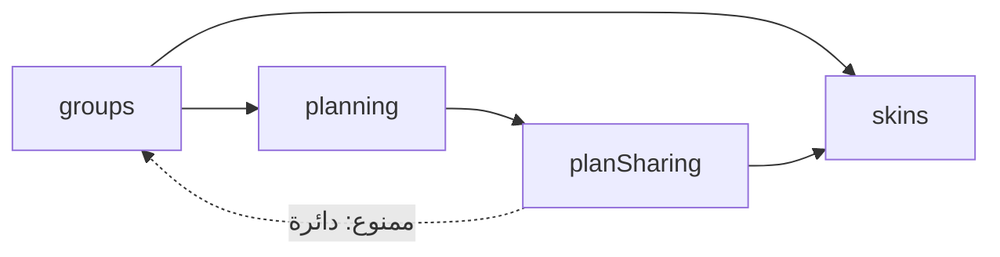

# 22 · شخصيات أوضح وأقرب لأصحابها

هذا شرح تحديث ٢٨ سبتمبر ٢٠٢٦ على فرع `codex/ux-journey` بعد المصدر `8106ba9`. يبني فوق [الفصل19](19-outing-skins.ar.md) الذي يشرح نسخة٢٤ سبتمبر، ولا يغيّر لقطة مرجع الأسطر التاريخية `59d45d3`. هذا تنفيذ بمساعدة AI للتعلّم؛ اقرئي كل خطوة ثم جرّبي كتابتها بنفسك في مشروع تدريبي.

## 1. ما المشكلة؟

جرّبت شذى المحرر ولاحظت ثلاثة أشياء:

1. الخيارات مكتوبة كلامًا: «فاتح، حنطي، أسمر». الإنسان يختار اللون بعينه أسرع من قراءة اسمه.
2. الشخصية لا تشبه أصحابها: الثوب بلا شماغ أو غترة، والعباية تغطي الرأس دائمًا، وثلاث درجات بشرة قليلة.
3. الشخصية لا تتفاعل مع الطلعة؛ تبقى نفس الوجه قبل النتيجة وبعدها، ولا تظهر في الدعوة.

## 2. السلوك الجديد

| ماذا تغيّر         | كيف يظهر                                                                                                         |
| ------------------ | ---------------------------------------------------------------------------------------------------------------- |
| الاختيارات المرئية | البشرة واللون دوائر ملونة، اللبس وغطاء الرأس رسومات مصغرة، التعبير والنظارة إيموجي، العبارة فقاعة كلام           |
| غطاء الرأس         | بدون، شماغ، غترة، طاقية، حجاب. مستقل عن اللبس: تقدرين تختارين كاجوال مع حجاب، أو ثوب بدون شماغ                   |
| البشرة             | خمس درجات بدل ثلاث                                                                                               |
| الرسم              | وجه بيضاوي، حواجب تتغير مع التعبير، لمعة في العين، خدود، رقبة بظل خفيف، شماغ بنقشة حمراء وعقال، حجاب يحيط بالوجه |
| «فاجئني» 🎲        | يغيّر اللقب واللون والتعبير والنظارة والعبارة عشوائيًا في المسودة فقط                                            |
| ردة الفعل          | بعد نتيجة التصويت: شخصيتك تحتفل 🎉 إذا فاز اختيارك، أو 😒 إذا خسر. بعد القرعة: 🎲 للجميع                         |
| الدعوة             | صاحب الدعوة يقدر يضيف شخصيته أعلى بطاقة الدعوة العامة                                                            |

## 3. قرارات مهمة قبل الكود

**«فاجئني» لا يغيّر البشرة ولا اللبس ولا غطاء الرأس.** هذه تصف الشخص نفسه، وتغييرها عشوائيًا قد يزعج. لذلك دالة `surprise` في catalog.ts تبدّل الأجزاء المرحة فقط. والنتيجة مسودة: لا يُحفظ شيء قبل «حفظ الشخصية».

**التصويت سري.** الخادم لا يرسل إلا عدد الأصوات و`my_vote` الخاص بك. لو احتفلت شخصية سارة لأن خيارها فاز، لعرفتِ بماذا صوّتت سارة. لذلك في التصويت تتفاعل شخصيتك أنتِ فقط، وعلى جهازك فقط. في القرعة لا يوجد اختيار شخصي، فيظهر 🎲 للجميع.

**الشكل القديم لا يتغير بصمت.** قبل هذا التحديث كانت العباية ترسم غطاء الرأس. لو أضفنا `headwear` بقيمة افتراضية `none` لظهرت كل عباية محفوظة (حتى في الأرشيف) بلا غطاء. الحل في الخطوة4.

**شخصية الدعوة اختيار صاحبها.** الرابط عام، لذلك لا نضع فيه شخصيات أعضاء القروب أو بياناتهم. صاحب الدعوة يختار شخصية لنفسه، أو يتركها فارغة.

## 4. الخادم: حقل جديد مع احترام البيانات القديمة

في [groups/models.py](../../backend/hatim/features/groups/models.py) أضفنا القيم إلى `Literal`:

```python
tone: Literal["fair", "light", "warm", "tan", "deep"] = "warm"
headwear: Literal["none", "shemagh", "ghutra", "taqiyah", "hijab"] = "none"
```

`Literal` يعني أن Pydantic يقبل هذه الكلمات فقط؛ `"crown"` يرجع422. ثم أضفنا `model_validator(mode="before")`. كلمة before تعني أنه يعمل على القاموس الخام **قبل** التحقق من الحقول:

```python
if isinstance(data, dict) and "headwear" not in data:
    return {**data, "headwear": "hijab" if data.get("outfit") == "abaya" else "none"}
```

إذا جاء شكل قديم بلا headwear، نكمله بما كان يُرسم فعلًا. إذا أرسل المستخدم headwear صراحة، نحترم اختياره. نفس النموذج يقرأ skin وskin_override وskin_snapshot من PostgreSQL، لذلك الأرشيف أيضًا يبقى كما كان. لم نكتب ترحيلًا لأن الشكل مخزن JSONB.

مقارنة التعارض في `checked_skin` تقارن نموذجين بعد الإكمال. لذلك لو أرسلت الواجهة الشكل الذي استلمته (مع headwear) كـexpected، يطابق القيمة القديمة المخزنة بدونه، ولا يحدث409 كاذب. اختبار `test_headwear_is_independent_and_legacy_abaya_keeps_its_cover` يثبت ذلك.

في [plan_sharing/models.py](../../backend/hatim/features/plan_sharing/models.py) أضفنا `character: Skin | None = None` إلى InvitationDetails. التفاصيل مخزنة JSONB أيضًا، والدعوات القديمة تُقرأ بـnull. plan_sharing كان يعتمد على groups أصلًا، فيستورد Skin من [groups/**init**.py](../../backend/hatim/features/groups/__init__.py)، المدخل العام للوحدة.

بعد تغيير النماذج شغّلنا `npm run types:api` لتوليد openapi.json وschema.d.ts من جديد، فعرفت TypeScript القيم الجديدة.

## 5. الواجهة: لماذا ميزة جديدة؟

الدعوة (planSharing) تحتاج رسم الشخصية. لكن الرسم كان في groups، وgroups يعتمد على planning، وplanning يعتمد على planSharing. لو استورد planSharing من groups لصارت دائرة:



الحل ليس نقل الرسم إلى shared؛ الشخصية لها معنى في المنتج وليست أداة عامة. أنشأنا ميزة `src/features/skins` لا تعتمد على أي ميزة، وأعلنّاها في architecture.json. `npm run check:architecture` يرفض أي استيراد يخالف ذلك.

| الملف                                                                                                                                                        | وظيفته                                                                                    |
| ------------------------------------------------------------------------------------------------------------------------------------------------------------ | ----------------------------------------------------------------------------------------- |
| [skins/catalog.ts](../../src/features/skins/catalog.ts)                                                                                                      | الأسماء، ألوان البشرة `tones`، `headwears`، الإيموجي، `moods`، `defaultSkin`، و`surprise` |
| [skins/SkinAvatar.tsx](../../src/features/skins/SkinAvatar.tsx)                                                                                              | الرسم بطبقات SVG، مع `bare` و`decorative` و`mood`                                         |
| [skins/SkinEditor.tsx](../../src/features/skins/SkinEditor.tsx)                                                                                              | `SkinPicker` للاختيارات نفسها، و`SkinEditor` نافذة الحفظ للقروب والطلعة                   |
| [skins/index.ts](../../src/features/skins/index.ts)                                                                                                          | ما يُسمح باستعماله من خارج الميزة                                                         |
| [groups/skins/SkinPeople.tsx](../../src/features/groups/skins/SkinPeople.tsx)                                                                                | عرض الحاضرين وحساب ردة الفعل؛ بقي في groups لأنه يعرف الجولة والحضور                      |
| [planSharing/InvitationForm.tsx](../../src/features/planSharing/InvitationForm.tsx) و[InvitationCard.tsx](../../src/features/planSharing/InvitationCard.tsx) | إضافة الشخصية للدعوة وعرضها                                                               |

## 6. الرسم طبقة فوق طبقة

SVG يرسم بالترتيب: كل عنصر لاحق فوق السابق. ترتيب SkinAvatar:

1. الخلفية الدائرية وحلقة منقطة ونجوم صغيرة.
2. داخل `ClipPath` دائري: الرقبة ثم الجسم واللبس ثم طرفا الشماغ/الغترة النازلان على الكتفين، أو الجزء الخلفي للحجاب. القص يمنع الكتفين من الخروج عن الدائرة.
3. الأذنان (فقط إذا الرأس مكشوف أو بطاقية)، ثم الوجه، ثم الشعر أو الطاقية.
4. مقدمة الحجاب: مسار خارجي ومسار فتحة الوجه مع `fillRule="evenodd"`. evenodd يلوّن المنطقة بين المسارين فقط، فيظهر إطار حول الوجه.
5. مقدمة الشماغ أو الغترة، ثم العقال: بيضاويان أسودان.
6. الملامح: الحواجب والعينان والخدود والفم حسب `face`.
7. النظارة، ثم غرض اللقب (الدلة، الجوال والمفاتيح، المنيو) إلا إذا كان `bare`، ثم قصاصات الاحتفال.

نقشة الشماغ `Pattern`: مربع٦×٦ فيه مربعان أحمران يتكرر. في الويب كل الرسومات في صفحة واحدة، فلو تكرر `id="check"` في عدة رسومات قد يأخذ الرسم نقشة غيره. لذلك نولّد معرفًا فريدًا بـ`useId()` ونحذف منه الرموز غير المسموحة.

`shade(hex, amount)` يغمّق لون البشرة لظل الرقبة: يفصل الأحمر والأخضر والأزرق من النص السداسي، يضرب كل واحد في `1 - amount`، ثم يعيدها نصًا.

## 7. الاختيارات المرئية وقارئ الشاشة

`choices` في SkinPicker ترسم لكل قيمة زرًا يحتوي `look`: دائرة، أو إيموجي، أو رسمًا مصغرًا. الكلمة لم تختفِ: الزر له `accessibilityLabel` بالاسم العربي. قارئ الشاشة يقول «حنطي»، واختبارات Playwright تضغط `getByRole("button", { name: "حنطي" })`.

الرسم المصغر داخل الزر يأخذ `decorative`، فلا يعلن نفسه صورة ثانية باسم العضو. ويأخذ `bare` حتى لا تغطي صينية المعزّب الثوب في مربع اللبس.

`SkinEditor` يملك المسودة والحفظ وexpected داخل نافذة Sheet. نافذة المشاركة نفسها Sheet، وفتح نافذة فوق نافذة مربك. لذلك فصلنا `SkinPicker`: الدعوة تعرضه داخل نموذجها مباشرة، وتضع القيمة في `details.character`. تُحفظ الشخصية مع زر «حفظ التعديلات» للدعوة، لا قبله.

## 8. ردة الفعل

في SkinPeople:

```ts
function moodOf(round, isMe) {
  if (round?.status !== "resolved" || !round.result_id) return null;
  if (round.mode === "draw") return "draw";
  if (!isMe || !round.my_vote) return null;
  return round.my_vote === round.result_id ? "win" : "lose";
}
```

`?.` يعني: إذا لم توجد جولة لا تكملي القراءة. الدالة ترجع null لكل حالة لا نعرف فيها شيئًا مؤكدًا: جولة مفتوحة، تعادل، أو عضو آخر في تصويت. SkinAvatar يحوّل win إلى وجه «joy» مع قصاصات، وlose إلى «sulk»، ويضع شارة الإيموجي في الزاوية، ويضيف معنى الحالة لاسم الصورة: «أمل · المعزّب · فاز اختيارك».

RoundPanel يمرر `round={spinning ? null : round}`؛ أثناء دوران القرعة لا تظهر ردة فعل تكشف النتيجة قبل انتهاء الحركة. ردة الفعل لا تُحفظ في قاعدة البيانات ولا تغيّر RoundView.

## 9. الاختبارات والتحقق

- [test_skins.py](../../backend/tests/test_skins.py): رفض `headwear: "crown"` و`tone: "blue"`، إكمال العباية القديمة بالحجاب في القروب والطلعة، قبول expected القديم دون تعارض، وحفظ شماغ مع درجة tan.
- [test_plan_sharing.py](../../backend/tests/test_plan_sharing.py): character تبدأ null، تُحفظ وتظهر للعام، تُزال، وحقل غريب داخلها أو قيمة غير معروفة ترجع422.
- [skins.spec.ts](../../tests/skins.spec.ts): الضغط على «فاجئني» ثم اختيارات صريحة منها «قمحي غامق» و«شماغ» وحفظها، وتصوير قسم الاختيارات بعرض393. رحلة جديدة تثبت 🎉 لشخصيتي بعد فوز صوتي، وأن شخصية سارة لا تتفاعل في التصويت، ثم 🎲 للجميع بعد قرعة.
- [plan-sharing.spec.ts](../../tests/plan-sharing.spec.ts): إضافة شخصية بحجاب ودرجة أسمر للدعوة، وظهورها للزائر باسم «صاحب الدعوة · عند الإشارة».

سجل التحقق:

- `npm run test:api`: ٣٠٢ اختبار Python ناجحة. ruff ناجح.
- `npm run typecheck` و`npm run check:architecture` ناجحان بعد إضافة ميزة skins.
- بناء الويب ناجح. Playwright على خادم اختبار معزول (`test:e2e:server`): رحلات الشخصيات الثلاث ورحلتا الدعوة ناجحة. الصور `skins-editor-mobile.png` و`skins-choices-mobile.png` و`skins-reaction-mobile.png` و`designed-invitation.png` روجعت بعرض393.
- لم يُختبر على iPhone أو محاكي iOS في هذا التحديث.

## 10. حدود معروفة

- نسخة PDF من الدعوة لا ترسم الشخصية؛ قالب PDF نص HTML ولا يستعمل react-native-svg.
- نسخة تطبيق قديمة مثبتة لا تعرف درجتي fair وtan؛ قد ترسم لون بشرة غير صحيح حتى تُحدَّث.
- ردة الفعل لحظية؛ لا حركة مستمرة، فلا تحتاج احترام إعداد تقليل الحركة.
