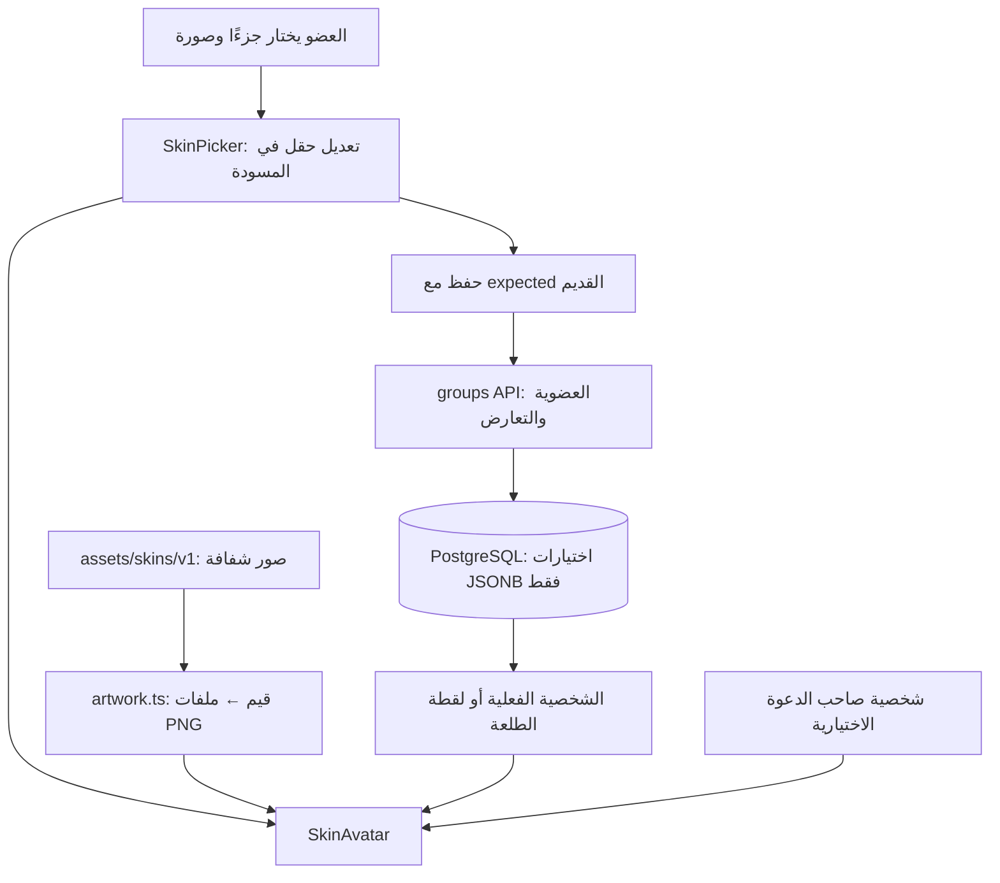

# 23 · شخصيات كرتونية من صور مستقلة

هذا تحديث28سبتمبر2026 على فرع `codex/ux-journey` بعد المصدر `d306a92`. يشرح استبدال رسم الشخصية السابق بصور مولّدة بأسلوب كرتوني لطيف وفكاهي، وإعادة تنظيم محررها. التفاصيل متوسطة والملامح بسيطة: خدود مستديرة، ابتسامة مشاكسة ورقبة قصيرة. [الفصل22](22-expressive-skins.ar.md) يصف المرحلة السابقة، ومرجع الأسطر `59d45d3` يظل لقطة تاريخية لا نغير شرحها ليناسب كودًا أحدث. الصور وهذه النسخة أُنجزت بمساعدة AI؛ يمكن تعلّم نفس التركيب برسومات تصنعينها بنفسك.

## الفكرة قبل الكود

تحديث لاحق: [الفصل25](25-girl-boy-skins.ar.md) يشرح بنت/ولد والإكسسوارات، ثم تصحيح الرقبة بقواعد متصلة للبنت بعد `df5aab9` وفصل خيارات الشكلين. الحزمة الحالية41 صورة، بينما هذا الفصل يصف النسخة الأصلية ذات20 طبقة؛ لقطة مرجع الأسطر القديمة محفوظة.

تخيلي دمية ورقية: جسم، وفوقه لباس، ثم شعر أو غطاء، ثم نظارة. إذا طبعتِ الدمية كلها في صورة واحدة فلن تستطيعي تبديل نظارتها وحدها. لذلك نحتاج صورًا مستقلة بخلفية شفافة. الشفافية تسمح برؤية ما تحت الجزء الفارغ من الصورة.

بدأنا [بمرجع شخصية كاملة](../skins/2026-09-28/character-master.png) تكون فيه الرقبة والملابس متصلتين، ثم أنشأنا منه20 ملف PNG: خمس درجات للرأس، ثلاث مجموعات ملامح، ثلاثة ملابس، خمسة اختيارات للشعر/غطاء الرأس، نظارة، وثلاثة أغراض للقب. الدلة والفناجين للمعزّب، الجوال والمفاتيح لـ«عند الإشارة»، والمنيو لـ«اختاروا أنتم». الأغراض بنفس أسلوب الرسم. التفاصيل مرحة وقريبة من ثقافة الطلعات، لكنها لا تعطي صاحبها دورًا أو تصويتًا إضافيًا.

العضو يفتح «شخصيتي في القروب» أو تخصيص الطلعة، ثم يختار **الجزء**، ثم إحدى صوره. يرى النتيجة قبل «حفظ الشخصية». زر الحفظ ثابت في أسفل النافذة. داخل محرر الدعوة تُستخدم نفس الاختيارات؛ تحفظ مع الدعوة. لم نضف إنشاء قروب أو حساب كشرط للاكتشاف.

## أين كل شيء؟

| الملف | مسؤوليته |
|---|---|
| [assets/skins/v1](../../assets/skins/v1/README.md) | الصور الأصلية الشفافة، ودليل أسمائها |
| [generation-prompts.json](../../assets/skins/v1/generation-prompts.json) | نص كل طلب توليد، مرجعه والملف الناتج؛ مصدر الصور قابل للمراجعة |
| [artwork.ts](../../src/features/skins/artwork.ts) | يربط قيمة الاختيار بصورة محلية |
| [catalog.ts](../../src/features/skins/catalog.ts) | القيم والأسماء والعبارات والألوان والاختيار الافتراضي و«فاجئني» |
| [SkinAvatar.tsx](../../src/features/skins/SkinAvatar.tsx) | يجمع الطبقات في صورة الشخصية المعروضة |
| [SkinEditor.tsx](../../src/features/skins/SkinEditor.tsx) | منتقي الأجزاء، المسودة، معاينتها وحفظها |
| [index.ts](../../src/features/skins/index.ts) | المدخل العام لميزة الشخصيات؛ لم يتغير في هذا التحديث |

الأسهم تعني انتقال بيانات، وليس تحميل ملفات الصور إلى PostgreSQL. الدعوة تحفظ شخصيتها في عقد المشاركة الحالي. حدود الوحدات كما هي: groups وplanSharing يستوردان من skins عبر index.ts. لا تحتاج ميزة skins معرفة التصويت أو العضوية أو الاتصال بالخادم.

## 1. ربط الاختيار بملف: artwork.ts

`heads` قاموس: المفتاح مثل `warm`، والقيمة صورة الرأس الحنطي. `require("../../../assets/skins/v1/head-warm.png")` يجعل أداة بناء Expo تعرف الملف وقت البناء وتضمّه للتطبيق. مسار الملف ثابت لأن Metro يحتاج اكتشاف الصور مسبقًا؛ لا نبني مسارًا عشوائيًا من مدخل المستخدم.

`ImageSourcePropType` نوع تفهمه صورة React Native. و`Record<Skin["tone"], ImageSourcePropType>` مع `satisfies` يقول لـTypeScript: يجب أن توجد صورة لكل درجة بشرة مسموحة، وكل قيمة مصدر صورة صالح. لو حذفنا درجة من الخريطة، يكشف فحص الأنواع الخطأ قبل التشغيل. نفس النمط للملابس والغطاء والملامح والأغراض.

النظارة ملف واحد؛ اختيار none يعني أن SkinAvatar لا يرسم هذه الطبقة. الخلفية لون عادي، لا تحتاج صورة. حذفنا رموز الإيموجي من بيانات التعبير والنظارة لأن الأزرار تعرض الشخصية الفعلية الآن.

## 2. جمع الصور: SkinAvatar.tsx

المكوّن يستقبل skin واسم الشخص وsize. إذا لم يختر شخصية يعرض أول حرف من اسمه كما كان. إذا اختار، يرسم دائرة خلفية ثم الصور فوق بعضها بالترتيب:

1. الرأس والأنف والأذنان والرقبة، حسب tone.
2. الملابس، حسب outfit.
3. العينان والحاجبان والفم، حسب expression أو ردة الفعل المؤقتة.
4. الشعر/غطاء الرأس، حسب headwear.
5. النظارة إن اختيرت.
6. غرض الشخصية ما لم يُطلب bare للمعاينة المصغرة.

`Layer` دالة صغيرة ترسم صورة واحدة. `frame` أربعة أرقام: موضعها أفقيًا وعموديًا، ثم عرضها وارتفاعها. نكتب الإحداثيات على مساحة تخيلية عرضها160. عندما يكون size=80 يكون scale=0.5؛ نضرب كل رقم في النصف فتصغر **كل الأجزاء معًا** وتحافظ على مكانها.

الرأس والملابس يستعملان الإطار الكامل `[0,0,160,160]`: الرقبة والياقة جاءتا من نفس المرجع، فلا نصغّر قميصًا كاملًا تحت رأس. صورة اللبس فيها فراغ شفاف كبير فوق الكتفين، وهذا مقصود. الملامح تستعمل `[19,9,124,124]` والنظارة `[15,5,125,125]` لمطابقة مقاس وموضع العينين بعد التوليد. نرفع الشماغ والغترة ست وحدات حتى يبقى الحاجبان ظاهرين؛ بقية الأغطية تستعمل الإطار الكامل. الغرض صغير في زاوية أسفل الشخصية. `position: "absolute"` يضع الصور فوق بعضها بدل صف رأسي. `overflow: "hidden"` مع دائرة يقص أطراف الكتفين خارج الأفاتار.

الصورة PNG تحتفظ بالفراغ الشفاف حول القطعة. لذلك لا تقصي الملفات تلقائيًا إلى حدود الرسم؛ سيختلف مركز العينين والشماغ عن الرأس. `resizeMode="stretch"` يطابق الصورة مع إطارها المحدد؛ أبعادها الأصلية1254×1254 وكل إطارات التركيب مربعة، فلا نضغط الملابس رأسيًا لتلائم الرأس.

كل طبقة `accessible={false}`: قارئ الشاشة لا يحتاج سماع «صورة» ست مرات. الحاوية الخارجية تعلن الاسم واللقب وردة الفعل، والمعاينة المصغرة decorative لا تكرر الإعلان داخل زر مسمّى. الشارات تستخدم أيقونات واضحة، وwin يعرض smile، وlose يعرض side_eye. حساب ردة الفعل الخاصة بالتصويت بقي داخل groups ولا يكشف أصوات الآخرين.

## 3. المحرر: SkinEditor.tsx

هناك مستويان مختلفان من الحالة:

- `part`: أي قسم مفتوح الآن، مثل اللبس. تغييره لا يعدّل الشخصية.
- `draft`: اختيارات الشخصية كلها. تغيير اللبس ينشئ نسخة `{ ...draft, outfit: value }`، فيبقي البشرة والغطاء وغيرهما كما اختارها العضو.

`parts` يعطي الأقسام أسماء عربية. `panel` يختار دالة عرض القسم الحالي فقط. `choices` يبني الأزرار المتشابهة مرة واحدة: صورة، اسم، إطار يوضح التحديد، وحالة selected لقارئ الشاشة. عند الضغط يرسل onChange نسخة المسودة الجديدة. صور البشرة والغطاء والتعبير والنظارة معاينات لنفس الشخصية مع تغيير الجزء المقصود فقط. الملابس تعرض قطعة اللباس نفسها داخل نافذة تركّز على الياقة والصدر حتى لا يخفيها غطاء الرأس؛ هذا قص في العرض فقط، والملف الأصلي بهوامشه محفوظ للتركيب.

المعاينة الكبيرة تستقبل draft مباشرة، لذا لا تنتظر استجابة الخادم. «فاجئني» يبقى تعديلًا محليًا للأجزاء المرحة، ولا يغير البشرة أو اللبس أو غطاء الرأس. الخلفية لها أربعة ألوان؛ الأقمشة نفسها مرسومة بألوان ثابتة في هذه الحزمة. هذا ليس محرر تلوين حر أو رفع صور شخصية.

`SkinEditor` يحتفظ بـexpected كما كان عند فتح النافذة. التحديث الدوري لا يستبدل المسودة أو خط البداية. `inFlight` يمنع الضغط المكرر من إرسال حفظين، وbusy يعطّل الخيارات أثناء الحفظ. عند النجاح تُغلق النافذة؛ عند الخطأ تبقى المسودة وتظهر رسالة بجانب الحفظ. footer في Sheet يضع زر الحفظ والإزالة خارج المنطقة القابلة للتمرير، فيظلان قابلين للوصول على شاشة صغيرة. الحفظ داخل الدعوة يتبع زر حفظ الدعوة، وليس نافذة إضافية.

## 4. API وقاعدة البيانات

لا توجد هجرة جديدة ولا أعمدة أو علاقات جديدة، لذلك مخطط ERD لم يتغير. جدول circle_members يحفظ skin، وouting_participants يحفظ skin_override وskin_snapshot. وحدة groups تملك هذه الأعمدة وصلاحية تعديل العضو نفسه. plan_invitations.details يحفظ character الاختيارية ويملكه plan_sharing. أنواع Skin وOpenAPI لم تتغير في هذا التحديث.

نرسل قيمة مثل `headwear: "shemagh"`، لا ملف الشماغ ولا عنوانه. expected يظل مطلوبًا لمنع ضياع تعديل جهاز آخر. التخصيص في الطلعة يرث القروب إن لم توجد قيمة مستقلة. اللقطة عند الإغلاق تحفظ **اختيارات** الشخص، لا نسخة مرسومة ثابتة: تغيير الرسوم في إصدار التطبيق يغيّر طريقة عرض الأرشيف أيضًا، مع بقاء اختياراته الأصلية.

لا تستخدم هذه الإضافة الصور لاتخاذ القرار، ولا تغير الحساسية أو الميزانية أو خانة وجبة أو احتمال فوز أحد. [العقد](../api-social.ar.md) و[عقد الدعوة](../api-plan-sharing.ar.md) يوضحان الصلاحيات وحدود النشر.

## 5. كيف تضيفين قطعة بنفسك؟

للتدريب ارسمي نظارة أخرى في محرر صور: لوحة1254×1254، خلفية شفافة، موضع العدسات مطابق للصورة الحالية. احفظي PNG واستبدلي صورة النظارة في مشروعك التدريبي، ثم راجعيها على الغترة والحجاب والشعر، وعلى صورة صغيرة في الخطة وكبيرة في المحرر. هذه مهارة تركيب صور عادية؛ لا تحتاج خدمة AI أثناء التشغيل.

إضافة **اختيار جديد** في التطبيق الحقيقي تختلف عن استبدال الرسم: أضيفي قيمته إلى نموذج Skin في Python، وجددي العقد بأنواع API، ثم catalog وartwork وخيارات المحرر. أضيفي اختبار الحفظ والقراءة والرفض للقيم غير المعروفة، وحدّثي الشرح. لا تغيّري معنى قيمة محفوظة قديمة لتشير إلى غرض مختلف.

## 6. التحقق والحدود

- `npm run check`: حدود الوحدات وفحص TypeScript و302 اختبار Python ناجحة. تحذير إهمال موجود في مكتبة Starlette/AnyIO، بلا فشل.
- `npm run format:check` وبناء الويب ناجحان.
- ست رحلات Playwright في skins وplan-sharing، على مخطط PostgreSQL معزول: حفظ ومزامنة وميراث وأرشفة، فشل اتصال وتعارض تعديل مع بقاء المسودة، ردة فعل خاصة بالتصويت، ودعوة عامة مع شخصية.
- رحلة الصور الجديدة تنتظر اكتمال تحميل الملفات فعلًا، وتثبت أن تبديل البشرة أو اللبس يبدل مصدر طبقة واحدة فقط، ثم تحفظ وتعيد فتح المحرر. فحص بعرض320 يثبت وجود الحفظ داخل الشاشة وعدم تجاوز عرض الصفحة. روجعت أغطية الرأس الخمسة بصريًا.
- بناء Release وتشغيله على محاكي iPhone17 Pro بنظام iOS26.4، ثم فتح المحرر ومعاينة تعديل الأجزاء. تحقق حفظ البيانات الفعلي في اختبارات المتصفح المعزولة؛ لم نكتب اختيارات اختبار فوق شخصية المستخدم في المحاكي.

أدلة العرض في [مجلد الفحص](../skins/2026-09-28/). الملفات الأصلية20 صورة، حجمها الإجمالي10.52MiB قبل تغليف التطبيق، دون مرجع التوثيق. هذا يزيد حجم الأصول عن SVG السابق. التطبيق الأصلي يضمها محليًا، والويب يحمل الصور المستخدمة من خادمه؛ حفظ الاختيارات ما زال يحتاج اتصالًا. لم نضف خدمة AI أو مكتبة جديدة. نسخة PDF الحالية لا ترسم الشخصية، ولا توجد أشكال وجه أو لحى أو تلوين حر في هذا الإصدار.
