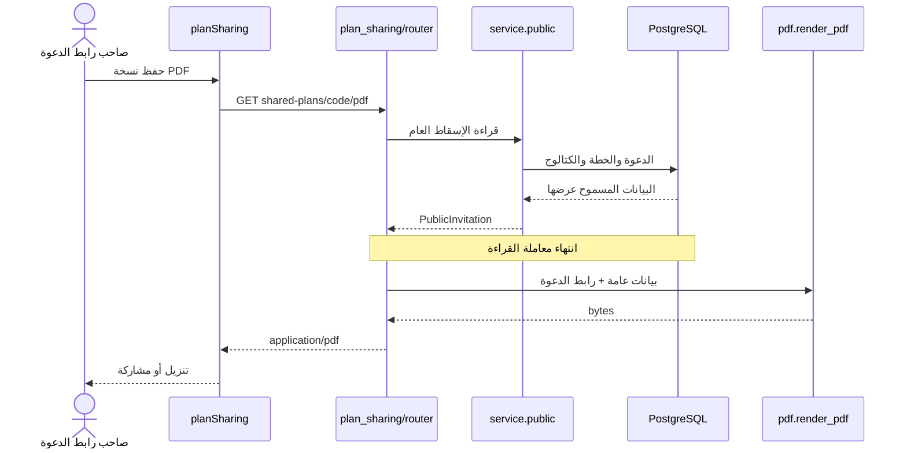

# 24 · ملف PDF واحد يصممه خادم Python

هذا الفصل يشرح تحديث٢٨سبتمبر٢٠٢٦ بعد المصدر `f50dc01` على `codex/ux-journey`. يشرح الملفات الحالية المرافقة له، ولا يغير مرجع الأسطر ذي اللقطة `59d45d3`. وصف الطباعة المحلية في الفصل20 محفوظ تاريخيًا. هذه ميزة منفذة، وليست مقترحًا.

## ما المشكلة التي نحاول حلها؟

كان الهاتف يحول HTML إلى PDF باستخدام Expo Print. المتصفح يفتح نافذة طباعة منفصلة. أضفنا سابقًا جسر Swift لإعادة روابط iOS التي فقدتها الطباعة. صار لدينا أكثر من مسار يؤثر في شكل الملف.

الآن يطلب التطبيق ملفًا من Python. يقرأ الخادم آخر خطة مسموح بعرضها، يرسم الصفحات، ويرجع بايتات PDF جاهزة. كلمة «بايتات» تعني محتوى الملف نفسه. المتصفح يحفظها، والهاتف يمررها إلى قائمة المشاركة. التنسيق والروابط مسؤولية مكان واحد.

## تتبعي الرحلة

1. المنظّم يحفظ الدعوة وينشئ رابطها كما كان يفعل سابقًا. لا تنشأ دعوة لمجرد الضغط على معاينة.
2. من «خيارات المشاركة ← حفظ نسخة PDF»، أو من صفحة الدعوة العامة، تستدعي الواجهة `exportPdf(code)`.
3. `pdfDownload.ts` يطلب `GET /api/shared-plans/{code}/pdf`. لا يرسل عنوانًا أو HTML أو أسماء رفقة أو نسخة خطة من ذاكرة الشاشة.
4. `router.py` يفتح قراءة PostgreSQL ويمرر الرمز إلى `service.public`.
5. `public` يجد الدعوة، ويتحقق أن مصدرها ما زال متاحًا، ثم يستعمل `project` لبناء الإسقاط العام الحالي. «الإسقاط» هنا اختيار حقول مسموح بنشرها من نموذج أكبر.
6. يُغلق اتصال القراءة قبل إنشاء PDF؛ فلا تبقى معاملة مفتوحة أثناء رسم الصفحات.
7. `pdf.render_pdf` يستقبل PublicInvitation ورابطها، ويرجع `bytes`.
8. FastAPI يرجع200 و`application/pdf`. الهاتف والمتصفح يتحققان من الرد قبل حفظه.

## افهمي الملفات قبل قراءة الأسطر

| الملف | مسؤوليته |
|---|---|
| `backend/hatim/features/plan_sharing/models.py` | العقد القائم للدعوة والإسقاط العام؛ لم نضف بيانات خاصة للتصدير |
| `service.py` | يعيد استعمال دالة `public` نفسها لصفحة JSON ولـPDF |
| `router.py` | مسار HTTP، معاملة القراءة، أصل الرابط من الإعداد، نوع الرد ومعالجة خطأ الإنشاء |
| `pdf.py` | الخطوط والتصميم وقياس النص والبطاقات والروابط والصفحات وQR |
| `fonts/` | نسختا400 و600 من IBM Plex Sans Arabic مع رخصة OFL؛ لا تنزيل أثناء الطلب |
| `src/features/planSharing/pdfDownload.ts` | طلب مهلة30ثانية، خطأ واضح، فحص Content-Type وبداية `%PDF-` |
| `exportPdf.ts` | ملف في cache ثم Expo Sharing؛ يترك نسخة المشاركة للنظام حتى يستطيع المستلم قراءتها |
| `exportPdf.web.ts` | Blob ثم رابط download مؤقت؛ يحرر URL بعد أن يبدأ Safari القراءة |
| `SharePlanButton.tsx` | يرسل code المحفوظ فقط، ويبقي المنع أثناء المسودة غير المحفوظة أو الخطأ |
| `PublicInvitationScreen.tsx` | حالة الانتظار والخطأ وإعادة المحاولة للمدعو |
| `backend/tests/test_plan_pdf.py` | يفتح PDF الحقيقي ويفحص الصفحات والروابط والخطوط والصلاحية والحالات الطويلة |
| `tests/plan-sharing.spec.ts` | يتحقق من تنزيل الملف من الرحلة الفعلية، وفشل الخادم ثم إعادة المحاولة |

حُذف `pdfHtml.ts`، واعتماد `expo-print`، والوحدة `modules/hatim-pdf-links`. لا نحتفظ بمسارين متنافسين. `expo-file-system` و`expo-sharing` يبقيان لنقل الملف إلى نظام الهاتف.

## كيف يرسم Python العربية؟

PDF ليس صفحة متصفح. يجب أن يعرف البرنامج شكل كل حرف وموضعه. نسجل الخطين مرة عند تحميل الوحدة بواسطة `pdfmetrics.registerFont`، ثم نستخدمهما داخل المستند. تضمين الخط في الملف يجعل جهاز المستلم قادرًا على عرضه دون تثبيت الخط.

`arabic-reshaper` يصل الحروف العربية حسب موضعها، و`python-bidi` يرتب السطر المختلط، مثل «الساعة 8:30 PM». نفعل ذلك لكل سطر بعد تحديد الكلمات التي تتسع فيه؛ قلب فقرة كاملة قبل تقسيمها يضع الأسطر بترتيب خاطئ.

`Text` يرث `Flowable`، أي عنصر يستطيع ReportLab وضعه في الصفحة. له خطوتان:

- `wrap(width, height)`: يستقبل المساحة المتاحة ويقيس عرض الكلمات. عندما لا تتسع كلمة يبدأ سطرًا جديدًا. الكلمة الطويلة جدًا تقسم أيضًا. المسافات والأسطر الفارغة المتكررة تختصر حتى لا يصنع إدخال قصير عشرات الصفحات البيضاء.
- `draw()`: يرسم الأسطر من اليمين بخطها ولونها. إن كان العنصر رابطًا يضيف `linkURL`؛ هذه مساحة قابلة للنقر داخل PDF نفسه.

النص يرسم حرفيًا. كتابة `<script>` في الرسالة لا تشغله ولا تحوله إلى وسم. لا يوجد متصفح خفي ولا تفسير HTML، ولا وصول إلى صور أو عناوين يقدمها المستخدم.

## كيف نحافظ على التصميم بين الصفحات؟

`Panel` يجمع عناصر البطاقة. يقيس كل عنصر، ويجمع ارتفاعاتها مع الهوامش، ثم يرسم خلفية مستديرة وحدًا خفيفًا. ReportLab ينقل البطاقة كاملة إذا لم تتسع في الصفحة الحالية. هذا يحافظ على اسم التجربة والأطباق والرابط معًا.

`render_pdf` هو ترتيب المستند: غلاف بثيم الدعوة ورابط العودة وQR ووقت الإصدار، ملخص التجارب والخانات والتكلفة، تنبيهات الخطة، بطاقات التجارب، ثم ملاحظة الاقتراحات. وجود QR في البداية يمنع إنشاء صفحة ختامية كاملة للرمز وحده. الخانات مستمدة من المحرك القائم؛ لا يعيد PDF ترتيب الأولويات أو اختيار مطاعم أخرى.

`SimpleDocTemplate` يحدد A4 والهوامش. `page_frame` يرسم هوية حاتم ورقم الصفحة. الوقت يأتي من `read_at` في الخادم ويحول إلى `Asia/Riyadh`. `BytesIO` يشبه ملفًا في الذاكرة، فنرجع محتواه دون حفظ ملفات خاصة على قرص الخادم.

QR يرسم محليًا من رابط الدعوة باستخدام ReportLab. الرابط نفسه قابل للنقر أيضًا. لا نحتاج خدمة خارجية لإنشاء الرمز.

## أين قاعدة البيانات في التغيير؟

لا جدول جديد ولا migration. `plan_invitations` يملك تفاصيل التصميم ورمز الوصول والمراجعة، وplanning/groups يملكان مصادر الخطط، وexperiences يملك الكتالوج. المعاملة الجديدة قراءة فقط. ERD لا يتغير، لأن PDF ناتج مؤقت من البيانات القائمة، وليس كيانًا مخزنًا. لا نسخ صور أو ملفات أو تقييمات Google إلى PostgreSQL.

حدود `architecture.json` بقيت نفسها: plan_sharing يعتمد على planning وgroups وexperiences من واجهاتها العامة؛ pdf.py داخل ميزة المشاركة. لا منطق جديد في main.py أو shared أو الجسر legacy_plans.

## الاتصال والنشر

`HATIM_PUBLIC_ORIGIN` عنوان الموقع العام الذي نطبعه في الرابط وQR، مثل `https://your-domain.example` دون `/api`. ينبغي أن يطابق العنوان الذي تستخدمه دعوات iPhone. غيابه في التطوير يجعل أصل الطلب هو البديل؛ localhost لا يعمل على أجهزة الأصدقاء.

`npm run public:test` يكتب عنوان النفق في إعداد الواجهة والخادم. إذا أعاد استعمال API يعمل مسبقًا، يجب إعادة تشغيل ذلك API ليقرأ القيمة الجديدة. عند تغير النفق لا تتغير معرفات PostgreSQL، لكن الملفات التي حملت رابط النفق القديم تحتفظ به. الاستضافة الثابتة تحل عمر الرابط.

Docker يثبت `uv.lock` وينسخ حزمة hatim كاملة بما فيها الخطوط والترخيص. لا خدمة طباعة أو Chromium ولا قرص دائم للتصدير. `deploy/compose.yaml` يطلب العنوان العام صراحة.

## تعلّمي بناءها بيدك

ابدئي ببرنامج Python يرسم عنوانًا عربيًا واحدًا في PDF. افتحي الملف؛ نجاح التنفيذ وحده لا يثبت اتصال الحروف. أضيفي تقسيم السطور، ثم بطاقة واحدة تحتوي رابط خرائط. اختبري بطاقة طويلة قبل إضافة تسع بطاقات. بعد ثبات الرسم اجعلي الدالة تستقبل نموذج PublicInvitation بدل بيانات مكتوبة في الكود. أخيرًا ضعيها خلف GET في FastAPI واربطِي زرًا ينزل الرد.

افصلي اختيار الخطة عن تنسيقها: إذا تغير القرار، اختبري planner؛ إذا انقصّ عنوان البطاقة، اختبري pdf.py. بهذه الطريقة تستطيعين تحسين التصميم دون نسخ قواعد الحساسية أو إعادة كتابة التخطيط.

## التحقق وحدود النسخة

اختبارات الخادم تفتح الملفات الفعلية: خطط مباشرة وطلعات قروب، أحدث اختيار بعد تقليص الخانات، الإلغاء404، عدم تضمين رموز الإدارة، أبعاد A4، روابط داخل الصفحات، خط مضمّن، ثلاثة ثيمات ونص عربي/إنجليزي طويل وتسع تجارب، خطة فارغة مؤرشفة، وإنشاء متزامن لعدة ملفات. اختبار الفشل يتأكد من503 واضح وبقاء الدعوة قابلة للقراءة.

اختبار المتصفح يتابع تنزيل بايتات PDF بدل نافذة الطباعة، ويحاكي تعذر الإنشاء ثم يعيد المحاولة. فُحص كذلك الملف بصريًا وبناء الهاتف ومسار المشاركة؛ النتائج النهائية أدناه.

التصميم الحالي نصي؛ لا يرسم شخصية الدعوة أو صور الأطباق. عنوان Google يفتح الموقع/البحث والتقييم الحالي، ولا يخزن تقييمًا رقميًا. الخطة والملف يشتركان في الإسقاط العام؛ الحساسية والأسماء الخاصة والجيب لا تُنشر. PDF يحتاج اتصالًا عند إنشائه ويظل نسخة ثابتة بعد التنزيل. بيانات الكتالوج الحالية توضيحية وليست توثيقًا لأماكن حقيقية.

### نتائج التحقق النهائي — ٢٨ سبتمبر ٢٠٢٦

- `npm run check`: حدود المعمارية وTypeScript و٣١١ اختبار Python ناجحة، منها٩ اختبارات PDF جديدة. `ruff check` للملفات المعدلة و`npm run format:check` ناجحان.
- رحلتا `tests/plan-sharing.spec.ts` ناجحتان على PostgreSQL داخل schema مؤقت مستقل. أُوقف خادم الاختبار ونُظّف schema بعده؛ لم نبدل تفضيلات المستخدمة أو خطتها.
- نجح تنزيل الملف في Safari على Mac من الدعوة العامة، ونجح بناء Release وتشغيل iPhone17Pro وفتح مشاركة ملف PDF الأصلي عبر Expo Sharing. الملف المقروء من cache احتوى روابط Google والخطة، وليس مجرد نص بلون رابط.
- بعد مراجعة ملف الخطة ذي خمس تجارب نُقل QR إلى الغلاف: صار صفحتين بدل ثلاث، مع٧ روابط فعلية؛ وأضيف اختبار يمنع عودة صفحة للرمز وحده. روجعت الصفحتان بصريًا، والخطة الطويلة في٥ صفحات، والحالة الفارغة في صفحة واحدة، دون قص النصوص أو انقسام البطاقات.
- نجح Docker build، ثم أنشأت الصورة النهائية PDF بلا شبكة وبنظام ملفات للقراءة فقط. الخطوط والمنطقة الزمنية موجودتان داخل الصورة. فُحص endpoint العام عبر النفق المؤقت وأعاد الملف النهائي بروابط أصل النفق الحالي.
- ما يزال تحذير Deprecation من Starlette/AnyIO وتحذيرات بناء من تبعيات React Native؛ لم تمنع الفحوص. لا ادعاء بنشر دائم أو تجربة هاتف فعلي، وQR مرتبط بعمر النفق المؤقت في هذا الاختبار.
