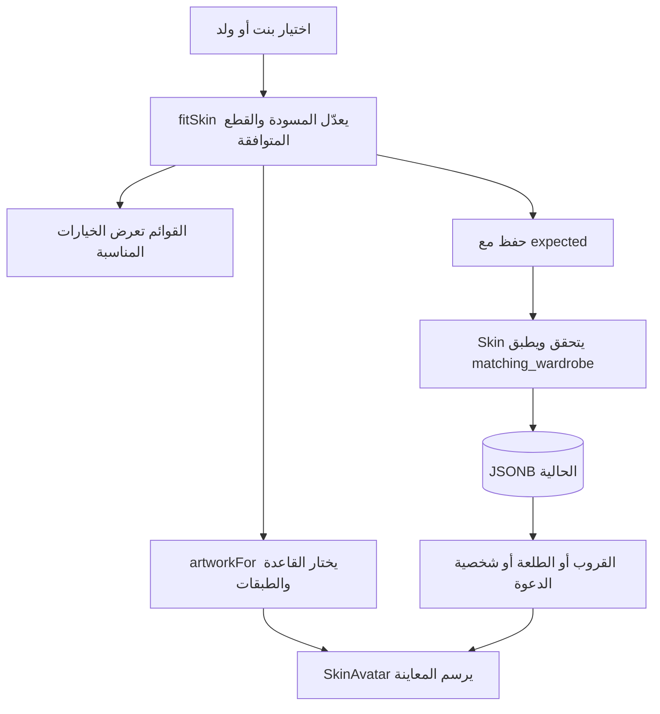

# 25 · شخصية بنت أو ولد وتركيب القطع بشكل صحيح

التنفيذ الأول موجود في `df5aab9`، وهذا الفصل يشرح تصحيحه اللاحق على فرع `codex/ux-journey` بتاريخ28سبتمبر2026. لا نغيّر لقطة كتاب شرح الأسطر التاريخية `59d45d3`. المشكلة كانت في استعمال بعض القطع للشكلين رغم اختلاف الرأس، وفي تركيب رقبة البنت واللبس كصورتين لا تلتقيان جيدًا.

## ما يراه المستخدم

يظهر اختيار **بنت / ولد** فوق المعاينة. بعده تظهر القطع المناسبة للشكل المختار:

| الجزء | بنت | ولد |
|---|---|---|
| اللبس | كاجوال أو عباية | كاجوال أو ثوب |
| غطاء الرأس | بدون غطاء، حجاب، قبعة | بدون غطاء، شماغ، غترة، طاقية، قبعة |
| الإكسسوار | بدون، نظارة، شمسية، مشبك وردة | بدون، نظارة، شمسية |

تبديل بنت إلى ولد يغيّر العباية إلى كاجوال ويزيل الحجاب والوردة، مع إبقاء بقية القطع المتوافقة. التبديل العكسي يصحح الثوب والغطاء الرجالي فقط. «فاجئني» يختار إكسسوارًا من قائمة الشكل الحالية، ولا يغيّر الشكل أو البشرة أو اللبس أو الغطاء. المعاينة فورية والحفظ بزر مستقل. تخصيص الطلعة لا يغيّر شخصية القروب، وشخصية صاحب الدعوة اختيار مستقل. الشخصيات لا تغيّر الحساسية أو الميزانية أو الحضور أو أصوات الأعضاء، ولا تُضاف إلى PDF في هذا التحديث.


## 1. ما الذي نخزنه؟

نخزن اختيارات قصيرة داخل JSONB، وليس صورة. `gender` في `Skin` اسم مظهر الشخصية، وليس بيانات هوية الحساب:

```python
gender: Literal["girl", "boy"] = "boy"
```

`Literal` يسمح بالقيم المكتوبة فقط؛ قيمة مجهولة تعيد422. القيمة الافتراضية تجعل بيانات النسخ القديمة قابلة للقراءة. لا نخمن من الاسم أو اللبس. بعد التحقق تعمل `matching_wardrobe` في `backend/hatim/features/groups/models.py`، فتصلح القطع المعروفة التي لا تنتمي للقائمة المختارة، كما في الجدول.

مثال طلب اختيار بنت أول مرة:

```json
{
  "skin": {"persona": "host", "gender": "girl", "outfit": "casual", "headwear": "none"},
  "expected": null
}
```

الخادم يملأ بقية الحقول الافتراضية. عندما توجد شخصية محفوظة نرسلها في `expected`. معناها: «احفظ إذا كانت الشخصية لا تزال كما قرأتها». `checked_skin` يحوّل القيمة القديمة والجديدة والمتوقعة بالنموذج نفسه قبل المقارنة، فلا يؤدي تصحيح حجاب محفوظ للولد إلى تعارض وهمي. أما تغيير فعلي من جهاز آخر فيعيد409 ويحفظ المحرر المسودة حتى تحل المشكلة.

لا حاجة لترحيل SQL جديد: نستخدم `circle_members.skin` و`outing_participants.skin_override/skin_snapshot` كما هي، وميزة `groups` تملكها. ميزة `plan_sharing` تملك `details.character` وتستعمل نفس نموذج Skin من المدخل العام. ERD والعلاقات لم تتغير. لقطة الطلعة المغلقة تحفظ الاختيارات؛ قد تتطور رسوماتها وقواعد توافق القطع عند القراءة، دون إعادة كتابة الأرشيف.

## 2. لماذا جعلنا الرأس والرقبة واللبس قاعدة واحدة؟

عندما تكون الرقبة في صورة والقميص في صورة أخرى، يمكن أن تظهر فتحة بينهما. تحريك العباية لأعلى كان يخفي جزءًا من المشكلة لكنه يغيّر نسب الرسم. أزلنا هذا الحل. في `artwork.ts` نستخدم للبنت **قاعدة متصلة** لكل لباس ودرجة بشرة: لباسان × خمس درجات =10 صور.

```ts
const base = girlBases[outfit === "abaya" ? "abaya" : "casual"][skin.tone ?? "warm"];
```

القوس الأول يختار اللبس، والثاني يختار البشرة. `??` يعطي قيمة افتراضية فقط إذا غابت البشرة. تظل أزرار البشرة واللبس مستقلة للمستخدم؛ تغيير أحدهما لا يغير قيمة الآخر. الرأس والرقبة والقماش داخل الصورة متصلون أصلًا، لذلك لا نحتاج إطارات تمديد لسد فجوة.

`artworkFor` يعيد `base` و`garment` و`faces` و`covers`. للبنت garment=null لأن اللبس داخل القاعدة؛ للولد يبقى اللبس طبقة منفصلة كما كان. `outfitArtwork` يعيد الرسم الموافق لمعاينة اللبس في المحرر. `require` ثابت لكل ملف حتى يستطيع Expo تضمينه داخل تطبيق الآيفون والعمل دون تنزيل الصور عند كل استخدام.

## 3. الملامح والنظارات والأغطية

`SkinAvatar.tsx` يركّب الأجزاء فوق بعضها باستخدام `Layer`. مواضع الطبقات محسوبة على لوحة160 وحدة؛ إذا كان حجم العرض80 فكل موضع يصبح نصف قيمته. لا نعدل الصور الأصلية أثناء التشغيل.

ملامح البنت أصغر ومثبتة بالنسبة للأنف والذقن. لها نظارة عادية مستقلة بإطار رفيع، وللولد نظارة شمسية مستقلة تلائم ميل عينيه. النظارة تحتاج محاذاة العدستين وجسر الأنف، وليس عرض الوجه فقط. قبعة البنت مستقلة عن قبعة الولد؛ ترسم فوق الشعر، بينما الحجاب يستبدل الشعر ويغطي محيط الرأس والأذنين والرقبة. اخترنا الحجاب الجديد بعد ظهور حافة الرأس والأذن من التصميم السابق. مشبك الوردة طبقة منفصلة للبنت، ولا يضاف إلى قائمة الولد أو «فاجئني».

الصور مولدة أثناء التطوير فقط؛ التطبيق لا يستدعي AI. لبناء المشروع بنفسك ارسمي قاعدة متصلة، ثم ضعي الملامح والغطاء والنظارة على طبقات في برنامج رسم. صدّريها PNG بشفافية ومساحة واحدة، وأبقي الفراغ حول كل قطعة؛ قصّ كل ملف حول رسمته يحطم المحاذاة. [سجل الصور وطلبات توليدها](../../assets/skins/v1/README.md).

## 4. مسودة React وقاعدة التوافق

في `catalog.ts` توجد القوائم `outfitsFor` و`headwearsFor` و`accessoriesFor`. يمرر `SkinPicker` القيم إلى أزرار لها أسماء وحالة اختيار لقارئ الشاشة. تغيير الشكل ينفذ:

```ts
onChange(fitSkin({ ...draft, gender: value as Skin["gender"] }));
```

`...draft` ينسخ الاختيارات، ثم نستبدل gender، و`fitSkin` يصلح القطع غير المتوافقة. القاعدة مطابقة للخادم حتى لا تعرض المعاينة شيئًا مختلفًا عن المحفوظ. يطبق `SkinAvatar` القاعدة أيضًا قبل الرسم، فيحمي مواضع العرض من بيانات قديمة. لا تُرسل مسودة المحرر للخادم إلا عند الحفظ، وتتعطل الأزرار أثناءه.

`personaName` يعطي «المعزّبة» للبنت و«المعزّب» للولد عندما يكون اللقب host. يصدر عبر `skins/index.ts` إلى الخطة والدعوة؛ لا تحتاج كل ميزة إلى نسخة أخرى من منطق الرسم. الألقاب الأخرى والعبارات مشتركة.



## الملفات والفحص

| المكان | المسؤولية |
|---|---|
| `backend/hatim/features/groups/models.py` | تحقق Skin وتصحيح قطع الشكلين |
| `src/features/skins/catalog.ts` | القوائم والتوافق والاختيار العشوائي والألقاب |
| `src/features/skins/artwork.ts` | ربط الاختيارات بملفات الصور |
| `src/features/skins/SkinAvatar.tsx` | ترتيب الطبقات ومواضعها |
| `src/features/skins/SkinEditor.tsx` | مسودة التعديل والأزرار والمعاينات والحفظ |
| `assets/skins/v1/` | الصور وطلبات التوليد ومراجعها |
| `backend/tests/test_skins.py` | البيانات القديمة والمقارنة والتزامن والميراث والأرشيف |
| `tests/skins.spec.ts` | القوائم والمعاينات والتبديل والحفظ واستقلال الطلعة |

عقد OpenAPI وأنواع TypeScript منذ `df5aab9` يستوعبان القيم نفسها؛ لا حقل جديد في هذا التصحيح. حدود الوحدات وarchitecture.json كما هي. نجح فحص المعمارية وTypeScript و320 اختبار Python، وسبع رحلات متصفح للشخصيات والدعوة على PostgreSQL مؤقتة. [دليل التحقق والصور النهائية](../skins/2026-09-28/girl-boy/README.ar.md) يفصل فحص الرسم والبناء.

تمرين: غيّري شكل إطار النظارة في مشروع تدريبي مع الحفاظ على موضع العدستين. قارني الشخصية كبيرة في المحرر وصغيرة في الخطة، مع الشعر والحجاب والقبعة، قبل اعتبار التعديل منتهيًا.
