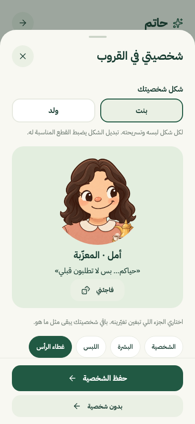
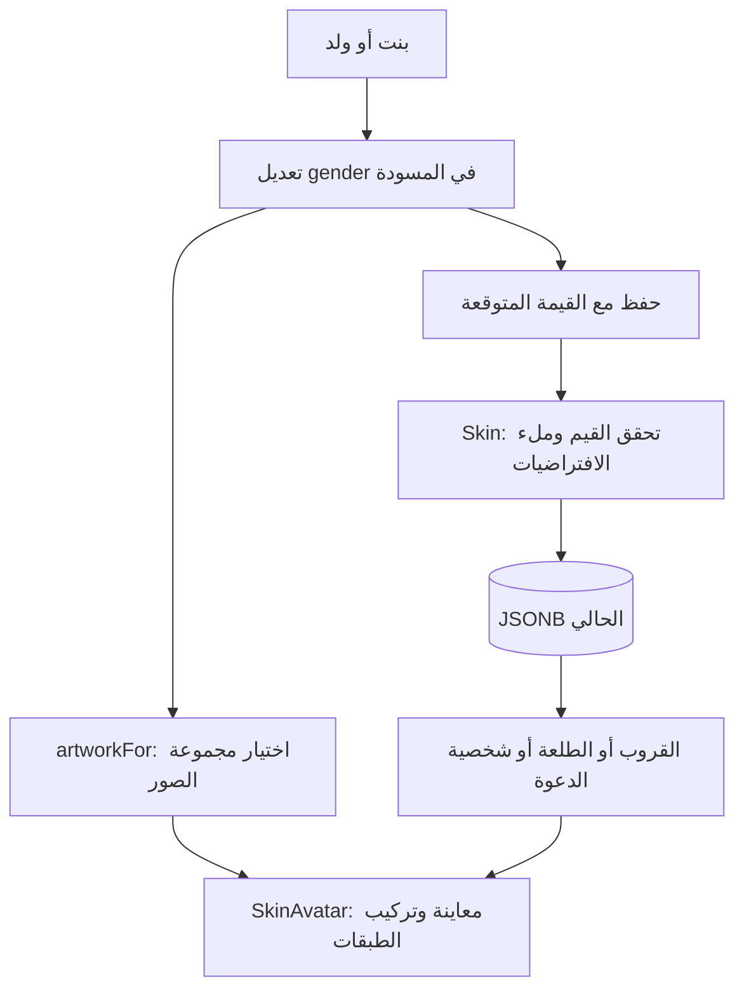

# 25 · شخصية بنت أو ولد

تحديث28سبتمبر2026 على فرع `codex/ux-journey` بعد المصدر `bb0f139`. المشكلة أن جميع الشخصيات كانت تستعمل نفس الشعر وملامح الوجه؛ تغيير العباية أو الحجاب وحده لم يكن يغيّر ذلك. هذا الفصل يصف التنفيذ الفعلي، ولا يستبدل شرح لقطة الكود التاريخية `59d45d3`.

## ما يراه المستخدم

في «شخصيتي في القروب» أو «شخصيتي لهذه الطلعة»، يظهر **شكل شخصيتك: بنت / ولد** فوق المعاينة. اختيار بنت يستعمل شعرًا متموجًا، ملامح لطيفة بتعابير الابتسامة والغمزة والنظرة الجانبية، وكاجوال بياقة مستديرة. للبنت رأس وذقن ورقبة وشعر مستقل، والكاجوال والعباية هما اللبس المتاح. تختار الشعر أو الحجاب أو قبعة كاجوال. لا يظهر الثوب والشماغ في قائمتها. تتوفر نظارة شمسية ومشبك وردة بالإضافة للنظارة العادية؛ تختار إكسسوارًا واحدًا ويمكن جمعه مع القبعة. لون البشرة يبقى اختيارًا مستقلًا. اختيار الحجاب يخفي طبقة الشعر ويحتفظ بملامح البنت. لا يغيّر «فاجئني» هذا الاختيار.

المعاينة تتغير فورًا، والحفظ يتم بزر «حفظ الشخصية». تخصيص الطلعة يبقى خاصًا بها، ويمكن إزالته للعودة إلى شخصية القروب. شخصية صاحب الدعوة اختيار منفصل داخل محرر الدعوة؛ تحفظ مع الدعوة وتظهر لمن معه الرابط. لا تُضاف الشخصية إلى PDF في هذا التحديث.



## 1. معلومة صغيرة بدل صورة في قاعدة البيانات

في `backend/hatim/features/groups/models.py` أضفنا:

```python
gender: Literal["girl", "boy"] = "boy"
```

`gender` هنا اسم حقل **مظهر الشخصية**؛ ليس سؤالًا عن الهوية الشخصية أو حقل حساب. `Literal` يسمح بالقيمتين المكتوبتين فقط؛ قيمة غير معروفة تعيد422. `= "boy"` قيمة افتراضية لأن الرسم الموجود سابقًا هو رسم الولد. لذلك يظل JSON القديم صالحًا. لا نخمن من اسم المستخدم أو من اختياره عباية أو حجابًا.

النموذج يعيد الحقل ضمن الرد، ويحفظه عند التعديل داخل JSONB الحالي. مثال اختيار أول مرة:

```json
{
  "skin": {
    "persona": "host",
    "gender": "girl",
    "outfit": "casual",
    "headwear": "none"
  },
  "expected": null
}
```

الخادم يملأ باقي الحقول الافتراضية. إذا وُجد اختيار سابق، ترسل الواجهة قيمته في expected بدل null. `checked_skin` يقارن نموذجين مكتملين؛ غياب gender في سجل قديم لا يصنع تعارضًا وهميًا. لكن إذا غيّره جهاز آخر إلى girl تبقى مقارنة النسخة القديمة مختلفة، فيعود409 ويحافظ المحرر على المسودة.

أضاف النموذج أيضًا cap إلى headwear وsunglasses وflower إلى accessory. `girl_wardrobe` يعمل بعد التحقق: للبنت يحول thobe إلى casual، وأغطية shemagh/ghutra/taqiyah إلى none. هذا يصحح ما سمح به المحرر السابق؛ القاعدة تطبق على قيمة JSONB المقروءة وعلى expected أيضًا. لا نحتاج ترحيل SQL لأن JSONB يسمح بمفتاح جديد دون عمود جديد. ملكية البيانات والعلاقات كما هي: groups يملك skin وskin_override وskin_snapshot، وplan_sharing يملك details.character. عند إغلاق الطلعة تتجمد الاختيارات، ومنها gender. لا تتغير تفضيلات الطعام أو التصويت أو الحضور.

## 2. ربط البيانات بالصور

في `src/features/skins/artwork.ts` توجد مجموعة boy للصور السابقة، ومجموعة girl تستخدم خمس درجات لرأس مستقل، ثلاث ملامح، شعرًا بفرق وسطي، كاجوال وعباية وحجابًا مصممة لنسب الرأس الجديد. القبعة والإكسسوارات والأغراض مشتركة بين الشكلين. جرى تضييق فتحتي ياقة الكاجوال والعباية لتغطية الفراغ حول الرقبة. ترتفع طبقة عباية البنت بإطار `[0,-38,160,198]` لتغلق فتحة جانبي الرقبة مع امتداد القماش لأسفل الصورة. تستخدم الملامح والنظارة إطارات ملائمة لكل شكل؛ بقية القطع تحتفظ بمساحة التركيب المشتركة.

```ts
export function artworkFor(skin: Skin | null | undefined) {
  return looks[skin?.gender ?? "boy"];
}
```

`skin?.gender` يقرأ الحقل إن وجدت شخصية. `?? "boy"` يحافظ على التوافق مع قيمة قديمة ناقصة. نعيد قاموس الصور المناسب، ثم يختار SkinAvatar التعبير واللبس والغطاء من هذا القاموس. عند cap يرسم الشعر ثم القبعة فوقه، أما الحجاب فيستبدل الشعر. كل إكسسوار له موضعه: النظارة والشمسية على العينين، والوردة إلى جانب الشعر أو الغطاء. حتى ردة فعل فوز الاختيار أو خسارته تستخدم ملامح الشكل المختار.

الطبقات الجديدة1254×1254 بخلفية شفافة فعلًا. الحزمة أصبحت35 صورة؛ حجمها موثق في سجل الأصول قبل التغليف. [طلبات التوليد ومراجعها](../../assets/skins/v1/girl-generation-prompts.json) توثق مصدر الرسومات. التوليد تم أثناء التطوير؛ التطبيق لا يستدعي AI. تستطيعين بناء نفس النظام برسومات ترسمينها يدويًا وتصدرين كل قطعة على نفس المساحة الشفافة.

## 3. تعديل مسودة React

في `catalog.ts` قاموس genders يحول girl إلى «بنت» وboy إلى «ولد». `SkinPicker` يرسم زرين لهما حالة اختيار يقرأها قارئ الشاشة. الضغط ينفذ:

```ts
onChange(fitSkin({ ...draft, gender: value as Skin["gender"] }));
```

`...draft` ينسخ جميع الاختيارات السابقة، ثم يستبدل gender. `fitSkin` يطبق نفس قاعدة ملابس البنت في الخادم، فيبدّل الثوب والغطاء غير المناسبين فقط ويحتفظ بالباقي. `outfitsFor` و`headwearsFor` يعرضان الخيارات المناسبة. لا يكتب إلى الخادم حتى الحفظ. أثناء الحفظ تتعطل الأزرار. `artworkFor(draft)` يختار صور معاينات اللبس أيضًا؛ لا نعرض معاينة قميص الولد عند تحرير بنت.

`personaName` يعيد «المعزّبة» إذا كانت persona=host وgender=girl، وإلا يعيد اسم الشخصية المعتاد. يستخدمه المحرر وSkinAvatar وSkinPeople وInvitationCard، ويُصدّر من `skins/index.ts` حتى لا تتجاوز الميزات حدود بعضها. عبارات «عند الإشارة» و«اختاروا أنتم» مشتركة.



## الملفات والفحص

| المكان | التغيير |
|---|---|
| `backend/hatim/features/groups/models.py` | عقد gender والتوافق القديم |
| `backend/openapi.json` و`src/shared/api/schema.d.ts` | عقد مولد، لا نعدل الأنواع يدويًا |
| `src/features/skins/` | الخيارات، أسماء الألقاب، الرسومات، المعاينة والمحرر |
| `src/features/groups/skins/SkinPeople.tsx` | لقب المعزّبة في الخطة والاختيار |
| `src/features/planSharing/InvitationCard.tsx` | اللقب في الدعوة العامة |
| `assets/skins/v1/girl-*.png` والإضافات المشتركة | خمس عشرة طبقة جديدة مستقلة |
| `backend/tests/test_skins.py` | رفض القيم الخاطئة، السجل القديم، التزامن، الميراث والأرشيف |
| `tests/skins.spec.ts` | الاختيار المرئي، تبديل الصور، الحفظ وإعادة الفتح واستقلال الطلعة |
| اختبارات plan-sharing في Python والمتصفح | وصول اختيار البنت إلى الدعوة العامة |

نجح `npm run check`: حدود الوحدات وTypeScript و319 اختبار Python. نجحت خمس رحلات متصفح للشخصيات ورحلتان للمشاركة على قاعدة مؤقتة معزولة؛ ثم أُعيدت رحلة البنت بعد ضبط إطار العباية ونجحت. فُحصت الصور المركبة للبشرة واللبس والحجاب والتعابير، وبقي زر الحفظ ظاهرًا في المقاسات المختبرة. نجح بناء الويب وRelease لمحاكي iPhone17Pro، وراجعتُ عرض الشخصية الجديدة على iOS26.4. هذا ليس فحصًا على جهاز iPhone حقيقي. [الصور ودليل التحقق](../skins/2026-09-28/girl-boy/README.ar.md).

تمرين مستقل: أضيفي تعبير «ضحكة» على ورقة أولًا. حددي القيمة الجديدة، وصورة لكل شكل، ومكانها في القاموس والنموذج، ثم اختبري أن تغييرها لا يغيّر البشرة أو اللبس. لا تحتاجين جدولًا جديدًا أو خدمة جديدة لكل اختيار تجميلي.
