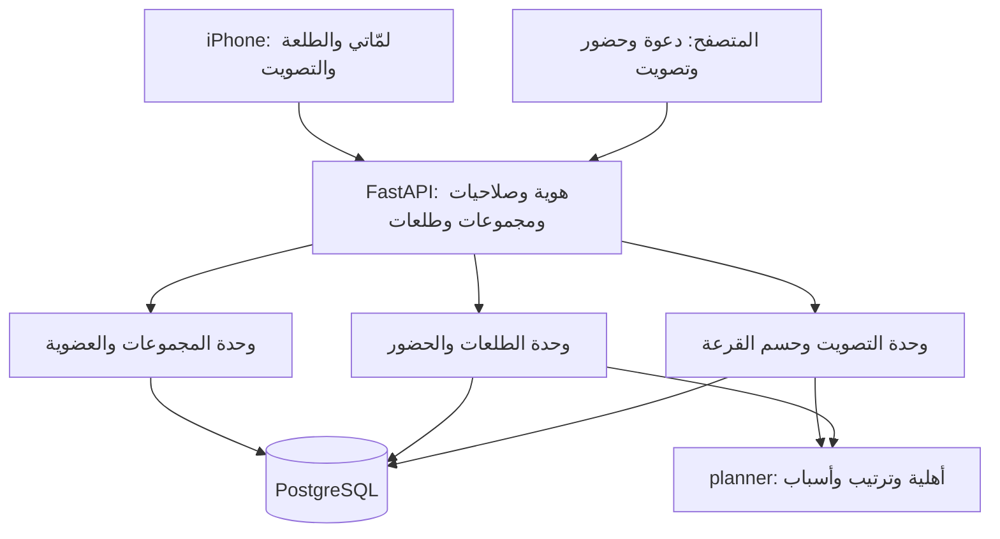
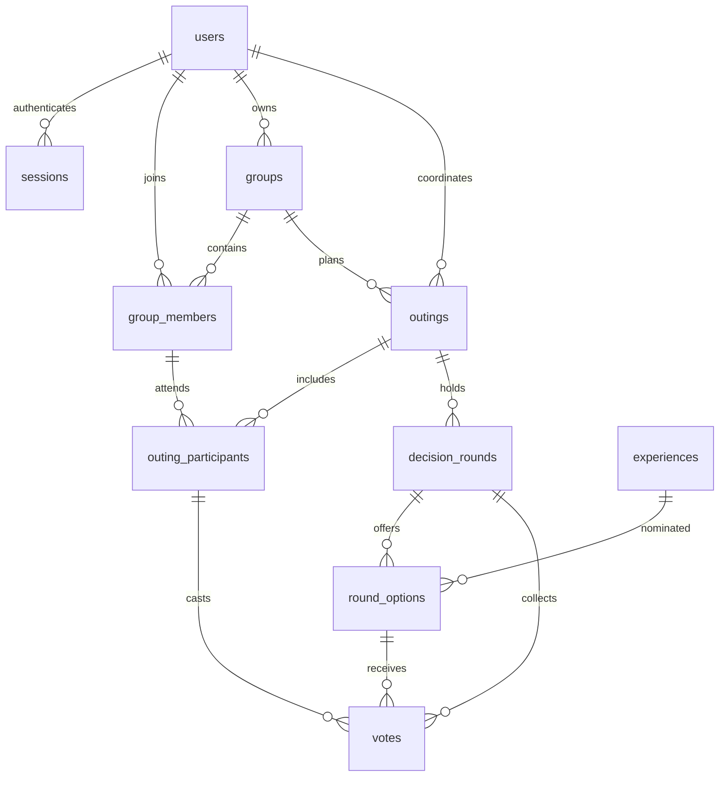
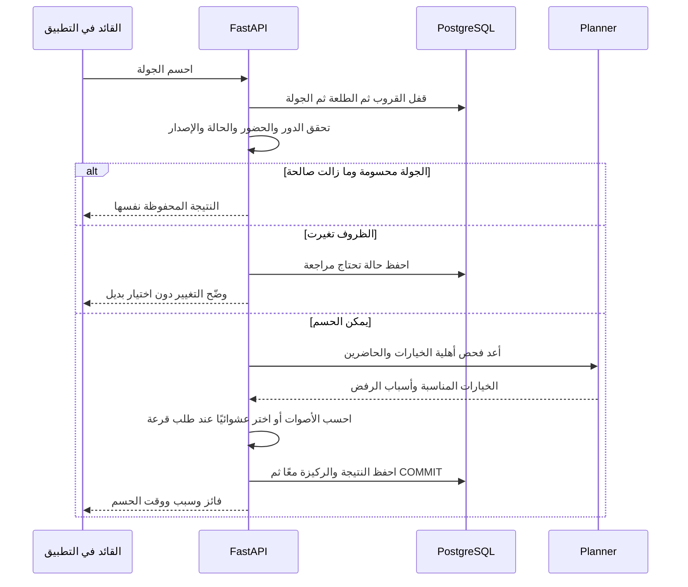

# قروبات ثابتة وطلعات وتصويت وقرعة — مقترح للنقاش

الحالة: **نقاش تاريخي نُفذت ميزاته الأساسية على `codex/persistent-groups` بتاريخ 15 سبتمبر 2026 بناءً على طلب «طبقها على التطبيق».** بقية هذه الصفحة تحفظ نص التصميم السابق؛ المرجع للواقع هو [المعمارية الحالية](../architecture-python-postgres.ar.md) و[شرح التنفيذ](../learning-python-postgres/13-social-groups.ar.md).

الفروق الفعلية: الجداول accounts وaccount_sessions وcircles وcircle_members بدل أسماء users/sessions/groups/group_members المقترحة؛ الربط بالنسخة القديمة اختياري بمفتاحها، لا نقل تلقائي لهوية مخمّنة. نُفذ مقعد الاحتياط المشترك مع اشتراك الطرفين وبطاقة واحدة للمستهدف في الطلعة. القرعة حركة نرد مع نتيجة محفوظة، وليست عجلة مرسومة بأقسام. API تعرض أحدث جولة؛ السجلات السابقة تبقى في DB دون شاشة تاريخ مستقلة. لا توجد واجهة اقتراح خيارات من العضو أو استعادة كلمة مرور أو نشر دائم. التفاصيل المستقبلية أدناه لا تُعد وعدًا بأنها منفذة.

[المعمارية المنفذة](../architecture-python-postgres.ar.md) · [شرح الفكرة للمبتدئة](../learning-python-postgres/group-feature-design.ar.md)

## القرار الأساسي: القروب يبقى، والطلعة تتغير

القروب الحالي محفوظ أصلًا في PostgreSQL، لكنه مرتبط بإعدادات خطة واحدة ووصول يعتمد على مفتاح الجهاز. الإضافة المطلوبة أوسع: قائمة قروبات يمكن العودة إليها، وكل قروب يحتوي أشخاصًا معروفين وطلعات متعددة دون إعادة تسجيل ذوق الجميع كل مرة.

مثال: قروب «ربع الخميس» فيه ستة أعضاء. طلعة الخميس يحضرها أربعة، وعشاء الاثنين يحضره اثنان. يبقى الستة في القروب؛ حساب الخطة والتصويت لكل طلعة يستعمل الحاضرين فيها فقط. العضو الغائب لا تعطل ميزانيته أو قيوده طلعة لا يحضرها.

| المستوى | ما يحتفظ به؟ |
|---|---|
| الحساب | هوية يمكن استعادتها بعد تغيير الجهاز أو نطاق رابط الاختبار |
| القروب | الاسم والمالك والعضويات والتفضيلات المعتادة لكل عضو داخل هذا القروب |
| الطلعة | عنوان وسعة وجبات وحضور وقائد وركيزة وجيب يدوي ومكتمل |
| جولة الاختيار | قائمة قصيرة ثابتة وتصويت أو قرعة ونتيجة محفوظة |

الجروبات المثبتة تظهر في «لَمّاتي». تثبيت القروب ترتيب شخصي للمستخدمة، وليس تغيّرًا لترتيب قروبات بقية الأعضاء. أول نسخة يمكن أن تعرض جميع القروبات الحديثة وتضيف is_pinned على عضويتي عند الحاجة، دون نظام مجلدات أو شبكة اجتماعية.

## رحلة الاستخدام المقترحة

1. من «لَمّاتي» تختارين قروبًا قائمًا أو تنشئين قروبًا وتدعين أعضاءه.
2. يدخل العضو من التطبيق أو المتصفح، يسجل الدخول، ويحفظ ذوقه مرة واحدة لهذا القروب. لا نُلزم عضو المتصفح بتثبيت التطبيق.
3. «طلعة جديدة» تحدد الاسم والخانات؛ الحضور يبدأ «لم يؤكد» عدا منشئ الطلعة الحاضر. يمكن تعديل الإجمالي لاحقًا.
4. كل شخص يؤكد حضوره؛ يراجع ذوقه ويضع ميزانية لهذه الطلعة إن اختلفت عن المعتادة.
5. حاتم يعرض التجارب المناسبة للحاضرين مع أسبابها. قائد الطلعة يضع ثلاثة إلى خمسة خيارات فقط في الجولة.
6. المجموعة تختار التصويت أو «خلّها على حاتم» للقرعة. النتيجة تصبح **ركيزة الطلعة** بعد إجراء حسم معلن؛ بقية الخطة يرتبها planner.
7. تقل الخانات أو تزيد دون إعادة الحضور والتصويت. بعد انتهاء الطلعة يُحفظ ملخصها وتبدأ التالية بإعدادات جديدة.

لا نضيف محادثة أو حجوزات أو خرائط أو قوائم من مطاعم غير موثقة ضمن هذه الإضافة. تظل الوحدة تجربة من الكتالوج التحريري.

## الأدوار: صلاحية ثابتة ومسؤولية للطلعة

أقترح مالكًا وأعضاء على مستوى القروب، مع قائد متغير لكل طلعة. بذلك يمكن أن تختار سارة هذه المرة وبدر المرة القادمة دون تسليمه ملكية القروب.

| الإجراء | مالك القروب | قائد الطلعة | عضو حاضر |
|---|---|---|---|
| تغيير اسم القروب وإدارة العضوية | نعم | فقط إن كان المالك | لا |
| تعيين قائد للطلعة | نعم | لا | لا |
| إنشاء طلعة | نعم | نعم بصفته عضوًا | نعم بصفته عضوًا نشطًا |
| إدارة الخانات وقائمة الخيارات وفتح/حسم الجولة | نعم | نعم في طلعته | لا |
| تعديل ذوق شخص آخر | لا | لا | لا |
| التصويت | صوت واحد إذا حاضر | صوت واحد إذا حاضر | صوت واحد |
| تغيير الركيزة بعد حسمها | نعم، بإجراء واضح | نعم، بإجراء واضح | اقتراح فقط |
| إزالة عضو من القروب أو إعادته | نعم | لا | لا |

تظهر مسؤولية «قائد الطلعة» بجوار الاسم. لا صوت مضاعف للمالك، ولا صلاحية لكسر قيد صلب. إنشاء الطلعة يجعل منشئها قائدًا افتراضيًا، ويستطيع المالك تعيين عضو حاضر آخر. نقل ملكية القروب يحتاج إجراء مستقل، ولا يسمح بإزالة المالك دون نقلها.

كلمة role الحالية في Preferences تعني مقيمًا/زائرًا؛ لا نعيد استخدامها للصلاحيات. يستعمل المقترح owner_user_id للقروب وcoordinator_user_id للطلعة، حتى يظل المعنى واضحًا.

## التصويت يختار ركيزة، وحاتم يشرح الباقي

اقتراحي للنسخة الأولى: **صوت واحد قابل للتعديل لكل حاضر، لصالح تجربة واحدة** من القائمة القصيرة. لا تصويت سلبي ولا تصويت لإسقاط شخص. الغائب ومن لم يؤكد حضوره لا يصوتان. عدم التصويت لا يعد موافقة.

نظهر الإجمالي «صوّت 3 من 4» وعدد أصوات كل تجربة. لا حاجة لعرض اسم المصوّت لكل اختيار في واجهة بقية الأعضاء. قائد الطلعة يرى أن شخصًا لم يصوت دون كشف تفاصيل قيوده للجميع.

- عند فتح الجولة تثبت قائمة الخيارات وقائمة المصوتين الحاضرين؛ لا تتبدلان بينما الناس يصوتون.
- يمكن للقائد إغلاقها مبكرًا، لكن الواجهة تقول صراحة «سيُحسم القرار بأصوات 3 من 4»، ولا تدعي الإجماع. لا يوجد إغلاق تلقائي في أول نسخة.
- لا تبدأ جولة جديدة في طلعة مؤرشفة أو دون خانة متبقية. أعلى عدد أصوات يفوز. التعادل يبقي الحالة «نحتاج نحسمها» ويتيح قرعة بين المتعادلين فقط.
- إذا لا يوجد أي صوت فلا نسمي خيارًا فائزًا بالتصويت. يمكن إنشاء جولة قرعة معلنة من القائمة المناسبة.
- الأغلبية لا تتجاوز الحساسية أو عدم وجود خيار نباتي أو سقف ميزانية الحاضر. فحص القابلية يأتي قبل التصويت ويعاد قبل اعتماد النتيجة.
- إن كانت هناك ركيزة حالية، زر الحسم يقول «اعتماد النتيجة بدل الركيزة الحالية». لا تُستبدل بمجرد وصول صوت آخر.

لا نخلط عدد الأصوات خفية مع معادلة 70%/30% الحالية. التصويت/القرعة يحددان anchor_id، والخوارزمية الحالية تشرح ترتيب بقية التجارب. يبقى السبب الظاهر للركيزة واضحًا: «اختيار المجموعة: 3 من 4 أصوات» أو «حُسمت بقرعة بين خيارين متعادلين».

## القرعة: مرح دون تدوير حتى نحصل على نتيجة نحبها

توجد طريقتان معلنتان: قرعة مباشرة من القائمة المناسبة، أو قرعة لفك تعادل التصويت. يملك كل مرشح احتمالًا متساويًا داخل القائمة الفعلية المعروضة. الرسم الدوار في الهاتف يعرض نتيجة الخادم؛ لا يقررها كل جهاز بشكل منفصل.

الخادم يحفظ النتيجة مرة واحدة. لو ضغط القائد مرتين أو وصل طلب من المالك معه، يعاد نفس الناتج. إعادة تحميل الشاشة لا تنتج تجربة أخرى. لتغيير القرار يُلغى القرار صراحة وتُفتح جولة جديدة بعنوان واضح، بدل زر «لف مرة ثانية» غير محدود.

إذا بقي خيار واحد، يظهر أنه الخيار الوحيد المناسب دون عجلة توحي بتعدد فرص. إذا لم يبق أي خيار، نوضح السبب ولا نلف. القرعة من نتائج التعادل لا تدخل فيها خيارات خسرت التصويت.

تقليل slots وحدها يحافظ على الركيزة وعلى نتيجة الجولة. إن تغير الحضور أو القيود أو خيار مؤثر في الأهلية، تتوقف الجولة أو تصبح نتيجتها «تحتاج مراجعة». لا نحذف التصويت القديم ولا نختار بديلًا بصمت؛ يبقى سجل الجولة السابقة للتفسير، ولا يُحسب ضمن جولة جديدة. التحقق الجديد إما يؤكد الركيزة بإجراء معلن أو يبدأ جولة أخرى. إذا تعذرت الركيزة، يبقى سلوك حجز خانتها وشرح السبب.

## الطرد الفكاهي والإزالة الحقيقية

أقترح فعلًا مرحًا اسمه **«روح خذ لفة وارجع»**: يظهر أفاتار العضو على «مقعد الاحتياط» 30 ثانية مع عبارة مثل «أي شيء ما صارت اختيار يا فلان». يظهر أنه مزاح، ولا يسحب العضوية أو الصوت أو يخفي القيود من الحساب. يمكن تقديم نسخة أبسط منه كـ«بطاقة صفراء» بلا حركة أو عداد.

يُفعّل المزاح باختيار الشخص نفسه، ويستطيع رفضه أو إغلاق البطاقة فورًا. لا تصدر أكثر من بطاقة لهذا الشخص في الطلعة الواحدة، ولا تتراكم الأصوات ضده. لا تُستخدم الحساسية أو الميزانية مادة للنكتة. هذه قواعد تفاعل مقترحة تحافظ على فلسفة «الصديق المتفهم».

الإزالة الفعلية في قائمة الإدارة باسم واضح **«إزالة من القروب»** مع اسم العضو وتأكيد الأثر. مالك القروب فقط ينفذها. يتحول سجل العضوية إلى removed بدل حذف حسابه أو طمس تاريخ الطلعات. يفقد الوصول الجديد والتصويت في الطلعات المفتوحة؛ تتأثر أهلية جولات تلك الطلعات ويظهر طلب مراجعتها.

العضو المزال لا يعود تلقائيًا من رابط القروب القديم؛ استعادته تحتاج قرار المالك. ذلك يختلف عن السلوك الحالي الذي يسمح بالانضمام مجددًا من الدعوة بعد حذف العضوية. ضمان المنع هنا متعلق بالحساب المعروف، وليس وعدًا بكشف كل حساب جديد لنفس الشخص.

لا يخرج المالك نفسه ويترك القروب بلا مالك؛ ينقل الملكية أو يؤرشف القروب أولًا. لا نجعل خسارة التصويت سببًا لطرد تلقائي أو حرمان من الطعام.

## معمارية الميزة المقترحة

تبقى خدمة Python واحدة، والواجهة مشتركة، ونفس وسيلة الاتصال HTTP والتحديث الدوري. الأسهم تمثل وحدات داخل التطبيق، لا microservices أو عمليات مستقلة. Cloudflare يبقى وسيلة اختبار HTTP كما في المعمارية الحالية. لا حاجة إلى WebSocket أو خدمة ذكاء اصطناعي أو نظام jobs للقرعة.

## نموذج بيانات مبدئي

هذا نموذج مستهدف للنقاش، لا migration منفذة. users وsessions جزء من أساس الحسابات المطلوب سابقًا؛ experiences تنقل الكتالوج الثابت إلى DB. schema_migrations الحالية تستمر ولو لم تظهر في الرسم.

| الجدول | الحقول/المسؤولية المقترحة |
|---|---|
| users | id وهوية الدخول وتجزئة كلمة المرور |
| sessions | مستخدم وبصمة جلسة وانتهاء وإبطال |
| groups | id وname وowner_user_id ورمز الدعوة وحالة الأرشفة |
| group_members | group_id وuser_id وstatus وتفضيلات القروب وis_pinned وfun_opt_in |
| outings | group_id وcoordinator_user_id وtitle وstatus وSettings وplanning_revision |
| outing_participants | outing_id وgroup_member_id وحضور pending/going/declined وbudget_override ولقطة تفضيلات عند إغلاق الطلعة |
| experiences | كتالوج تحريري بمعرفات ثابتة وحقول الأهلية الحالية، مع تعطيل منطقي بدل حذف تجربة مستخدمة |
| decision_rounds | outing_id وmode وحالة الجولة وplanning_revision وقت فتحها وقائمة المصوتين الثابتة وresult_experience_id وطريقة الحسم ووقته |
| round_options | round_id وexperience_id وترتيب العرض، مع عنوان/سعر موجز محفوظ لتفسير التاريخ |
| votes | round_id وparticipant_id وexperience_id؛ صوت واحد قابل للتعديل حتى الإغلاق |

حقول Settings الخاصة بالخانات والركيزة والجيب اليدوي والمكتمل تنتقل من القروب إلى الطلعة. تبقى الخطة مشتقة في الطلعة المفتوحة. أرشفة الطلعة تحفظ ملخص الخطة وتفضيلات حضورها كما كانت كي لا تعيد كتابة تاريخ العشاء بعد تغير الذوق.

في النسخة الأولى نخزن التفضيلات المعتادة مرة واحدة على group_members. الطلعة المفتوحة تستخدمها مع budget_override عند وجودها. عند تعديل ملف عضو حاضر، تُحدّث planning_revision للطلعات المفتوحة المتأثرة وتُعلّم جولات الاختيار فيها للمراجعة داخل عملية متسقة. الطلعات المغلقة تعتمد لقطتها؛ لا يحدث نسخ متناقض صامت بين ملفين قابلين للتحرير.

planning_revision تتغير عند تغيّر المشاركين أو التفضيلات المؤثرة أو خيارات الكتالوج المرشحة. **لا تتغير لمجرد تقليل أو زيادة slots**؛ السعة تقص الترتيب ولا تعيد اختيار الركيزة. إتمام الركيزة يسجل أنها عيشت بالفعل، فلا تعاد قرعة جديدة تلقائيًا.

تحتاج SQL إلى UNIQUE(group_id,user_id)، وUNIQUE(outing_id,group_member_id)، وUNIQUE(round_id,participant_id)، وUNIQUE(round_id,experience_id) للخيارات. صوت التجربة يرتبط بالخيار داخل نفس الجولة بـforeign key مركب، فلا يمكن التصويت لخيار في جولة أخرى. العضو يجب أن يتبع نفس القروب والطلعة؛ يُصمم قيد ارتباط مناسب ويُعاد فحص الصلاحية في API. يسمح بجولة فعالة واحدة للطلعة، وتبقى الجولات الملغاة سجلًا تاريخيًا.

بطاقة المزاح اختيارية في مرحلة لاحقة؛ إن احتجنا مشاركتها بين الأجهزة نضيف outing_fun_cards بحقول outing وtarget وsender وexpires_at وdismissed_at، وقيد بطاقة واحدة للهدف في الطلعة. انتهاء العرض محسوب من expires_at؛ لا يحتاج طابور مهام. لا نضيف الجدول قبل تنفيذ الميزة.

## حدود API المقترحة

المسارات التالية عقود تصميمية، وليست endpoints متاحة الآن. المصادقة والجلسات تسبق استعمالها. نستخدم /api/v2 خلال الترحيل كي تستمر نسخة iPhone القديمة على عقدها إلى أن يتم تحديثها.

| المسار | العمل |
|---|---|
| GET/POST /api/v2/groups | قروباتي وإنشاء قروب |
| GET /api/v2/groups/{id} | تفاصيل وفق العضوية، بملخص مناسب للدور |
| PUT /api/v2/groups/{id}/me/preferences | تعديل تفضيلاتي في القروب |
| POST /api/v2/groups/{id}/outings | إنشاء طلعة بقائد وحضور بداية |
| GET /api/v2/outings/{id} | بيانات الطلعة والخطة وموجز الجولة المسموح |
| PUT /api/v2/outings/{id}/me/attendance | تأكيد/اعتذار وتحديث الأهلية |
| PUT /api/v2/outings/{id}/me/budget | ميزانية لهذه الطلعة أو إلغاء override |
| PUT /api/v2/outings/{id}/settings | خانات وركيزة وجيب ومكتمل، لصاحب الصلاحية |
| POST /api/v2/outings/{id}/rounds | تثبيت القائمة وفتح تصويت أو قرعة |
| PUT /api/v2/rounds/{id}/my-vote | إضافة صوتي أو استبداله بطريقة idempotent |
| DELETE /api/v2/rounds/{id}/my-vote | سحب صوتي قبل الإغلاق |
| POST /api/v2/rounds/{id}/resolve | حسم الفائز أو بيان التعادل أو إعادة نتيجة سابقة |
| POST /api/v2/rounds/{id}/draw | قرعة مباشرة أو فك التعادل وفق حالة الجولة، تحفظ مرة واحدة |
| POST /api/v2/groups/{id}/members/{user_id}/remove | إزالة عضوية بواسطة المالك |
| POST /api/v2/groups/{id}/members/{user_id}/restore | إعادة عضوية بقرار المالك |

الإنشاء والدعوة والحسابات وتعيين القائد والأرشفة ونقل الملكية تحتاج عقودًا مكملة عند اعتماد النطاق؛ الجدول يوضح حدود الميزة ولا يدعي أنه مواصفة OpenAPI مكتملة. رد العرض العام لا يحمل بصمات جلسات أو ملفات تفضيلات جميع الأشخاص. التصويت يحميه حساب وصلاحية وحضور، وليس مجرد معرفة رابط الجولة.

التصويت والحسم وتغيير الحضور وإزالة العضوية تستخدم ترتيب أقفال واحدًا: القروب ثم الطلعة ثم الجولة. عند تعديل ملف يؤثر في عدة طلعات مفتوحة، تقفل طلعات القروب وجولاتها بترتيب معرف ثابت. هذا يمنع اعتماد صوت بالتزامن مع إزالة صاحبه أو تجاهل قيد وصل أثناء الحسم. إن وصلت قرعة مرتين، الأولى تحفظ والثانية ترى النتيجة. في التعادل لا يطبق الفرع الأخير نتيجة حتى يختار القائد إجراء القرعة صراحة. انتهاء HTTP أو إعادة المحاولة لا يسمحان ببدء حسم مختلف.

## الانتقال من النسخة الحالية

1. بناء الحسابات والاستعادة والعضويات قبل الادعاء بأن القروبات محفوظة عبر الأجهزة. رابط اختبار يتغير لا يغيّر الهوية بعد تسجيل الدخول على النطاق الجديد.
2. إضافة تصميم القروبات/الطلعات بترحيل جديد؛ لا تعديل migration001 المطبقة. كل مجموعة قديمة تصبح قروبًا وطلعة أولى تحفظ الإعدادات والمكتمل والجيب.
3. لا يمكن اشتقاق حساب شخص من اسمه أو من بصمة مفتاح قديم. ترقية وصول قديم إلى حساب تتطلب أن يثبت المستخدم حيازته للمفتاح القديم من العميل ويسجل دخوله، ثم يربطهما الخادم. نحتفظ ببيانات غير المطالب بها حتى يكتمل هذا التدفق، ولا ننشئ كلمات مرور افتراضية.
4. إضافة قائمة «لَمّاتي» وشاشة القروب والطلعة والحضور، مع تعديل الدعوة للويب. تحديث نسخة iPhone وعقد API قبل إيقاف المسارات القديمة.
5. تنفيذ التصويت ثم القرعة. نقل الكتالوج إلى DB وضبط علاقاته جزء من هذه المرحلة قبل قبول أصوات مرتبطة به.
6. المزاح بعد نجاح الرحلات الأساسية، دون تغيير الخوارزمية أو الصلاحيات بسببه.

## معايير قبول تربط الفكرة بكود قابل للاختبار

- فتح القروب بعد تسجيل الدخول من جهاز آخر يستعيد الأعضاء والتفضيلات.
- طلعتان لنفس القروب لا تتشاركان slots أو completed_ids أو الجيب اليدوي.
- العضو الغائب لا يؤثر على أهلية طلعة ولا يصوت فيها.
- لا يستطيع قائد طلعة إزالة عضو من القروب أو منح نفسه الملكية.
- تعديل الصوت يستبدله؛ إعادة نفس PUT لا تزيد العداد.
- أغلبية التصويت لا تدخل تجربة غير مناسبة للحاضرين.
- طلبا قرعة متزامنان يرجعان نفس النتيجة المخزنة.
- التعادل، وعدم التصويت، وخيار واحد، وعدم وجود خيار، حالات ظاهرة ومفهومة.
- تقليل الخانات يحافظ على نتيجة الجولة؛ تغيير قيود حاضر يطلب مراجعتها.
- عضو أزيل لا يقرأ بيانات لاحقة ولا يصوت، ولا يعود من الرابط القديم تلقائيًا.
- بطاقة المزاح لا تغير العضوية أو الوزن أو التفضيلات أو أهلية التجارب، ويمكن رفضها فورًا.
- التوثيق يذكر ما نُفذ فعلًا، ويحدث ERD وAPI ومسارات الواجهة وأمثلة الشرح في نفس التغيير.

## ترتيب التنفيذ المقترح

أبدأ بالحسابات والقروب الثابت والطلعات والحضور، ثم التصويت على الركيزة، ثم القرعة، ثم اللمسة الفكاهية. أول جزء وحده يعطي قيمة يومية: «قروبنا وذوقنا محفوظان، ونحدد فقط مين معنا اليوم». هذا ترتيب مقترح للنقاش، ولا يعني أن التنفيذ بدأ.
