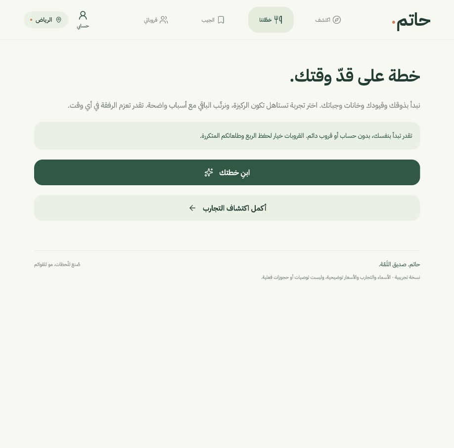
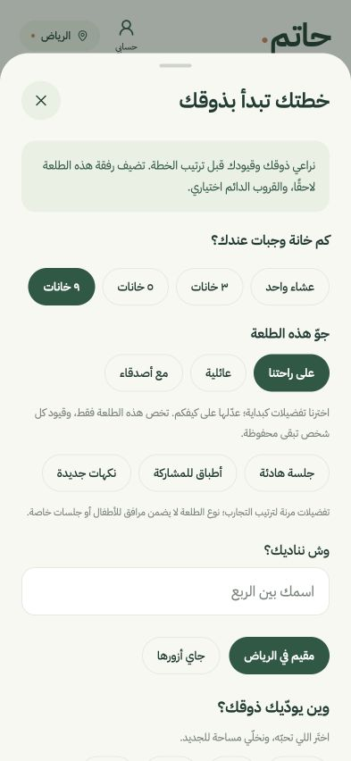
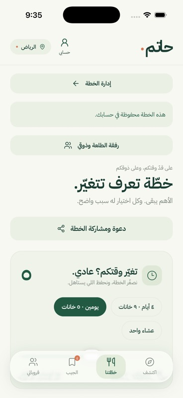
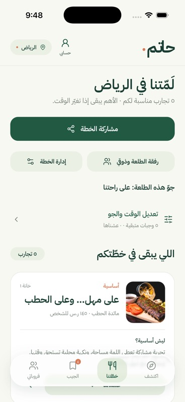
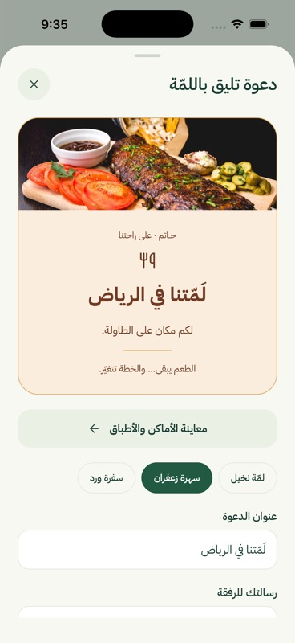
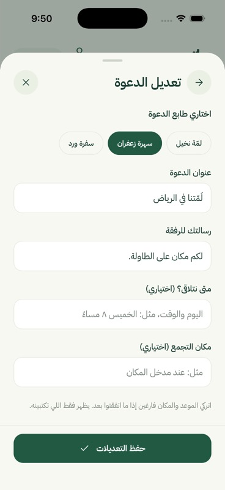
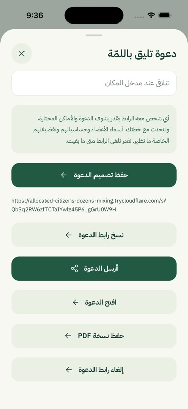
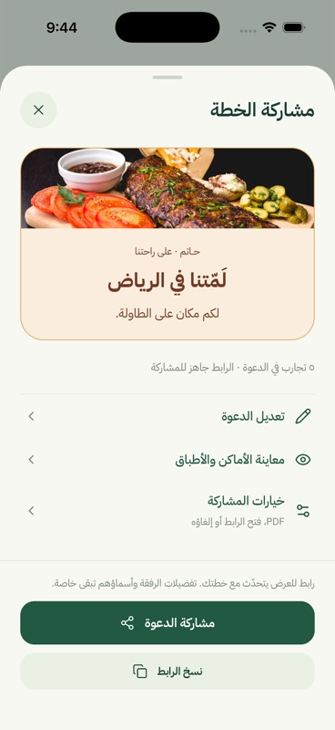
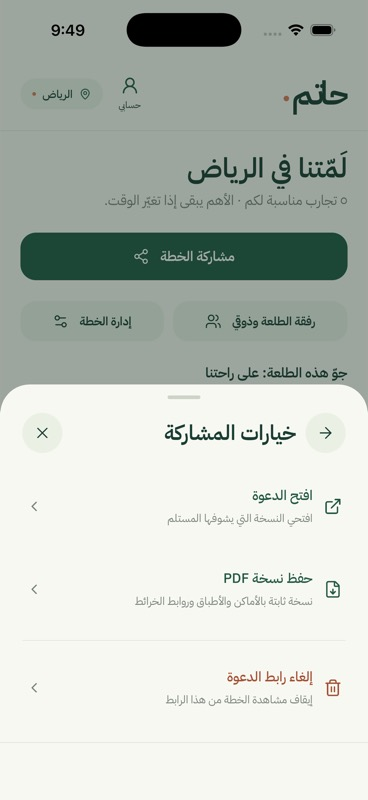

# مراجعة رحلة حاتم — ٢٧ سبتمبر ٢٠٢٦

النطاق: بداية الاكتشاف، إنشاء خطة مباشرة، قراءة الخطة، مشاركة دعوة للعرض. الأدلة لقطات جديدة في هذه المراجعة من محاكي iPhone 17 Pro ومن المتصفح. لا تستخدم هذه المراجعة لقطات الاختبار السابقة.

| الخطوة | الدليل | المشكلة المثبتة | التغيير المستهدف |
|---|---|---|---|
| ١. الاكتشاف | [الشاشة](01-discover-before.jpg) | الهوية واضحة والاكتشاف بلا حساب؛ البحث والقائمة أسفل مقدمة طويلة على الهاتف | اختصار المقدمة على الهاتف وإبقاء البحث قريبًا من البداية |
| ٢. بدء الخطة | [الشاشة](05-start-before.png) | «ابدأ خطتك» ينقل إلى شاشة تطلب «ابنِ خطتك» مرة أخرى | فتح نموذج الخطة مباشرة من زر البداية |
| ٣. قراءة الخطة | [الشاشة](02-plan-before.jpg) | إدارة الخطة وحفظ الحساب والرفقة تسبق عنوان الخطة؛ لا تظهر تجربة في الشاشة الأولى | العنوان ثم أدوات مختصرة ثم التجارب، وفتح تعديل الوقت عند الحاجة |
| ٤. تجهيز الدعوة | [الشاشة](03-invitation-before.jpg) | المعاينة ممزوجة بكل حقول التعديل؛ زر الإرسال بعيد | معاينة، تعديل مستقل، وإجراء رئيسي ثابت |
| ٥. إرسال الدعوة | [الشاشة](04-invitation-actions-before.jpg) | ستة أزرار بالوزن نفسه تقريبًا، حفظ وإرسال بارزان معًا، والرابط الخام يشغل مساحة | مشاركة أساسية، نسخ ثانوي، وخيارات منفصلة للملف وفتح الرابط وإلغائه |

## قابلية الوصول وحدود المراجعة

اللقطات تؤكد طول الصفحة وتنافس الأزرار؛ لا تثبت وحدها توافق VoiceOver أو WCAG. فحص الكود أظهر أن Button لا يصرّح بحالته المشغولة لقارئ الشاشة، وأن Sheet لا يوفّر موضعًا ثابتًا للإجراء الأساسي. نضيف وصف الحالة ونتحقق من الأزرار بلوحة المفاتيح وفي عرض الهاتف. القيود والحساسية تبقى ظاهرة في نموذج التفضيلات، ولا تختصر بحذفها.

هذه مراجعة لمسارات محددة، وليست اختبار قابلية استخدام مع مشاركين حقيقيين. نتائج التحقق بعد الإصلاح ولقطاته موثقة أدناه بعد التشغيل الفعلي.

## النتيجة المنفذة

| الخطوة | الحالة بعد التعديل | ما تغيّر |
|---|---|---|
| ١. الاكتشاف | أوضح | البحث ظاهر في أول شاشة هاتف؛ المقدمة أقصر، وعدد النتائج صحيح، وزر لاستعادة كل التجارب عند عدم التطابق |
| ٢. بدء الخطة | أقصر | زر واحد من الاكتشاف إلى النموذج، مع بقاء الحساسية والقيود ونية اختيار الركيزة/الجيب |
| ٣. قراءة الخطة | أكثر تركيزًا | اسم الخطة الحقيقي، أدوات مختصرة، وأول تجربة ظاهر في شاشة المحاكي؛ الوقت والجو قابلان للفتح والطي |
| ٤. تجهيز الدعوة | مفصول إلى أعمال واضحة | معاينة أولًا، حقول التعديل في شاشة مستقلة، حفظ ثابت وتنبيه عند ترك تعديل غير محفوظ |
| ٥. إرسال الدعوة | إجراء رئيسي واضح | مشاركة ونسخ في موضع ثابت، وPDF والفتح والإلغاء داخل خيارات؛ الإلغاء يحتاج تأكيدًا |

التسميات تفرق بين «مشاركة الخطة» للعرض و«اجمع تفضيلات الرفقة» للانضمام وإضافة القيود. لا حساب مطلوب للاكتشاف، ولا قروب دائم مطلوب للتخطيط. لم تُغير بيانات الخطة أو تفضيلات المستخدم في الفحص؛ أُغلقت المسودة المحلية التجريبية دون حفظ.

## الشاشات من الفحص الحالي

### ١. الاكتشاف — قبل ثم بعد

### ٢. بدء الخطة — قبل ثم بعد

الصورة السابقة من عرض المتصفح الواسع، واللاحقة من عرض الهاتف؛ المقارنة هنا لعدد الخطوات، لا قياس المساحات. تتبع الزر أثبت أن خطوة التأكيد الثانية أزيلت.

### ٣. الخطة — قبل ثم بعد

### ٤. إعداد الدعوة — قبل ثم بعد

### ٥. المشاركة — قبل ثم بعد

## دليل التحقق

- نجح `npm run check`: فحص الحدود، TypeScript، و٢٩٨ اختبار Python. وأعيد فحص التنسيق والحدود والأنواع بعد تعديلات الوصول الأخيرة.
- نجحت مجموعة المتصفح كاملة: ٢٣ اختبارًا، تشمل ٣ اختبارات رحلة جديدة. أثبتت أن المعاينة لا تنشر رابطًا، والإجراء الرئيسي ظاهر في عرضي٣٢٠ و٣٩٣، وأن فشل الحفظ لا يفقد النص. فُحص رجوع لوحة المفاتيح من المشاركة إلى النسخ، وحالة aria-expanded، وحماية المسودة والتعارض والإلغاء وPDF الحي مع الخطة.
- نجح بناء Release وتشغيله على iPhone 17 Pro، iOS26.4. فُحصت المعاينة والتعديل والرجوع والخيارات بصريًا؛ حفظ PDF من موضعه الجديد فتح قائمة مشاركة iOS. أُلغيت القائمة دون إرسال إلى أحد. مع لوحة مفاتيح الهاتف، بقي حقل التجمع وزر الحفظ ظاهرين. فُحص تنبيه ترك المسودة ثم تجاهلها.
- فُحصت الروابط المحلية في الشرح، وحُفظت صفحات الكود التاريخية الـ٤٨ دون تعديل، ونجح تحليل٢٩مخططMermaid.

## الحدود والملاحظات المتبقية

لم تُجرَ جلسات مستخدمين أو مراجعة VoiceOver كاملة أو اختبار كل أحجام Dynamic Type. نموذج التفضيلات لا يزال طويلًا لأنه يعرض القيود المهمة صراحة؛ تقسيمه إلى مراحل مع حفظ آمن يستحق مراجعة منفصلة بعد تجربة هذه النسخة. صفحة الدعوة العامة والقروبات والأدوار تعمل وفق اختباراتها الحالية، لكن هذه الجولة لا تدعي إعادة تصميم كل شاشاتها. محتوى الأماكن ما زال توضيحيًا، ولم يتحول إلى كتالوج موثّق.

[شرح التغيير للمبتدئة](../../learning-python-postgres/21-clear-user-journey.ar.md) · [عقد API](../../api-plan-sharing.ar.md) · [المعمارية](../../architecture-python-postgres.ar.md)
